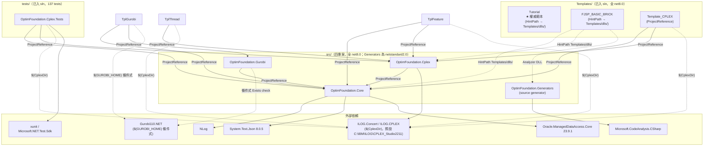

[TOC]

## 審查範圍

> ==Effort==: **high**　|　==Base==: 全 repo 體檢（非 diff）　|　==Sync==: 2026-07-19 事實同步（框架資料防護上線 + Templates 收斂為三個並全部現代化 + 測試數實測 137；規格見 `specs/2026-07-18-framework-data-guard.md`）

!!! note 使用說明
    本檔為 Code Review 地圖，由 `/code-review` 自動產生。
    Phase 2 的所有 Review 評語都會引用本檔的 §section。

!!! note 目錄結構前提
    本檔位於 git repo 根（`OptimizationFramework/OptimFoundation/OptimFoundation/`）。其外層 `OptimFoundation/` 僅為資料夾外殼、非 repo。
    `Templates/` 與 `tests/` 已收進 git repo、sln 含全部 8 專案（4 src + 3 Templates + 1 tests）。
    下表路徑一律相對 **git repo 根**（`src/...`、`Templates/...`、`tests/...`）。

## File Index

### src（四專案：Core / Cplex / Gurobi / Generators）

| 檔案 | 行數 | 專案 | 關鍵 Symbol |
|------|-----|------|-------------|
| `src/OptimFoundation.Core/DesignBases.cs` | 93 | Core | `ModelElementBase`, `ConstraintBase`, `ParameterBase`, `VariableBase` |
| `src/OptimFoundation.Core/SetBase.cs` | 146 | Core | `ISetBrick`（marker）, `SetBase<T>`（`IReadOnlyList<T>`；`Load(IDataSource, name=null)` paved path、`LoadInline/LoadFrom/LoadCsv`、四道防呆） |
| `src/OptimFoundation.Core/IO/IDataSource.cs` | 31 | Core | `IDataSource`（名稱可定址：`LoadParam<T>(file=null)`/`LoadSet`；CSV/InMemory）, `ISolutionSink` |
| `src/OptimFoundation.Core/IO/SetNaming.cs` | 32 | Core | `SetNaming`（internal；set 名慣例單一真相：`Logical`/`File`——三來源用檔名形式 `Set_{X}`，邊界轉位址） |
| `src/OptimFoundation.Core/IO/CsvDataSource.cs` | 43 | Core | `CsvDataSource : IDataSource`（ctor 建 Data/、set 走 `SetNaming.File`、`LoadTable`→raw DataTable）, `CsvSolutionSink : ISolutionSink` |
| `src/OptimFoundation.Core/IO/DbDataSource.cs` | 82 | Core | `DbDataSource`（**query-only，不實作 IDataSource**）：`LoadParam`/`LoadSet`/`LoadTable`(raw DataTable) 皆明寫 SQL；無 tablePrefix/dataId/resolver |
| `src/OptimFoundation.Core/IO/InMemoryDataSource.cs` | 47 | Core | `InMemoryDataSource : IDataSource`（demo / 測試用，`AddParameters`/`AddSet` 鏈式；set key 走 `SetNaming.Logical`） |
| `src/OptimFoundation.Core/EngineBase.cs` | 468 | Core | `EngineBase<TModel,TVar,TExpr,TConstr>`（`ISolverEngine`, `ITrajectorySource`）— 三引擎共同父類 |
| `src/OptimFoundation.Core/Enums.cs` | 22 | Core | `VarType`, `ConstraintSense`, `ObjectiveSense` |
| `src/OptimFoundation.Core/Experiment.cs` | 58 | Core | `Experiment`（`AddTrial`, `Save`, `Load`） |
| `src/OptimFoundation.Core/ISolverEngine.cs` | 55 | Core | `ISolverConfig`, `ISolverEngine`, `SolveStatus`, `ISpecialConstraints<TVar,TExpr>`（三介面合檔，原獨立檔已刪） |
| `src/OptimFoundation.Core/ITrajectorySource.cs` | 15 | Core | `ITrajectorySource` |
| `src/OptimFoundation.Core/ITunableConfig.cs` | 18 | Core | `ITunableConfig`（跨引擎 tuning 旋鈕抽象） |
| `src/OptimFoundation.Core/VariableBuilder.cs` | 129 | Core | `VariableBuilder`（`GenVarCombinations`, `ConvertSetsToStringLists`, `GetVarNames<T>`, `BuildVars<T>`） |
| `src/OptimFoundation.Core/IO/CsvCtrl.cs` | 204 | Core | `CsvCtrl`（`BuildParameter<T>(fileName=null)`（預設檔名 = 型別名）, `ReadIntSet/ReadDoubleSet/ReadStrSet/ReadDateSet`, `ReadTable`→DataTable, `ReadMatrixCsv`, `WriteSolution`） |
| `src/OptimFoundation.Core/IO/DBCtrlBase.cs` | 29 | Core | `DBCtrlBase : IDbCtrl`（abstract；`NonQuery` 預設委派 `Execute`） |
| `src/OptimFoundation.Core/IO/IDbCtrl.cs` | 37 | Core | `IDbCtrl : IDisposable`（含 `NonQuery`；亂碼註解已修復為完整中文 doc comment） |
| `src/OptimFoundation.Core/Experiments/ConfigSnapshot.cs` | 60 | Core | `ConfigSnapshot`（`From(ISolverConfig)`） |
| `src/OptimFoundation.Core/Experiments/CsvExperimentWriter.cs` | 86 | Core | `CsvExperimentWriter : IExperimentWriter` |
| `src/OptimFoundation.Core/Experiments/IExperimentWriter.cs` | 25 | Core | `ExpWriterType`, `IExperimentWriter` |
| `src/OptimFoundation.Core/Experiments/JsonExperimentWriter.cs` | 41 | Core | `JsonExperimentWriter : IExperimentWriter` |
| `src/OptimFoundation.Core/Experiments/SolveMetrics.cs` | 33 | Core | `SolveMetrics`, `ConvergencePoint` |
| `src/OptimFoundation.Core/Experiments/Trial.cs` | 50 | Core | `Trial`（`Trial.Capture(engine, label, solveAction, note)`） |
| `src/OptimFoundation.Core/Infrastructure/ClassInfo.cs` | 30 | Core | `ClassInfo`（SQL command 產生器） |
| `src/OptimFoundation.Core/Infrastructure/FolderDir.cs` | 95 | Core | `FolderDir`, `FolderDir.ProjFolder`；含保留期清理 `PurgeOutputs`/`PurgeOlderThan` |
| `src/OptimFoundation.Core/Infrastructure/ReflectionHelper.cs` | 83 | Core | `ReflectionHelper`（`GetMemberNames`, `GetMemberTypes`, `GenerateSQLCols`） |
| `src/OptimFoundation.Core/Logging/Logging.cs` | 94 | Core | `Logging`（static；**全域可變靜態狀態**，見 Review Scope Notes） |
| `src/OptimFoundation.Cplex/CplexConfig.cs` | 96 | Cplex | `CplexConfig : ISolverConfig, ITunableConfig` |
| `src/OptimFoundation.Cplex/OptEngine.cs` | 1060 | Cplex | `OptEngine : EngineBase<Cplex,INumVar,ILinearNumExpr,IRange>`；巢狀 `TrajectoryCallback`, `TeeWriter`；含 `CopyModel`/`MergeModel`/`*Thread` 多引擎同步方法群（§Symbol Index 高風險） |
| `src/OptimFoundation.Cplex/OptModel.cs` | 140 | Cplex | `OptModel : IDisposable`（fluent：`UseConfig`/`AddVariables`/`AddModel`/`OnSolved`/`Execute`） |
| `src/OptimFoundation.Core/IO/OracleDBCtrl.cs` | 238 | Core | `OracleDBCtrl : DBCtrlBase`（2026-07-10 由原 Db.Oracle 專案併入） |
| `src/OptimFoundation.Generators/AutoSetsGenerator.cs` | 250 | Generators | `AutoSetsGenerator : IIncrementalGenerator`（Roslyn source generator；消費者：三個 Templates（Analyzer DLL）與 sibling AI-Modeling 的 HospitalRostering 系列；另負責為 DataContext 子類 emit 註冊碼） |
| `src/OptimFoundation.Generators/IsExternalInit.cs` | 5 | Generators | `IsExternalInit`（netstandard2.0 polyfill） |
| `src/OptimFoundation.Gurobi/GurobiConfig.cs` | 46 | Gurobi | `GurobiConfig : ISolverConfig, ITunableConfig` |
| `src/OptimFoundation.Gurobi/OptEngine.cs` | 419 | Gurobi | `OptEngine`：**同檔內兩個同名 `public class OptEngine`**，以 `#if GUROBI_INSTALLED`/`#else` 互斥（真實實作 vs. 無 DLL 時的 throw stub） |

### csproj / sln（src 五專案 + 根 sln）

| 檔案 | 專案 | 關鍵設定 |
|------|------|----------|
| `OptimFoundation.sln` | — | 全部 8 專案：`Core`/`Cplex`/`Gurobi`/`Generators` + `Tutorial`/`FJSP_BASIC_BRICK`/`Template_CPLEX` + `OptimFoundation.Cplex.Tests`（`dotnet build` 全綠是基準） |
| `src/OptimFoundation.Core/OptimFoundation.Core.csproj` | Core | `net8.0`；`PackageReference` NLog 5.3.4、Oracle.ManagedDataAccess.Core 23.9.1、System.Text.Json 8.0.5 |
| `src/OptimFoundation.Cplex/OptimFoundation.Cplex.csproj` | Cplex | `net8.0`；`ProjectReference` → Core；ILOG 走 `$(CplexDir)` property（預設 `C:\IBM\ILOG\CPLEX_Studio2211`） |
| `src/OptimFoundation.Generators/OptimFoundation.Generators.csproj` | Generators | `netstandard2.0`；`IsRoslynComponent`；`PackageReference` Microsoft.CodeAnalysis.CSharp 4.8.0；消費者：三個 Templates（`Templates/dlls/` Analyzer DLL）+ AI-Modeling |
| `src/OptimFoundation.Gurobi/OptimFoundation.Gurobi.csproj` | Gurobi | `net8.0`；`ProjectReference` → Core；`Reference` 條件式 `Exists('$(GUROBI_HOME)\bin\Gurobi110.NET.dll')` |
| `Templates/Tutorial/Tutorial.csproj` | Tutorial（已入 sln） | ★ 權威教學範本（未來開發照此模式）：Model.md → 積木 → Dataload 顯式 ctor（逐行讀檔）→ 解驗證協定；三模式 CSV / inmemory / experiment；吃 `Templates/dlls/` |

### tests（repo `tests/`，已入 sln；137 tests 全綠，2026-07-19 `dotnet test` 實測）

| 檔案 | 專案 | 關鍵 Symbol |
|------|------|-------------|
| `tests/OptimFoundation.Cplex.Tests/OptimFoundation.Cplex.Tests.csproj` | Tests | `net8.0`；xunit 2.9.3；`ProjectReference` → Core、Cplex；ILOG 走 `$(CplexDir)` property |
| `tests/.../Unit/EngineBaseTests.cs` | Tests | `EngineBaseTests`（26 tests：BuildBVs / Pool / Soft constraints） |
| `tests/.../Unit/ModelElementBaseTests.cs` | Tests | `ModelElementBaseTests`（8 tests：`ToString`/`InitClassBySets`） |
| `tests/.../Unit/VariableBuilderTests.cs` | Tests | `VariableBuilderTests`（10 tests） |
| `tests/.../Unit/CsvCtrlTests.cs` | Tests | `CsvCtrlTests`（7 tests：CSV 讀寫） |
| `tests/.../Unit/DataSourceTests.cs` | Tests | `DataSourceTests`（10 tests：DbDataSource 按名對位） |
| `tests/.../Integration/ExperimentIntegrationTests.cs` | Tests | `ExperimentIntegrationTests`（2 tests：CSV/JSON 落地、Trajectory） |
| `tests/.../Integration/OptEngineIntegrationTests.cs` | Tests | `OptEngineIntegrationTests`（9 tests：實跑 CPLEX LP/MILP） |
| `tests/.../Integration/SolverParamCoverageTests.cs` | Tests | `SolverParamCoverageTests`（1 test：逐一 tuning 參數覆蓋率） |
| `tests/.../Mocks/MockEngine.cs` | Tests | `MockEngine`（測試替身） |
| `tests/.../Mocks/TestModels.cs` | Tests | 測試用 Variable/Parameter 類別 |

> 測試覆蓋 `Core` + `Cplex`；`Gurobi`／`Generators` 與 `OracleDBCtrl`（真 Oracle 連線）**無任何測試**。

### Templates（repo `Templates/`；全部 net8.0，皆已入 sln；**三者皆套用 `DataContext` 資料防護**）

三個範本的 `Dataload` 一律是 `partial class ... : DataContext`，建構走 `OptData.Load(() => new Dataload(...))`，載入後框架自動驗資料（參照完整性 / key 唯一性 / 數值 sanity / opt-in `[FullGrid]`）。讀檔仍是顯式 `.Load(...)` 逐行寫。

| Template | 結構 | 依賴模式 | 備註 |
|------|------|------|------|
| `Templates/Tutorial/` | `Program.cs` + `Model/` + `Data/` + `SetClass/` + `ParameterClass/` + `VariableClass/` + `Constraint/` + `Generated/` | **HintPath → `Templates/dlls/`** | ★ **權威教學範本，新題目從這裡複製起手**；三模式 CSV / inmemory / experiment；`Parameter_Demand` 掛 `[FullGrid]` 作示範 |
| `Templates/FJSP_BASIC_BRICK/` | `Program.cs` + `Model/` + `Constraint/` + `Data/` + `SetClass/` + `ParameterClass/` + `VariableClass/` + `Generated/` | **HintPath → `Templates/dlls/`** + AutoSetsGenerator Analyzer DLL | FJSP 題（積木式）；`timeLimit=90` 為實測可穩定達 `Optimal` 的最小值（30/60 秒只到 `Feasible` 且解會浮動） |
| `Templates/Template_CPLEX/` | `Program.cs` + `RosteringProblem.cs` + `ExperimentDemo.cs` + `CrossExperiment.cs` + `Constraints/`×12 + `Data/` + `SetClass/` + `VariablesClass/`×11 | `ProjectReference` → Core+Cplex；ILOG → `$(CplexDir)`；Generators 走 repo 內 `Templates/dlls/` | 排班題完整範本；`Random(42)` 固定種子以求可重現；`Data/*.csv` 有 `CopyToOutputDirectory` |

> **2026-07-19 收斂**：`FJSP_BASIC`（非積木舊式）、`FeatureTest`、`Template_Gurobi`、`Template_ThreadTest` 已刪除，Templates 收斂為上述三個並全部現代化。
> `Template_Solver` 已於 2026-07-10 刪除（依賴跨 repo Solver.dll，無法建置）；其拆檔結構已由 Template_CPLEX 繼承。

### specs / README（git repo `OptimFoundation/OptimFoundation/`）

| 檔案 | 行數 | 主題 |
|------|-----|------|
| `specs/2026-07-10-architecture-consolidation.md` | 58 | 架構整頓基準：Db.Oracle 併 Core、Solver 刪除、版控歸位、TFM net48、csproj 慣例，status: shipped |
| `specs/2026-06-18-experiment-tuning-tracking.md` | 314 | Experiment 套件化 tuning 實驗記錄環境（solver-agnostic），status: shipped |
| `specs/cplex-project-dev-spec.md` | 674 | CPLEX 新建專案的目錄結構、類別範本、csproj 設定、開發 Checklist |
| `specs/developer-guide.md` | 755 | 框架開發手冊（給下游開發者）；**API 鏡像源頭**：改 public API 必同步 `../AI-Modeling/CPLEX_API_REFERENCE.md` |
| `specs/2026-07-13-optset-basic-objects.md` | 248 | OptSet 積木設計說明（design-approved）：`[OptSet<T>]`/`[OptParam<>]`/`[OptVar<>]` 泛型統一語法、SetBase 契約、命名推導、三檔位讀取——Phase 2 /sdd 靶心 |
| `specs/2026-07-16-io-interface.md` | 176 | **IO 介面權威規格（現況）**：IDataSource/ISolutionSink + Csv/InMemory/Db 三來源（DB query-only）、SetNaming 檔名形式統一、SetBase 載入 + 防呆、Dataload 範式、錯誤語意總表 |
| `specs/framework-dev-spec.md` | 309 | 框架三層架構總覽規格書 |
| `README.md` | 126 | 專案總覽、Packages 表、Quick Example、DLL 參考設定；**與實際 6 個 src 專案不一致**（見 Review Scope Notes） |

## Dependency Graph

## Symbol Index

### OptimFoundation.Core

#### `src/OptimFoundation.Core/DesignBases.cs`

| Symbol | 種類 | 行號 | 說明 |
|---|---|---|---|
| `ModelElementBase` | class (abstract) | 8 | 反射快取 `_propsCache`；`InitClassBySets`/`ToString` 是 Variable/Parameter 命名慣例的核心 |
| `ModelElementBase.InitClassBySets` | method | 27 | 依序把可變參數塞進 property，型別不符時嘗試 `Convert.ChangeType` |
| `ModelElementBase.ToString` | method | 50 | 產生 `TypeName@v1@v2...` 格式字串（變數/參數命名的權威來源） |
| `ConstraintBase` | class (abstract) | 66 | |
| `ParameterBase` | class (abstract) | 72 | |
| `VariableBase` | class (abstract) | 77 | |

#### `src/OptimFoundation.Core/EngineBase.cs`

| Symbol | 種類 | 行號 | 說明 |
|---|---|---|---|
| `EngineBase<TModel,TVar,TExpr,TConstr>` | class (abstract) | 7 | 三個引擎（Cplex/Gurobi/Solver）共同父類 |
| `Config` | property | 14 | |
| `Status` | property | 15 | |
| `BestObjValue` | property | 16 | |
| `MIPGap` | property | 17 | |
| `LastMetrics` | property | 20 | |
| `TryInvokeLong` | method | 29 | |
| `EnableTrajectory` | method | 44 | virtual no-op，CPLEX override |
| `AddVariables` | method | 117 | protected virtual |
| `ReadVar` | method | 157 | |
| `GetAllVarNames` | method | 175 | |
| `SetVarLB`/`SetVarUB`/`SetVarRange` | method | 213/216/219 | |
| `VarSetsReset` | method | 226 | |
| `ClearPool` | method | 240 | |
| `AddLHS`（雙多載）/`AddRHS`（雙多載） | method | 262/272/278/288 | |
| `CreateGreatEqual`/`CreateLessEqual`/`CreateEqual`（各雙多載）/`CreateRange` | method | 298-355 | |
| `CreateMinimize`/`CreateMaximize` | method | 367/369 | |
| `CreateLeSoft`/`CreateGeSoft`/`CreateEqSoft` | method | 399/403/407 | virtual，軟約束 |
| `AddObjectiveTerm` | method | 460 | protected virtual |

#### `src/OptimFoundation.Core/Enums.cs`

| Symbol | 種類 | 行號 | 說明 |
|---|---|---|---|
| `VarType` | enum | 3 | Continuous/Integer/Binary |
| `ConstraintSense` | enum | 10 | |
| `ObjectiveSense` | enum | 17 | |

#### `src/OptimFoundation.Core/Experiment.cs`

| Symbol | 種類 | 行號 | 說明 |
|---|---|---|---|
| `Experiment` | class | 8 | |
| `Name`/`Description`/`CreatedAt`/`Trials` | property | 10-13 | |
| `AddTrial` | method | 26 | |
| `Save` | method | 35 | append 邏輯：Load JSON → 去重合併 → 覆寫 CSV+JSON |
| `Load` | method (static) | 56 | |

#### `src/OptimFoundation.Core/ISolverEngine.cs`（含 ISolverConfig / ISpecialConstraints）/ `ITrajectorySource.cs` / `ITunableConfig.cs`

| Symbol | 種類 | 行號 | 檔案 | 說明 |
|---|---|---|---|---|
| `ISolverConfig` | interface | 7 | ISolverEngine.cs | `TimeLimit`/`MipGap`/`Threads`/`LogToConsole`/`LogFilePath` |
| `ISolverEngine` | interface | — | ISolverEngine.cs | `Config`/`Status`/`LastMetrics`/`Build`/`Solve`/`GetObjectiveValue`/`GetVariableValue`/`GetSolution` |
| `SolveStatus` | enum | — | ISolverEngine.cs | |
| `ISpecialConstraints<TVar,TExpr>` | interface | 34 | ISolverEngine.cs | SOS1/SOS2/Indicator/LazyConstraint |
| `ITrajectorySource` | interface | 9 | ITrajectorySource.cs | |
| `ITunableConfig` | interface | 7 | ITunableConfig.cs | 8 個抽象旋鈕；三個 concrete config 對映不一致（見 Review Scope Notes） |

#### `src/OptimFoundation.Core/VariableBuilder.cs`

| Symbol | 種類 | 行號 | 說明 |
|---|---|---|---|
| `VariableBuilder` | class (static) | 10 | 含 `_ctorCache`（ConcurrentDictionary，thread-safe） |
| `GenVarCombinations` | method | 62 | |
| `ConvertSetsToStringLists` | method | 74 | 支援 DateTime/int/long/double/decimal/string/enum |
| `GetVarNames<TVariable>` | method | 112 | |
| `BuildVars<TVariable>` | method | 121 | |

#### `src/OptimFoundation.Core/Csv/CsvCtrl.cs`

| Symbol | 種類 | 行號 | 說明 |
|---|---|---|---|
| `CsvCtrl` | class (static) | 9 | |
| `ClearData` | method | 16 | |
| `ReadIntSet`/`ReadDoubleSet`/`ReadStrSet`/`ReadDateSet` | method | 31-34 | |
| `ReadMatrixCsv` | method | 85 | |

#### `src/OptimFoundation.Core/IO/DBCtrlBase.cs` / `IDbCtrl.cs`

| Symbol | 種類 | 行號 | 檔案 | 說明 |
|---|---|---|---|---|
| `DBCtrlBase` | class (abstract) | 6 | DBCtrlBase.cs | `: IDbCtrl` |
| `NonQuery` | method | 21 | DBCtrlBase.cs | virtual，預設委派 `Execute` 並丟棄筆數 |
| `Dispose` | method | 24 | DBCtrlBase.cs | virtual，呼叫 `Close()` |
| `IDbCtrl` | interface | 12 | IDbCtrl.cs | `: IDisposable`；完整中文 doc comment |

#### `src/OptimFoundation.Core/Experiments/*.cs`

| Symbol | 種類 | 行號 | 檔案 | 說明 |
|---|---|---|---|---|
| `ConfigSnapshot` | class (sealed) | 10 | ConfigSnapshot.cs | `Solver`/`Tunable`/`SolverSpecific` |
| `ConfigSnapshot.From` | method (static) | 19 | ConfigSnapshot.cs | reflection 抓 concrete config 專屬欄位 |
| `CsvExperimentWriter` | class (sealed) | 11 | CsvExperimentWriter.cs | `: IExperimentWriter`；輸出 UTF-8 **with BOM**（供 Excel zh-TW，見說明） |
| `Write`/`Read` | method | 22/67 | CsvExperimentWriter.cs | `Read` 恆回 null（CSV 非權威來源，只寫不讀） |
| `IExperimentWriter` | interface | 14 | IExperimentWriter.cs | |
| `ExpWriterType` | enum | 4 | IExperimentWriter.cs | CSV/JSON |
| `JsonExperimentWriter` | class (sealed) | 13 | JsonExperimentWriter.cs | `: IExperimentWriter`；輸出 UTF-8 **無 BOM**（與 Csv 版 BOM 策略不同，屬刻意設計） |
| `SolveMetrics` | class (sealed) | 9 | SolveMetrics.cs | |
| `ConvergencePoint` | class (sealed) | 26 | SolveMetrics.cs | |
| `Trial` | class (sealed) | 8 | Trial.cs | |
| `Trial.Capture` | method (static) | 24 | Trial.cs | 不接管/不 Dispose engine，呼叫端持有生命週期 |

#### `src/OptimFoundation.Core/Infrastructure/*.cs`

| Symbol | 種類 | 行號 | 檔案 | 說明 |
|---|---|---|---|---|
| `ClassInfo` | class | 6 | ClassInfo.cs | SQL insert/create 語句產生器 |
| `FolderDir` | class | 6 | FolderDir.cs | 靜態 `ProjFolder` 實例：Data/Solution/Log/Model/IIS/Sol/Experiment |
| `FolderDir.PurgeOutputs` | method (static) | 20 | FolderDir.cs | 清各輸出資料夾（不含 Data）超過 N 天舊檔；`retentionDays<=0` 關閉。OptModel ctor 每次 run 自動呼叫（預設 30） |
| `FolderDir.ProjFolder` | class (nested) | 28 | FolderDir.cs | `ProjectPath` 綁 `AppDomain.CurrentDomain.BaseDirectory` |
| `FolderDir.ProjFolder.PurgeOlderThan` | method | 71 | FolderDir.cs | 刪本資料夾中 LastWriteTime 早於 N 天前的檔；使用中/無權限跳過 |
| `ReflectionHelper` | class (static) | 11 | ReflectionHelper.cs | `OracleTypeMap` 私有對照表；`GetMemberNames`/`GetMemberTypes`/`GenerateSQLCols` |

#### `src/OptimFoundation.Core/Logging/Logging.cs`

| Symbol | 種類 | 行號 | 說明 |
|---|---|---|---|
| `Logging` | class (static) | 8 | **全域可變靜態狀態**：`_fileWriter`/`_logFile` 可變且無 DI，多執行緒（如 Template_ThreadTest）共用同一個 log 檔／`Console.OutputEncoding` |
| `FileWriter` | property (static, private) | 27 | lazy：首次寫入才開檔，避免孤兒 log；呼叫端須持有 `_lock` |
| `Info`/`Debug`/`Warn`/`Error` | method (static) | 52-55 | |
| `SetLogFileName` | method (static) | 64 | sanitize 非法檔名字元後換 log 檔路徑（lazy，寫入時才開檔） |
| `WriteToFile` | method (static) | 77 | |
| `ClearLogs` | method (static) | 83 | 先 dispose 目前 writer 再刪檔 |

### OptimFoundation.Cplex

#### `src/OptimFoundation.Cplex/CplexConfig.cs`

| Symbol | 種類 | 行號 | 說明 |
|---|---|---|---|
| `CplexConfig` | class (sealed) | 9 | `: ISolverConfig, ITunableConfig`；public 欄位為 camelCase CPLEX 專屬參數（`workThreads`/`epGap`/`randomSeed`... 約 30 個），property 為 adapter delegate |
| `TimeLimit`/`MipGap`/`Threads`/`LogToConsole`/`RootAlgorithm` | property | 68-73 | delegate 到對應欄位 |
| `NodeAlgorithm`/`PreIndicator` | property | 76-77 | CPLEX 無直接對應的擴充項 |
| `Seed`/`Emphasis`/`FeasibilityTol`/`OptimalityTol`/`MemoryLimitMb` | property | 80-84 | `ITunableConfig` 對映 |
| `Presolve` | property | 87 | int?↔bool? 轉換（0/非0 ↔ PreIndicator） |
| `HeuristicEffort` | property | 94 | 無底層欄位，僅供快照記錄，`Configuration` 不套用 |

#### `src/OptimFoundation.Cplex/OptEngine.cs`（1060 行，全 repo 最大檔）

| Symbol | 種類 | 行號 | 說明 |
|---|---|---|---|
| `OptEngine` | class | 20 | `: EngineBase<Cplex,INumVar,ILinearNumExpr,IRange>` |
| `TrajectoryCallback` | class (nested, private) | 54 | `Cplex.MIPInfoCallback` |
| `EnableTrajectory` | method | 48 | |
| `Configuration` | method | 97 | |
| `SetModelName` | method | 541 | |
| `AddVariable`/`AddVariables` | method | 552/565 | override |
| `LinearExpr`/`AddConstraint`/`AddRangeConstraint`/`SetObjective`/`SetVariableBounds` | method | 593-636 | override |
| `Build`/`Solve`/`GetObjectiveValue`/`GetVariableValue`/`Dispose` | method | 650/652/747/749/751 | |
| `CreateVar`/`Expr`/`AddLE`/`AddGE`/`AddEQ`/`Minimize`/`Maximize` | method | 763-780 | |
| `ResetConstraint` | method | 789 | |
| `CreateGreatEqualThread`/`CreateLessEqualThread`/`CreateEqualThread`/`ResetThreadConstraint` | method | 843-861 | **跨引擎執行緒同步約束**，高複雜度／高風險（見 Review Scope Notes） |
| `CopyModel`/`MergeModel`/`VariableMerge` | method | 885/916/928 | 多 `OptEngine` 實例間複製/合併模型 |
| `GetConflictConstraints` | method | 975 | |
| `TeeWriter` | class (nested, private) | 1015 | `TextWriter` |

#### `src/OptimFoundation.Cplex/OptModel.cs`

| Symbol | 種類 | 行號 | 說明 |
|---|---|---|---|
| `OptModel` | class | 29 | `: IDisposable`，fluent builder |
| `OptModel` (ctor) | method | 60 | `(projectName="Model", retentionDays=30)`；建構時自動清超過 N 天舊輸出檔 |
| `UseConfig`/`AddVariables`/`AddModel`/`OnSolved` | method | 74-95 | |
| `Execute` | method | 102 | |
| `Dispose` | method | 135 | |

### OptimFoundation.Gurobi

#### `src/OptimFoundation.Gurobi/GurobiConfig.cs`

| Symbol | 種類 | 行號 | 說明 |
|---|---|---|---|
| `GurobiConfig` | class (sealed) | 5 | `: ISolverConfig, ITunableConfig` |
| `TimeLimit`/`MipGap`/`Threads`/`LogToConsole`/`LogFilePath` | property | 8-12 | |
| `Method`/`Presolve`/`MipFocus`/`Seed`/`FeasibilityTol`/`OptimalityTol`/`Heuristics`/`SoftMemLimit` | property | 15-22 | Gurobi 專屬 |
| `ExportLp`/`ExportMps`/`ExportSol`/`ProjectName` | property | 25-28 | |
| `LicenseId`/`WlsAccessId`/`WlsSecret` | property | 31-33 | **Gurobi 專有，CplexConfig/Solver 版 GurobiConfig 都沒有** |
| `Emphasis`/`RootAlgorithm`/`HeuristicEffort` | property | 37-39 | delegate（get/set 轉呼叫其他 property） |

#### `src/OptimFoundation.Gurobi/OptEngine.cs`

| Symbol | 種類 | 行號 | 說明 |
|---|---|---|---|
| `OptEngine`（真實實作） | class | 20 | `#if GUROBI_INSTALLED`；`: EngineBase<GRBModel,GRBVar,GRBLinExpr,GRBConstr>` |
| `Configuration`/`AddVariable`/`AddVariables`/`LinearExpr`/`AddConstraint`/`SetObjective`/`SetVariableBounds` | method | 35-171 | override |
| `Build`/`Solve`/`GetObjectiveValue`/`GetVariableValue`/`Dispose` | method | 181-249 | |
| `Update`/`CreateVar`/`Expr`/`AddLE`/`AddGE`/`AddEQ`/`Minimize`/`Maximize` | method | 262-281 | |
| `AddRangeConstraint`/`AddLhs`/`AddRhs`/`CommitLE`/`CommitGE`/`CommitEQ`/`CommitRange` | method | 283-371 | |
| `OptEngine`（stub） | class | 386 | `#else`；`: EngineBase<object,object,object,object>`，所有方法 `throw new NotSupportedException("Gurobi DLL 未安裝")` |

### OptimFoundation.Core — OracleDBCtrl（原 Db.Oracle 專案，2026-07-10 併入）

#### `src/OptimFoundation.Core/IO/OracleDBCtrl.cs`（namespace 保留 `OptimFoundation.Db.Oracle`）

| Symbol | 種類 | 行號 | 說明 |
|---|---|---|---|
| `OracleDBCtrl` | class (sealed) | 11 | `: DBCtrlBase`；建構子直接 `base(connectionString)` |
| `Open`/`Close` | method | 18-19 | 刻意留空（每次操作自建 connection，靠 Oracle Connection Pool） |
| `Query`/`Execute`/`QueryScalar<TResult>` | method | 21/31/40 | override |
| `CreateConnection`/`BuildCommand` | method (private) | 52/59 | |
| `BuildConnectionString` | method (static) | 72 | |
| `CheckHasTable`/`DropTable`/`DeleteTable`/`TruncateTable` | method | 86/117/129/140 | |
| `ReadStrSet`/`ReadDoubleSet`/`ReadIntSet`/`ReadDateSet`/`LoadSet` | method | 147-152 | |

### OptimFoundation.Generators

#### `src/OptimFoundation.Generators/AutoSetsGenerator.cs`

| Symbol | 種類 | 行號 | 說明 |
|---|---|---|---|
| `AutoSetsGenerator` | class (sealed) | 29 | `[Generator]`，`: IIncrementalGenerator`；消費者：`Templates/FJSP_BASIC`（Analyzer DLL，`[OptVar]`/`[OptParam]`）與 sibling AI-Modeling |
| `VarType`（注入用，字串常數形式） | enum | 44 | 生成到使用端的 `OptimFoundation.Modeling` namespace |
| `OptVarAttribute` | class (sealed) | 47 | |
| `OptParamAttribute` | class (sealed) | 59 | |
| `Initialize` | method | 76 | `IIncrementalGenerator` 入口 |
| `EmitModel` | record (private, nested) | 246 | |

#### `src/OptimFoundation.Generators/IsExternalInit.cs`

| Symbol | 種類 | 行號 | 說明 |
|---|---|---|---|
| `IsExternalInit` | class (internal, static) | 4 | netstandard2.0 polyfill，允許 `init` 存取子 |

## Review Scope Notes

!!! warning 高風險區域（未解決）
    1. **FJSP_BASIC 依賴模式偏離慣例**：Core/Cplex 用 HintPath 指 `Templates/dlls/`（違反「內部依賴一律 ProjectReference」），且 `Templates/dlls/` 是第二份 DLL 落地點——框架改版後不重建就是 stale DLL 遮 API drift 的溫床（同 2026-07-11 AI-Modeling 事故模式）。修正候選：改 ProjectReference + Analyzer 走 ProjectReference OutputItemType。
    2. **同檔內兩個同名 public class**：`src/OptimFoundation.Gurobi/OptEngine.cs` 在 `#if GUROBI_INSTALLED`/`#else` 兩側各定義一個 `public class OptEngine`（真實實作 vs. 全 throw 的 stub），互斥編譯，屬刻意設計但審查時需注意兩份簽章是否保持同步。
    3. **`ITunableConfig` 實作對映不一致**：`CplexConfig`（含 `NodeAlgorithm`/`PreIndicator`，`Presolve` 是計算 property）與 `GurobiConfig`（含 `LicenseId`/`WlsAccessId`/`WlsSecret`）對 8 個旋鈕的對映方式（直接欄位 vs. delegate get/set）不統一，`ConfigSnapshot.From` 靠 reflection 補差異。
    4. **全域可變靜態狀態**：`OptimFoundation.Core.Logging`（`_fileWriter`/`_logFile`）與 `ModelElementBase`/`VariableBuilder` 的靜態快取字典為 process 全域共享；多執行緒情境（`Template_ThreadTest` 多引擎並行）下所有執行緒共寫同一個 log 檔案，需留意交錯輸出與換檔競爭。
    5. **測試覆蓋率缺口**：只有 `OptimFoundation.Cplex.Tests`（覆蓋 Core+Cplex）；`Gurobi`/`Generators` 與 `OracleDBCtrl`（真 Oracle 連線 runtime）無任何測試。
    6. **README.md 未提及 `OptimFoundation.Generators`**：Packages 表缺此專案。
    7. **非 ASCII 註解編碼一致性未全掃**：歷史上多檔出現 Big5→UTF-8 亂碼（`IDbCtrl.cs` 已修、Template_Solver 已刪），`Template_ThreadTest/Data/` 等未逐檔檢查。

!!! done 已解決（2026-07-13 事實同步）
    - ~~`OptimFoundation.Generators` 孤兒專案~~ → 已接線：FJSP_BASIC（Analyzer DLL）與 AI-Modeling HospitalRostering 系列消費
    - ~~全鏈 net48~~ → 2026-07-11 就地遷移 `net8.0`（Oracle 換 `Oracle.ManagedDataAccess.Core` 23.9.1；CPLEX/Gurobi managed wrapper 直接載），build 全綠 + 73 tests 通過

!!! done 已解決（2026-07-10 架構整頓，commits `d49aee4`→`dd876db`）
    - ~~跨 repo 建置依賴（MILP Solver/Solver.dll）~~ → OptimFoundation.Solver 與 Template_Solver 已刪除
    - ~~絕對路徑 HintPath（tests 的 C:\IBM\...）~~ → 統一 `$(CplexDir)` property
    - ~~ProjectReference vs HintPath 混用~~ → 全部 `ProjectReference`，solver DLL 走 property
    - ~~TargetFramework 三分天下~~ → 全鏈 `net48`（Generators 為 netstandard2.0，Roslyn 要求）
    - ~~Solver 專案檔名/類別名複製殘留~~ → 專案已刪除
    - ~~Templates 三套結構不對等~~ → Template_Solver 刪除後 CPLEX/Gurobi 同構（皆有 Constraints/Data/VariablesClass 拆檔）
    - ~~Templates 與 tests 不受版控 / repo 內過期副本~~ → 已收進 git repo，過期副本刪除
    - ~~sln 覆蓋不全~~ → 9 專案全入 sln
    - ~~README 幽靈 `OptimFoundation.Db` 列~~ → 已修正
    - ~~legacy packages.config / App.config / vendored packages/~~ → 已刪除
    - ~~System.Text.Json 8.0.0 已知弱點（NU1903）~~ → 升 8.0.5

!!! info 略過範圍
    - 所有 `obj/`、`bin/`、`.vs/` 目錄與其中的 generated `AssemblyInfo`/`AssemblyAttributes`
    - `docs/index.html`（單一靜態頁面，未展開內容）
