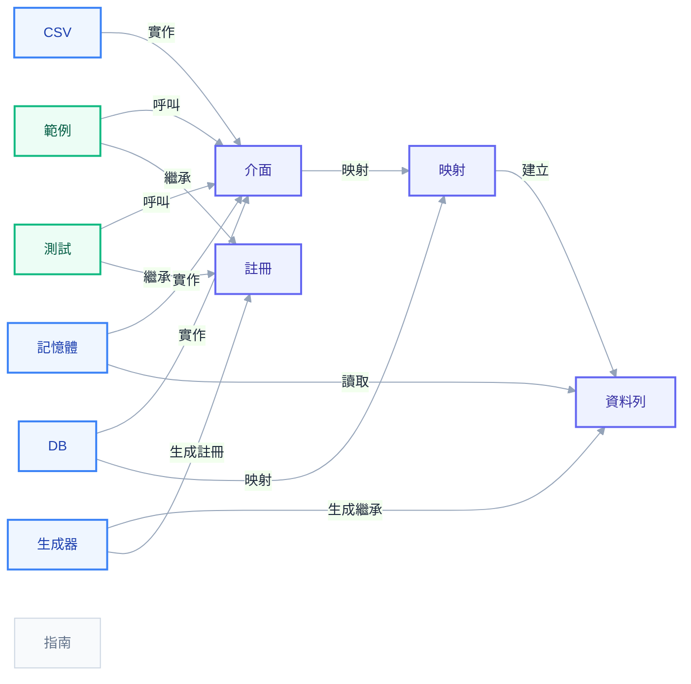

# OptimFoundation Code Map

## Focused Scope — Conflict Analysis（2026-10-04）

### File Index

| 檔案 | 範圍 | 關鍵 Symbol |
| --- | --- | --- |
| `src/OptimFoundation.Cplex/OptEngine.cs` | 現有方法與直接 caller，非 branch diff | `SolveCore`, `RunConflictAnalysis`, `GetConflictConstraints` |
| `src/OptimFoundation.Core/EngineBase.cs` | 求解入口 | `Solve`, `SolveCore` |
| `src/OptimFoundation.Core/Infrastructure/ProjectConfig.cs` | 匯出設定 | `ExportIIS` |
| `tests/OptimFoundation.Cplex.Tests/Integration/ModelImportIntegrationTests.cs` | 現有使用範例 | `ReadModel_Infeasible_RunsConflictAnalysis` |

### Dependency Graph

| Caller | Callee | 定位 |
| --- | --- | --- |
| `EngineBase.Solve` | virtual `SolveCore` → `OptEngine.SolveCore` | Core 求解入口與 Cplex override |
| `OptEngine.SolveCore` | `RunConflictAnalysis` | `OptEngine.cs:734–735` |
| `OptEngine.GetConflictConstraints` | `RunConflictAnalysis` | `OptEngine.cs:1083` |
| `RunConflictAnalysis` | `ILOG.CPLEX.Cplex.RefineConflict`, `WriteConflict`, `GetConflict` | 外部 solver SDK，`OptEngine.cs:1047,1054,1057` |
| `ModelImportIntegrationTests.ReadModel_Infeasible_RunsConflictAnalysis` | `Solve`, `GetConflictConstraints` | 測試 `:205,208` |

### Symbol Index

| 檔案 | Symbol | 行號 | 定位用途 |
| --- | --- | --- | --- |
| `src/OptimFoundation.Cplex/OptEngine.cs` | `_conflictConstraints` | 50 | 快取欄位；清除點 340、914，以及 `OptEngine.Configuration.cs:32` 的 `LoadConfig` |
| `src/OptimFoundation.Cplex/OptEngine.cs` | `_exportIIs` | 28 | 自動分析 gate 734 |
| `src/OptimFoundation.Core/Infrastructure/ProjectConfig.cs` | `ExportIIS` | 28 | 設定宣告 |
| `src/OptimFoundation.Core/EngineBase.cs` | `Solve` | 408 | `SolveCore` 呼叫 415；exception log 與 rethrow 417–420 |
| `src/OptimFoundation.Cplex/OptEngine.cs` | `SolveCore` | 647 | 狀態轉換 684–691，自動分析條件 734 |
| `src/OptimFoundation.Cplex/OptEngine.cs` | `RunConflictAnalysis` | 1040 | 實際分析與 ILP 匯出 |
| `src/OptimFoundation.Cplex/OptEngine.cs` | `GetConflictConstraints` | 1078 | public 存取入口、快取與狀態檢查 |
| `tests/OptimFoundation.Cplex.Tests/Integration/ModelImportIntegrationTests.cs` | `ReadModel_Infeasible_RunsConflictAnalysis` | 184 | 匯入 infeasible 模型後讀取衝突名稱 |

### Review Scope Notes

比較 visibility、觸發條件、快取、例外傳遞、回傳內容與分析成本。僅靜態追蹤，不執行 solver。

## Focused Scope — Set / Param 與 List（2026-10-04）

範圍為現有 API 的對稱性定位，非 branch diff；以下行號以本次掃描版本為準。僅建立地圖，未包含 review 結論。

### File Index

| 檔案 | +行 | -行 | 語言 | 關鍵 Symbol |
| --- | --- | --- | --- | --- |
| `src/OptimFoundation.Core/IO/IDataSource.cs` | N/A | N/A | C# | `IDataSource.Load<T>` |
| `src/OptimFoundation.Core/IO/ModelRowMapper.cs` | N/A | N/A | C# | `MapTable`, `MapRows` |
| `src/OptimFoundation.Core/IO/csv/CsvDataSource.cs` | N/A | N/A | C# | `CsvDataSource.LoadData` |
| `src/OptimFoundation.Core/IO/InMemoryDataSource.cs` | N/A | N/A | C# | `AddRows<T>`, `LoadData` |
| `src/OptimFoundation.Core/IO/db/DbDataSource.cs` | N/A | N/A | C# | `DbDataSource.Load<T>` |
| `src/OptimFoundation.Core/ModelElementBase.cs` | N/A | N/A | C# | `SetRowBase`, `ParameterBase` |
| `src/OptimFoundation.Core/DataContext.cs` | N/A | N/A | C# | `RegisterSet`, `RegisterParam`, `ParameterLookupExtensions` |
| `src/OptimFoundation.Generators/AutoSetsGenerator.cs` | N/A | N/A | C# | `AutoSetsGenerator`, generated conversion members |
| `Templates/Template/Data/Dataload.cs` | N/A | N/A | C# | `Dataload` |
| `tests/OptimFoundation.Cplex.Tests/Unit/GeneratorNumericCoverageTests.cs` | N/A | N/A | C# | `GncDataload`, CSV load tests |
| `specs/developer-guide.md` | N/A | N/A | Markdown | data loading examples |

### Dependency Graph

箭頭表示實際型別／方法依賴；同 namespace 的呼叫也列入。節點與 File Index 對應：介面 = IDataSource、映射 = ModelRowMapper、資料列 = ModelElementBase、記憶體 = InMemoryDataSource、生成器 = AutoSetsGenerator、註冊 = DataContext、範例 = Dataload、測試 = GeneratorNumericCoverageTests、指南 = developer-guide。


```mermaid
%%{init: {'theme':'base','themeVariables':{'primaryColor':'#eef2ff','primaryTextColor':'#1e293b','primaryBorderColor':'#6366f1','lineColor':'#94a3b8','fontFamily':'Segoe UI','fontSize':'14px'},'flowchart':{'curve':'basis','nodeSpacing':50,'rankSpacing':55}}}%%
flowchart LR
    EX["範例"] -->|呼叫| API["介面"]
    TEST["測試"] -->|呼叫| API
    CSV["CSV"] -->|實作| API
    MEM["記憶體"] -->|實作| API
    DB["DB"] -->|實作| API
    API -->|映射| MAP["映射"]
    DB -->|映射| MAP
    MAP -->|建立| ROW["資料列"]
    MEM -->|讀取| ROW
    GEN["生成器"] -->|生成繼承| ROW
    GEN -->|生成註冊| CTX["註冊"]
    EX -->|繼承| CTX
    TEST -->|繼承| CTX
    DOC["指南"]
    classDef primary fill:#eef2ff,stroke:#6366f1,stroke-width:2px,color:#3730a3;
    classDef success fill:#ecfdf5,stroke:#10b981,stroke-width:2px,color:#065f46;
    classDef warn fill:#fffbeb,stroke:#f59e0b,stroke-width:2px,color:#92400e;
    classDef error fill:#fef2f2,stroke:#ef4444,stroke-width:2px,color:#991b1b;
    classDef decision fill:#fefce8,stroke:#eab308,stroke-width:2px,color:#854d0e;
    classDef accent fill:#eff6ff,stroke:#3b82f6,stroke-width:2px,color:#1e40af;
    classDef muted fill:#f8fafc,stroke:#cbd5e1,stroke-width:1px,color:#64748b;
    class API,MAP,ROW,CTX primary;
    class CSV,MEM,DB,GEN accent;
    class EX,TEST success;
    class DOC muted;
```

### Symbol Index

| 檔案 | Symbol | 行號 | 定位用途 |
| --- | --- | --- | --- |
| `src/OptimFoundation.Core/IO/IDataSource.cs` | `Load<T>` | 26 | Set / Parameter 共用的 `List<T>` 載入入口 |
| `src/OptimFoundation.Core/IO/ModelRowMapper.cs` | `MapTable<T>`, `MapRows<T>` | 14, 21 | 表格轉 model row list |
| `src/OptimFoundation.Core/IO/csv/CsvDataSource.cs` | `LoadData` | 32 | CSV 表格來源 |
| `src/OptimFoundation.Core/IO/InMemoryDataSource.cs` | `AddRows<T>`, `LoadData` | 16, 68 | row sequence 註冊與表格讀取 |
| `src/OptimFoundation.Core/IO/db/DbDataSource.cs` | `Load<T>` | 25 | SQL 與 bind parameters 載入 |
| `src/OptimFoundation.Core/ModelElementBase.cs` | `InitClassBySets`, `SetRowBase`, `ParameterBase` | 21, 83, 91 | row 初始化與基底 |
| `src/OptimFoundation.Core/DataContext.cs` | `RegisterSet`, `RegisterParam`, `FindParameterOrLog<T>` | 234, 248, 314 | list 註冊與 parameter 查找 |
| `src/OptimFoundation.Generators/AutoSetsGenerator.cs` | `AutoSetsGenerator.Initialize` | 126 | generator 入口；生成 member 區塊見 485，單維 implicit operator 見 492，多維 Deconstruct 見 499 |
| `Templates/Template/Data/Dataload.cs` | `Dataload(IDataSource)` | 18 | 20–25 並列載入 Set 與 Parameter list |
| `Templates/Template/Data/Dataload.cs` | `CreateScaledSource` | 103 | typed rows 回寫 InMemoryDataSource |
| `tests/OptimFoundation.Cplex.Tests/Unit/GeneratorNumericCoverageTests.cs` | `GncDataload` | 46 | 53–54 並列 primitive sequence 投影成 Set rows 與 Parameter rows.ToList |
| `tests/OptimFoundation.Cplex.Tests/Unit/GeneratorNumericCoverageTests.cs` | `CsvSource_Load_UsesExplicitFileNameInsteadOfRowClassName` | 78 | 90 載入 Set list；69 為 Parameter 載入 helper |
| `tests/OptimFoundation.Cplex.Tests/Unit/GeneratorNumericCoverageTests.cs` | `DuplicateSetKey_IsRegisteredByGeneratorAndReportedWithoutBlocking` | 156 | Set list 註冊測試 |
| `specs/developer-guide.md` | data loading | 792, 802, 896 | Set / Parameter list 宣告、呼叫與共用入口說明 |

### Review Scope Notes

需區分「來源資料載入 `List<Set_X>`」與「`List<Set_X>` 投影成 primitive list」，並檢視反向 primitive sequence 建立 Set rows 的寫法。單筆 row 的 implicit conversion 與整個 generic list 的轉換分別定位。Generated outputs 不列入索引；solver 執行不在本次範圍。

### 維度比較擴充（零維、單維、雙維）

| File Index / Symbol Index | 宣告行號 | 生成的 public properties |
| --- | --- | --- |
| `Templates/Template/Set/Set_StringKey.cs` / `Set_StringKey` | 5–7 | `string Key` |
| `Templates/Template/Set/Set_SparsePair.cs` / `Set_SparsePair` | 5–8 | `string Key`, `DateTime Date` |
| `Templates/Template/Parameter/Parameter_Scalar.cs` / `Parameter_Scalar` | 5–6 | `double QTY` |
| `Templates/Template/Parameter/Parameter_OneDim.cs` / `Parameter_OneDim` | 5–7 | `string Key`, `double QTY` |
| `Templates/Template/Parameter/Parameter_TwoDim.cs` / `Parameter_TwoDim` | 5–8 | `string Key`, `DateTime Date`, `double QTY` |

Dependency Graph 補充：這五個宣告透過 `using OptimFoundation.Modeling` 使用 generator 產生的 attributes；`Dataload` 的同 namespace 型別引用指向這五個 rows。它們分別生成繼承 `SetRowBase` 或 `ParameterBase`。

零維 Set 的定位：`AutoSetsGenerator.cs:62` 定義 Error diagnostic `OPTF008`，`:194` 依 `hasDims` 選用；零維 Parameter 由 `ExtractParam`（`:173`）允許。Row 建立例子見 `Dataload.cs:68–90`。Generator 在 `:475` 產生維度 properties、`:482` 補 Parameter `QTY`、`:509` 依 AddCtors 生成 Parameter constructors。迴圈與參數取值例子見 `Templates/Template/Objective/ObjectiveFunction.cs:27–33`、`Templates/Template/Constraint/Constraint_Equal.cs:27–36`。

## File Index

索引涵蓋 tracked source、tests、Templates 與 project；排除 generated、外部套件與未追蹤 probe。

| 路徑 | 檔案數 | 責任 |
| --- | --- | --- |
| `Templates/FJSP_BASIC_BRICK` | 28 | 彈性製程排程、soft constraint 與 IIS 示範 |
| `Templates/RosteringProblem` | 46 | 排班限制式與解驗證 |
| `Templates/Sudoku_SHC279` | 19 | 多維集合與 Sudoku 題盤匯入 |
| `Templates/TSP_MultiDimSet` | 18 | 稀疏弧集合與 TSP |
| `Templates/Tutorial` | 22 | B/C/I 變數、參數與標準組裝教學 |
| `src/OptimFoundation.Core` | 25 | solver-neutral 建模、命名、資料載入、IO、logging、實驗紀錄 |
| `src/OptimFoundation.Cplex` | 9 | CPLEX adapter、參數套用、專案、執行 builder（Production / Experiment） |
| `src/OptimFoundation.Generators` | 3 | Set/Parameter/Variable 與 DataContext 註冊碼生成 |
| `tests/OptimFoundation.Cplex.Tests` | 25 | Core、generator 與 CPLEX 整合測試 |

## Dependency Graph

箭頭表示依賴；Core 不引用 solver SDK。

| 來源 | 依賴 |
| --- | --- |
| Cplex | Core、ILOG.Concert、ILOG.CPLEX |
| Generators | Roslyn；linked source：Core/VariablePrefixNaming.cs |
| Core、Cplex、Templates | Generators（Analyzer，依各 csproj） |
| Templates | Cplex |
| Tests | Core、Cplex、Generators（Analyzer）、xUnit |

## 執行路徑

- `OptData.Load`：載入資料 → 註冊集合與參數 → Freeze。
- `OptModel`：variables → objective → constraints → MIP start；也可由 `ReadModel` 匯入既有模型。
- `OptProject.Production()` 建 `OptProduction`、`OptProject.Experiment(name)` 建 `OptExperiment`，兩者繼承 `OptExecution`（共用動詞與 `ExpandTrials` / `StartRecord` / `RunTrial` / `SaveCompleted`），各自的 `RunCore` 寫規則；`RunTrial` 呼叫 `OptEngine.RunModel`：Build → ApplyTo → beforeSolve → Trial.Capture。
- 依賴方向：`OptProject` → `OptExecution` → `OptModel` / `OptEngine`；`OptExecution` 不引用 `OptProject`，正式求解結果寫進 `OptProject` 持有的 `ProductionResult`。
- `VariableManager` 負責變數的把關（前綴判型、維度比對、略過重複名稱）與索引（組名、依型別取名稱、由名稱取型別名），與 solver 無關；`EngineBase` 只拿名稱建 solver 變數、登記變數池、讀值，另管算式 pool、soft constraints 與模型統計；`OptEngine` 實作 solver primitives。
- `Experiment.Save` 輸出 trial、meta、可選 summary 與 trajectory CSV；同名實驗覆寫，鎖檔時另存。
- `FolderDir` 管理 Input、Output、Log、Model、IIS、Solution、Experiment；保留期清理排除 Input 與 Experiment。

## Symbol Index

以檔案定位型別；public API 契約見 XML comments 與 `specs/developer-guide.md`。

| 檔案 | 型別 |
| --- | --- |
| `Templates/FJSP_BASIC_BRICK/Constraint/Constraint_AssignOneEqp.cs` | `Constraint_AssignOneEqp` |
| `Templates/FJSP_BASIC_BRICK/Constraint/Constraint_CompleteDef.cs` | `Constraint_CompleteDef` |
| `Templates/FJSP_BASIC_BRICK/Constraint/Constraint_MakespanDef.cs` | `Constraint_MakespanDef` |
| `Templates/FJSP_BASIC_BRICK/Constraint/Constraint_MakespanInfeasibleCap.cs` | `Constraint_MakespanInfeasibleCap` |
| `Templates/FJSP_BASIC_BRICK/Constraint/Constraint_MakespanTargetSoft.cs` | `Constraint_MakespanTargetSoft` |
| `Templates/FJSP_BASIC_BRICK/Constraint/Constraint_MakespanWindow.cs` | `Constraint_MakespanWindow` |
| `Templates/FJSP_BASIC_BRICK/Constraint/Constraint_NoOverlap.cs` | `Constraint_NoOverlap` |
| `Templates/FJSP_BASIC_BRICK/Constraint/Constraint_RoutePrecedence.cs` | `Constraint_RoutePrecedence` |
| `Templates/FJSP_BASIC_BRICK/Data/Dataload.cs` | `Dataload` |
| `Templates/FJSP_BASIC_BRICK/Objective/ObjectiveFunction.cs` | `ObjectiveFunction` |
| `Templates/FJSP_BASIC_BRICK/Parameter/Parameter_ExactlyOne.cs` | `Parameter_ExactlyOne` |
| `Templates/FJSP_BASIC_BRICK/Parameter/Parameter_MakespanFloor.cs` | `Parameter_MakespanFloor` |
| `Templates/FJSP_BASIC_BRICK/Parameter/Parameter_MakespanPenalty.cs` | `Parameter_MakespanPenalty` |
| `Templates/FJSP_BASIC_BRICK/Parameter/Parameter_NoOverlapBackwardOffset.cs` | `Parameter_NoOverlapBackwardOffset` |
| `Templates/FJSP_BASIC_BRICK/Parameter/Parameter_NoOverlapForwardOffset.cs` | `Parameter_NoOverlapForwardOffset` |
| `Templates/FJSP_BASIC_BRICK/Parameter/Parameter_ProcessTime.cs` | `Parameter_ProcessTime` |
| `Templates/FJSP_BASIC_BRICK/Parameter/Parameter_SoftMakespanTarget.cs` | `Parameter_SoftMakespanTarget` |
| `Templates/FJSP_BASIC_BRICK/Program.cs` | `Program` |
| `Templates/FJSP_BASIC_BRICK/Set/Set_Eqp.cs` | `Set_Eqp` |
| `Templates/FJSP_BASIC_BRICK/Set/Set_Lot.cs` | `Set_Lot` |
| `Templates/FJSP_BASIC_BRICK/Set/Set_Operation.cs` | `Set_Operation` |
| `Templates/FJSP_BASIC_BRICK/Solution/FJSP_BASIC_BRICKSolution.cs` | `FJSP_BASIC_BRICKSolution` |
| `Templates/FJSP_BASIC_BRICK/Variable/VariableB_Assign.cs` | `VariableB_Assign` |
| `Templates/FJSP_BASIC_BRICK/Variable/VariableB_Precede.cs` | `VariableB_Precede` |
| `Templates/FJSP_BASIC_BRICK/Variable/VariableC_Complete.cs` | `VariableC_Complete` |
| `Templates/FJSP_BASIC_BRICK/Variable/VariableC_Makespan.cs` | `VariableC_Makespan` |
| `Templates/FJSP_BASIC_BRICK/Variable/VariableC_Start.cs` | `VariableC_Start` |
| `Templates/RosteringProblem/Constraint/Constraint_BelowAVG.cs` | `Constraint_BelowAVG` |
| `Templates/RosteringProblem/Constraint/Constraint_CrossGroup.cs` | `Constraint_CrossGroup` |
| `Templates/RosteringProblem/Constraint/Constraint_DoubleOffLT2.cs` | `Constraint_DoubleOffLT2` |
| `Templates/RosteringProblem/Constraint/Constraint_FullfillDemand.cs` | `Constraint_FullfillDemand` |
| `Templates/RosteringProblem/Constraint/Constraint_NightToDay.cs` | `Constraint_NightToDay` |
| `Templates/RosteringProblem/Constraint/Constraint_OffOneDay.cs` | `Constraint_OffOneDay` |
| `Templates/RosteringProblem/Constraint/Constraint_OneGroup.cs` | `Constraint_OneGroup` |
| `Templates/RosteringProblem/Constraint/Constraint_PreAssign.cs` | `Constraint_PreAssign` |
| `Templates/RosteringProblem/Constraint/Constraint_SixDayWork.cs` | `Constraint_SixDayWork` |
| `Templates/RosteringProblem/Constraint/Constraint_WeekendLT4.cs` | `Constraint_WeekendLT4` |
| `Templates/RosteringProblem/Data/Dataload.cs` | `Dataload` |
| `Templates/RosteringProblem/Objective/ObjectiveFunction.cs` | `ObjectiveFunction` |
| `Templates/RosteringProblem/Parameter/Parameter_BackupGroup.cs` | `Parameter_BackupGroup` |
| `Templates/RosteringProblem/Parameter/Parameter_BelowAVGPenalty.cs` | `Parameter_BelowAVGPenalty` |
| `Templates/RosteringProblem/Parameter/Parameter_CrossGroup.cs` | `Parameter_CrossGroup` |
| `Templates/RosteringProblem/Parameter/Parameter_DoubleOffLT2Penalty.cs` | `Parameter_DoubleOffLT2Penalty` |
| `Templates/RosteringProblem/Parameter/Parameter_DoubleOffThreshold.cs` | `Parameter_DoubleOffThreshold` |
| `Templates/RosteringProblem/Parameter/Parameter_DoubleOffWindow.cs` | `Parameter_DoubleOffWindow` |
| `Templates/RosteringProblem/Parameter/Parameter_GroupMismatchPenalty.cs` | `Parameter_GroupMismatchPenalty` |
| `Templates/RosteringProblem/Parameter/Parameter_NightToDay.cs` | `Parameter_NightToDay` |
| `Templates/RosteringProblem/Parameter/Parameter_NightToDayPenalty.cs` | `Parameter_NightToDayPenalty` |
| `Templates/RosteringProblem/Parameter/Parameter_NightToDayWindow.cs` | `Parameter_NightToDayWindow` |
| `Templates/RosteringProblem/Parameter/Parameter_OffOneDayPenalty.cs` | `Parameter_OffOneDayPenalty` |
| `Templates/RosteringProblem/Parameter/Parameter_OffOneDayWindow.cs` | `Parameter_OffOneDayWindow` |
| `Templates/RosteringProblem/Parameter/Parameter_One.cs` | `Parameter_One` |
| `Templates/RosteringProblem/Parameter/Parameter_PreAssign.cs` | `Parameter_PreAssign` |
| `Templates/RosteringProblem/Parameter/Parameter_ShiftDemand.cs` | `Parameter_ShiftDemand` |
| `Templates/RosteringProblem/Parameter/Parameter_SixDayPenalty.cs` | `Parameter_SixDayPenalty` |
| `Templates/RosteringProblem/Parameter/Parameter_SixDayWindow.cs` | `Parameter_SixDayWindow` |
| `Templates/RosteringProblem/Parameter/Parameter_Weekend4DayPenalty.cs` | `Parameter_Weekend4DayPenalty` |
| `Templates/RosteringProblem/Parameter/Parameter_WeekendOffThreshold.cs` | `Parameter_WeekendOffThreshold` |
| `Templates/RosteringProblem/Program.cs` | `Program` |
| `Templates/RosteringProblem/Set/Set_Date.cs` | `Set_Date` |
| `Templates/RosteringProblem/Set/Set_Employee.cs` | `Set_Employee` |
| `Templates/RosteringProblem/Set/Set_Group.cs` | `Set_Group` |
| `Templates/RosteringProblem/Solution/RosteringProblemSolution.cs` | `RosteringProblemSolution` |
| `Templates/RosteringProblem/Variable/VariableB_DoubleOffFlag.cs` | `VariableB_DoubleOffFlag` |
| `Templates/RosteringProblem/Variable/VariableB_DoubleOffLT2.cs` | `VariableB_DoubleOffLT2` |
| `Templates/RosteringProblem/Variable/VariableB_GroupMismatch.cs` | `VariableB_GroupMismatch` |
| `Templates/RosteringProblem/Variable/VariableB_NightToDay.cs` | `VariableB_NightToDay` |
| `Templates/RosteringProblem/Variable/VariableB_Off1Day.cs` | `VariableB_Off1Day` |
| `Templates/RosteringProblem/Variable/VariableB_ShiftAssign.cs` | `VariableB_ShiftAssign` |
| `Templates/RosteringProblem/Variable/VariableB_SixDayWork.cs` | `VariableB_SixDayWork` |
| `Templates/RosteringProblem/Variable/VariableC_BelowAVG.cs` | `VariableC_BelowAVG` |
| `Templates/RosteringProblem/Variable/VariableC_WeekendLT4.cs` | `VariableC_WeekendLT4` |
| `Templates/Sudoku_SHC279/Constraint/Constraint_BlockDigit.cs` | `Constraint_BlockDigit` |
| `Templates/Sudoku_SHC279/Constraint/Constraint_CellValue.cs` | `Constraint_CellValue` |
| `Templates/Sudoku_SHC279/Constraint/Constraint_ColumnDigit.cs` | `Constraint_ColumnDigit` |
| `Templates/Sudoku_SHC279/Constraint/Constraint_Given.cs` | `Constraint_Given` |
| `Templates/Sudoku_SHC279/Constraint/Constraint_RowDigit.cs` | `Constraint_RowDigit` |
| `Templates/Sudoku_SHC279/Data/Dataload.cs` | `Dataload` |
| `Templates/Sudoku_SHC279/Objective/ObjectiveFunction.cs` | `ObjectiveFunction` |
| `Templates/Sudoku_SHC279/Parameter/Parameter_ExactlyOne.cs` | `Parameter_ExactlyOne` |
| `Templates/Sudoku_SHC279/Parameter/Parameter_ObjCoef.cs` | `Parameter_ObjCoef` |
| `Templates/Sudoku_SHC279/Program.cs` | `Program` |
| `Templates/Sudoku_SHC279/Set/Set_Block.cs` | `Set_Block` |
| `Templates/Sudoku_SHC279/Set/Set_BlockCell.cs` | `Set_BlockCell` |
| `Templates/Sudoku_SHC279/Set/Set_Column.cs` | `Set_Column` |
| `Templates/Sudoku_SHC279/Set/Set_Digit.cs` | `Set_Digit` |
| `Templates/Sudoku_SHC279/Set/Set_Given.cs` | `Set_Given` |
| `Templates/Sudoku_SHC279/Set/Set_Row.cs` | `Set_Row` |
| `Templates/Sudoku_SHC279/Solution/Sudoku_SHC279Solution.cs` | `Sudoku_SHC279Solution` |
| `Templates/Sudoku_SHC279/Variable/VariableB_CellDigit.cs` | `VariableB_CellDigit` |
| `Templates/TSP_MultiDimSet/Constraint/Constraint_CustomerInDegree.cs` | `Constraint_CustomerInDegree` |
| `Templates/TSP_MultiDimSet/Constraint/Constraint_CustomerOutDegree.cs` | `Constraint_CustomerOutDegree` |
| `Templates/TSP_MultiDimSet/Constraint/Constraint_DepotInDegree.cs` | `Constraint_DepotInDegree` |
| `Templates/TSP_MultiDimSet/Constraint/Constraint_DepotOutDegree.cs` | `Constraint_DepotOutDegree` |
| `Templates/TSP_MultiDimSet/Constraint/Constraint_SubtourMTZ.cs` | `Constraint_SubtourMTZ` |
| `Templates/TSP_MultiDimSet/Constraint/Constraint_VisitOrderRange.cs` | `Constraint_VisitOrderRange` |
| `Templates/TSP_MultiDimSet/Data/Dataload.cs` | `Dataload` |
| `Templates/TSP_MultiDimSet/Objective/ObjectiveFunction.cs` | `ObjectiveFunction` |
| `Templates/TSP_MultiDimSet/Parameter/Parameter_ArcCost.cs` | `Parameter_ArcCost` |
| `Templates/TSP_MultiDimSet/Program.cs` | `Program` |
| `Templates/TSP_MultiDimSet/Set/Set_Arc.cs` | `Set_Arc` |
| `Templates/TSP_MultiDimSet/Set/Set_Customer.cs` | `Set_Customer` |
| `Templates/TSP_MultiDimSet/Set/Set_Depot.cs` | `Set_Depot` |
| `Templates/TSP_MultiDimSet/Set/Set_Node.cs` | `Set_Node` |
| `Templates/TSP_MultiDimSet/Solution/TSP_MultiDimSetSolution.cs` | `TSP_MultiDimSetSolution` |
| `Templates/TSP_MultiDimSet/Variable/VariableB_UseArc.cs` | `VariableB_UseArc` |
| `Templates/TSP_MultiDimSet/Variable/VariableC_VisitOrder.cs` | `VariableC_VisitOrder` |
| `Templates/Tutorial/Constraint/Constraint_BatchDef.cs` | `Constraint_BatchDef` |
| `Templates/Tutorial/Constraint/Constraint_Capacity.cs` | `Constraint_Capacity` |
| `Templates/Tutorial/Constraint/Constraint_Demand.cs` | `Constraint_Demand` |
| `Templates/Tutorial/Constraint/Constraint_SetupLink.cs` | `Constraint_SetupLink` |
| `Templates/Tutorial/Data/Dataload.cs` | `Dataload` |
| `Templates/Tutorial/Objective/ObjectiveFunction.cs` | `ObjectiveFunction` |
| `Templates/Tutorial/Parameter/Parameter_BatchSize.cs` | `Parameter_BatchSize` |
| `Templates/Tutorial/Parameter/Parameter_Capacity.cs` | `Parameter_Capacity` |
| `Templates/Tutorial/Parameter/Parameter_Demand.cs` | `Parameter_Demand` |
| `Templates/Tutorial/Parameter/Parameter_MachineHours.cs` | `Parameter_MachineHours` |
| `Templates/Tutorial/Parameter/Parameter_SetupCost.cs` | `Parameter_SetupCost` |
| `Templates/Tutorial/Parameter/Parameter_UnitProfit.cs` | `Parameter_UnitProfit` |
| `Templates/Tutorial/Program.cs` | `Program` |
| `Templates/Tutorial/Set/Set_Date.cs` | `Set_Date` |
| `Templates/Tutorial/Set/Set_Machine.cs` | `Set_Machine` |
| `Templates/Tutorial/Set/Set_Product.cs` | `Set_Product` |
| `Templates/Tutorial/Set/Set_Shift.cs` | `Set_Shift` |
| `Templates/Tutorial/Solution/TutorialSolution.cs` | `TutorialSolution` |
| `Templates/Tutorial/Variable/VariableB_Setup.cs` | `VariableB_Setup` |
| `Templates/Tutorial/Variable/VariableC_Produce.cs` | `VariableC_Produce` |
| `Templates/Tutorial/Variable/VariableI_Batch.cs` | `VariableI_Batch` |
| `src/OptimFoundation.Core/DataContext.cs` | `DataIssueKind`, `DataIssue`, `DataValidator`, `OptData`, `ParamRow`, `SetRegistration`, `ParamRegistration`, `DataContext`, `ParameterLookupExtensions` |
| `src/OptimFoundation.Core/EngineBase.cs` | `ISolverConfig`, `ISolverEngine`, `ISpecialConstraints`, `SolveStatus`, `VarType`, `ConstraintSense`, `ObjectiveSense`, `ModelType`, `OptBounds`, `EngineBase` |
| `src/OptimFoundation.Core/Experiments/ConfigSnapshot.cs` | `ConfigSnapshot` |
| `src/OptimFoundation.Core/Experiments/ExpCsvWriter.cs` | `CsvExperimentWriter`, `MetaCsvWriter`, `SummaryCsvWriter`, `TrajectoryCsvWriter`, `ExperimentCsv` |
| `src/OptimFoundation.Core/Experiments/Experiment.cs` | `Experiment`, `ITrajectorySource`, `Trial`, `ConfigSummary`, `BaselineComparison`, `BaselineComparer` |
| `src/OptimFoundation.Core/Experiments/SolveMetrics.cs` | `SolveMetrics`, `ConvergencePoint` |
| `src/OptimFoundation.Core/IO/IDataSource.cs` | `IDataSource`, `ISolutionSink`, `ISolutionBatch` |
| `src/OptimFoundation.Core/IO/InMemoryDataSource.cs` | `InMemoryDataSource` |
| `src/OptimFoundation.Core/IO/ModelRowMapper.cs` | `ModelRowMapper` |
| `src/OptimFoundation.Core/IO/TabularData.cs` | `TabularData` |
| `src/OptimFoundation.Core/IO/csv/CsvCtrl.cs` | `CsvCtrl` |
| `src/OptimFoundation.Core/IO/csv/CsvDataSource.cs` | `CsvDataSource`, `CsvSolutionSink` |
| `src/OptimFoundation.Core/IO/db/DbCtrlBase.cs` | `DbCtrlBase` |
| `src/OptimFoundation.Core/IO/db/DbDataSource.cs` | `DbDataSource` |
| `src/OptimFoundation.Core/IO/db/IDbCtrl.cs` | `IDbCtrl` |
| `src/OptimFoundation.Core/IO/db/OracleDbCtrl.cs` | `OracleDbCtrl`, `OracleSolutionSink` |
| `src/OptimFoundation.Core/DimensionNamesAttribute.cs` | `DimensionNamesAttribute` |
| `src/OptimFoundation.Core/Infrastructure/ClassInfo.cs` | `ReflectionHelper`, `ClassInfo` |
| `src/OptimFoundation.Core/Infrastructure/FolderDir.cs` | `FolderDir`, `ProjFolder` |
| `src/OptimFoundation.Core/Infrastructure/Logging.cs` | `Logging` |
| `src/OptimFoundation.Core/Infrastructure/ProjectConfig.cs` | `ProjectConfig` |
| `src/OptimFoundation.Core/ModelElementBase.cs` | `ModelElementBase`, `SetRowBase`, `ParameterBase`, `VariableBase`, `ConstraintBase` |
| `src/OptimFoundation.Core/ModelNaming.cs` | `ModelNaming` |
| `src/OptimFoundation.Core/VariableManager.cs` | `VariableManager` |
| `src/OptimFoundation.Core/VariablePrefixNaming.cs` | `VariablePrefixNaming` |
| `src/OptimFoundation.Cplex/CplexConfig.cs` | `CplexConfig` |
| `src/OptimFoundation.Cplex/OptEngine.Configuration.cs` | `OptEngine` |
| `src/OptimFoundation.Cplex/OptEngine.cs` | `OptEngine` |
| `src/OptimFoundation.Cplex/OptExecution.cs` | `OptExecution` |
| `src/OptimFoundation.Cplex/OptExperiment.cs` | `OptExperiment` |
| `src/OptimFoundation.Cplex/OptModel.cs` | `OptModel` |
| `src/OptimFoundation.Cplex/OptProduction.cs` | `OptProduction`, `ProductionResult` |
| `src/OptimFoundation.Cplex/OptProject.cs` | `OptProject` |
| `src/OptimFoundation.Generators/AutoSetsGenerator.cs` | `AutoSetsGenerator`, `OptSetAttribute`, `OptParamAttribute`, `OptVarAttribute`, `OptDimAttribute` |
| `src/OptimFoundation.Generators/IsExternalInit.cs` | `IsExternalInit` |
| `tests/OptimFoundation.Cplex.Tests/Integration/ExperimentIntegrationTests.cs` | `ExperimentIntegrationTests` |
| `tests/OptimFoundation.Cplex.Tests/Integration/ModelImportIntegrationTests.cs` | `ModelImportIntegrationTests` |
| `tests/OptimFoundation.Cplex.Tests/Integration/OptEngineIntegrationTests.cs` | `OptEngineIntegrationTests` |
| `tests/OptimFoundation.Cplex.Tests/Integration/ProjectScopeIntegrationTests.cs` | `ProjectScopeIntegrationTests` |
| `tests/OptimFoundation.Cplex.Tests/Integration/SolutionPipelineIntegrationTests.cs` | `SolutionPipelineIntegrationTests` |
| `tests/OptimFoundation.Cplex.Tests/Integration/SolverParamCoverageTests.cs` | `SolverParamCoverageTests` |
| `tests/OptimFoundation.Cplex.Tests/Integration/SolverParamValueMatrixTests.cs` | `SolverParamValueMatrixTests` |
| `tests/OptimFoundation.Cplex.Tests/Integration/UnreferencedVariableIntegrationTests.cs` | `UnreferencedVariableIntegrationTests` |
| `tests/OptimFoundation.Cplex.Tests/Mocks/MockEngine.cs` | `MockEngine`, `MockConfig` |
| `tests/OptimFoundation.Cplex.Tests/Mocks/TestModels.cs` | `VarS`, `VarDG`, `VarInt`, `VariableB_Pick`, `VariableC_Amt`, `VariableI_Cnt`, `VariableX_LegacyAmt`, `VariableY_LegacyCnt`, `VariableC_ArcFlow`, `VariableC_ArcFlowByDate`, `VariableC_ArcFlowWrongArity`, `Set_Arc`, `Constraint_Test`, `ParamX` |
| `tests/OptimFoundation.Cplex.Tests/Unit/ConfigSummaryTests.cs` | `ConfigSummaryTests` |
| `tests/OptimFoundation.Cplex.Tests/Unit/DbCtrlBaseTransactionTests.cs` | `FakeDbTransaction`, `FakeDbConnection`, `TestableDbCtrl`, `DbCtrlBaseTransactionTests` |
| `tests/OptimFoundation.Cplex.Tests/Unit/EngineBaseTests.cs` | `EngineBaseTests` |
| `tests/OptimFoundation.Cplex.Tests/Unit/ExperimentSaveTests.cs` | `ExperimentSaveTests` |
| `tests/OptimFoundation.Cplex.Tests/Unit/FakeDbCtrl.cs` | `FakeDbCtrl` |
| `tests/OptimFoundation.Cplex.Tests/Unit/GeneratorNumericCoverageTests.cs` | `Set_GncItem`, `Parameter_GncProfit`, `Parameter_GncScalar`, `VariableC_GncAmount`, `VariableI_GncCount`, `GncDataload`, `GeneratorNumericCoverageTests` |
| `tests/OptimFoundation.Cplex.Tests/Unit/ModelElementBaseTests.cs` | `ModelElementBaseTests` |
| `tests/OptimFoundation.Cplex.Tests/Unit/ObservabilityTests.cs` | `ObservabilityTests` |
| `tests/OptimFoundation.Cplex.Tests/Unit/OracleSolutionSinkTests.cs` | `OracleSolutionSinkTests` |
| `tests/OptimFoundation.Cplex.Tests/Unit/PoolSemanticsAndMipStartTests.cs` | `PoolSemanticsAndMipStartTests` |
| `tests/OptimFoundation.Cplex.Tests/Unit/RunnerSymmetryTests.cs` | `RunnerSymmetryTests` |
| `tests/OptimFoundation.Cplex.Tests/Unit/StringOverloadParityTests.cs` | `StringOverloadParityTests` |
| `tests/OptimFoundation.Cplex.Tests/Unit/VariableManagerTests.cs` | `VariableManagerTests` |

## Build

```powershell
dotnet build OptimFoundation.sln
dotnet test tests/OptimFoundation.Cplex.Tests/OptimFoundation.Cplex.Tests.csproj
```

CPLEX 由 `CplexDir` 指定；預設為 `C:\IBM\ILOG\CPLEX_Studio2211`。Templates 可個別使用 `dotnet build <csproj>`。

## Review Scope Notes

- 註解調整須保留 API 契約、數學式、單位、參數範圍、非直觀原因及平台限制。
- Generator 字串只有輸出註解可調整；不得改變 executable tokens 或 diagnostics。
- 不修改 Markdown 規格正文、TuningHistory、generated、外部套件或相鄰 AI-Modeling。

## Focused Scope — Tuning Evidence（2026-10-08）

本節依 `/code-review` Phase 1 建立資訊盤點地圖，供相鄰 AI-Modeling 的 tuning 攻略定位現行能力；沒有 code review 結論。範圍為現行 source，非 branch diff，+/- 行數不適用。保留本檔原有範圍。

### File Index

| 檔案 | +行 | -行 | 語言 | 關鍵 Symbol |
| --- | --- | --- | --- | --- |
| `src/OptimFoundation.Cplex/OptExecution.cs` | N/A | N/A | C# | `OptExecution`, `Run`, `ExpandTrials`, `StartRecord`, `RunTrial` |
| `src/OptimFoundation.Cplex/OptProduction.cs` | N/A | N/A | C# | `OptProduction.RunCore`, `ProductionResult` |
| `src/OptimFoundation.Cplex/OptExperiment.cs` | N/A | N/A | C# | `OptExperiment.RunCore` |
| `src/OptimFoundation.Cplex/OptEngine.cs` | N/A | N/A | C# | `RunModel`, `TrajectoryCallback`, `SolveCore`, `ReadBoundAndGap` |
| `src/OptimFoundation.Cplex/OptEngine.Configuration.cs` | N/A | N/A | C# | `LoadConfig` |
| `src/OptimFoundation.Cplex/CplexConfig.cs` | N/A | N/A | C# | `CplexConfig`, `Clone` |
| `src/OptimFoundation.Cplex/OptProject.cs` | N/A | N/A | C# | `OptProject`, `Production`, `Experiment` |
| `src/OptimFoundation.Core/Experiments/Experiment.cs` | N/A | N/A | C# | `Experiment`, `Trial`, `ConfigSummary`, `BaselineComparer` |
| `src/OptimFoundation.Core/Experiments/SolveMetrics.cs` | N/A | N/A | C# | `SolveMetrics`, `ConvergencePoint` |
| `src/OptimFoundation.Core/Experiments/ConfigSnapshot.cs` | N/A | N/A | C# | `ConfigSnapshot.From` |
| `src/OptimFoundation.Core/Experiments/ExpCsvWriter.cs` | N/A | N/A | C# | `CsvExperimentWriter`, `MetaCsvWriter`, `SummaryCsvWriter`, `TrajectoryCsvWriter`, `ExperimentCsv` |

### Dependency Graph

| Caller / 來源 | Callee / 依賴 | 關係 |
| --- | --- | --- |
| `OptProject` | `OptProduction`, `OptExperiment` | 建立正式求解 / 實驗入口 |
| `OptProduction.RunCore`, `OptExperiment.RunCore` | `OptExecution.RunTrial` → `OptEngine.RunModel`, `Experiment.Save` | 每個模型與設定組合建立引擎、記錄並寫出 |
| `OptEngine.RunModel` | `Trial.Capture`, `OptModel.ApplyTo` | 建模與求解生命週期 |
| `Trial.Capture` | `ConfigSnapshot.From`, `ITrajectorySource`, `SolveMetrics` | 設定快照與結果擷取 |
| `OptEngine.SolveCore` | `TrajectoryCallback`, `SolveMetrics`, `ILOG.CPLEX.Cplex` | SDK 求解與指標擷取 |
| `Experiment.Save` | 四個 CSV writers | artifact 序列化 |
| `CsvExperimentWriter`, `ConfigSummary` | `BaselineComparer` | 同批次、模型、seed 比較 |
| Cplex source 的 `using OptimFoundation.Core` | Core experiment types | adapter → solver-neutral contract |

### Symbol Index

| 檔案 | Symbol | 行號 | 定位用途 |
| --- | --- | --- | --- |
| `src/OptimFoundation.Cplex/OptExecution.cs` | `AddProjectConfig`, `CaptureTrajectory`, `BeforeSolve`, `OnSolved`, `AddModel`, `AddSolverConfig`, `AddTrial`, `Run`, `RunTrial` | 58, 72, 79, 86, 93, 104, 120, 136, 202 | 共用動詞與執行步驟 |
| `src/OptimFoundation.Cplex/OptProduction.cs` / `OptExperiment.cs` | `RunCore` | 23 / 21 | 正式求解 / 實驗各自的流程 |
| `src/OptimFoundation.Cplex/OptEngine.cs` | `RunModel`, `EnableTrajectory`, `TrajectoryCallback`, `SolveCore`, `ReadBoundAndGap` | 93, 136, 142, 649, 763 | 計時、軌跡、solver metrics |
| `src/OptimFoundation.Core/Experiments/Experiment.cs` | `Experiment`, `Trial.Capture`, `ConfigSummary.From`, `BaselineComparer.Compare` | 12, 179, 287, 404 | 儲存、彙總與基準比較 |
| `src/OptimFoundation.Core/Experiments/SolveMetrics.cs` | `SolveMetrics`, `ConvergencePoint` | 8, 136 | 指標資料結構 |
| `src/OptimFoundation.Core/Experiments/ConfigSnapshot.cs` | `From` | 23 | 設定快照 |
| `src/OptimFoundation.Core/Experiments/ExpCsvWriter.cs` | `CsvExperimentWriter`, `MetaCsvWriter`, `SummaryCsvWriter`, `TrajectoryCsvWriter`, `ExperimentCsv` | 14, 222, 315, 373, 441 | CSV 契約 |

### Scope Notes

- 追蹤 experiment、solver diagnostics、參數套用、baseline 與 CSV 語意；相關 tests 與 developer guide 僅作契約交叉定位。
- 略過 `.git`、`bin`、`obj`、generated、外部 solver DLL 實作、無關 Templates；本次不執行 solver、不修改 production code。
