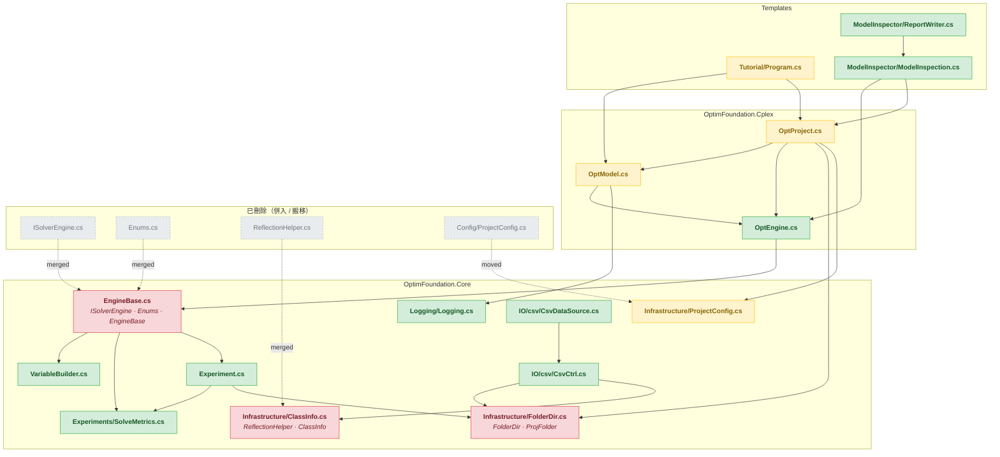

[TOC]

> **這不是 repo 的架構地圖**（那是 `CodeMap.md`）。本檔是 `/code-review` 單次審查用的 diff 地圖，review 結束即可刪除。

## 審查範圍

> ==Effort==: **medium**　|　==Base==: `HEAD`（working tree 未 commit 異動，branch `feat/CPLEX`）　|　==Changed files==: 33

本次異動主軸是**檔案與命名空間重組**：

| 動作 | 來源 | 去向 |
| --- | --- | --- |
| 併入 | `ISolverEngine.cs`（-126）、`Enums.cs`（-38） | `EngineBase.cs`（+173） |
| 併入 | `Infrastructure/ReflectionHelper.cs`（-87） | `Infrastructure/ClassInfo.cs`（+81） |
| 搬移 | `Config/ProjectConfig.cs`（-38） | `Infrastructure/ProjectConfig.cs`（+38） |
| 更名 | `FolderDir.PurgeOutputs` | `PurgeAllOutputs`（1 個呼叫點） |
| 更名 | `ProjFolder.GetFilePath` | `GetPathFile`（**33 個呼叫點**） |

其餘為 region 化、XML doc 改寫、移除 Gurobi 殘留。

## File Index

### 程式碼（26 檔）

| 檔案 | +行 | -行 | 關鍵 Symbol |
| --- | --- | --- | --- |
| `src/OptimFoundation.Core/EngineBase.cs` | +173 | -8 | `ISolverConfig`, `ITunableConfig`, `ISolverEngine`, `ISpecialConstraints`, `SolveStatus`, `VarType`, `ConstraintSense`, `ObjectiveSense`, `EngineBase<,,,>` |
| `src/OptimFoundation.Core/Infrastructure/ClassInfo.cs` | +81 | -0 | `ReflectionHelper`（由獨立檔併入）, `ClassInfo` |
| `src/OptimFoundation.Cplex/OptModel.cs` | +43 | -35 | `OptModel` |
| `src/OptimFoundation.Cplex/OptEngine.cs` | +7 | -6 | `OptEngine` |
| `src/OptimFoundation.Core/Infrastructure/FolderDir.cs` | +6 | -7 | `FolderDir`, `ProjFolder` |
| `src/OptimFoundation.Core/Experiment.cs` | +5 | -5 | `Experiment`, `ITrajectorySource` |
| `src/OptimFoundation.Generators/AutoSetsGenerator.cs` | +4 | -1 | `AutoSetsGenerator`, `OptSetAttribute`, `OptParamAttribute`, `OptVarAttribute`, `OptDimAttribute<T>` |
| `src/OptimFoundation.Core/IO/csv/CsvCtrl.cs` | +3 | -3 | `CsvCtrl` |
| `src/OptimFoundation.Core/VariableBuilder.cs` | +3 | -2 | `VariableBuilder` |
| `src/OptimFoundation.Cplex/OptProject.cs` | +3 | -1 | `OptProject` |
| `src/OptimFoundation.Core/DataValidator.cs` | +2 | -0 | `DataIssueKind`, `DataIssue`, `DataValidationException`, `DataValidator` |
| `src/OptimFoundation.Core/Logging/Logging.cs` | +2 | -2 | `Logging` |
| `src/OptimFoundation.Core/Experiments/SolveMetrics.cs` | +1 | -1 | `SolveMetrics`, `ConvergencePoint` |
| `src/OptimFoundation.Core/IO/csv/CsvDataSource.cs` | +1 | -1 | `CsvDataSource`, `CsvSolutionSink` |
| `src/OptimFoundation.Core/Infrastructure/ProjectConfig.cs` | +38 | -0 | `ProjectConfig`（untracked 新檔，與舊檔 byte-identical） |
| `src/OptimFoundation.Core/Config/ProjectConfig.cs` | +0 | -38 | **刪除 → Infrastructure/** |
| `src/OptimFoundation.Core/ISolverEngine.cs` | +0 | -126 | **刪除 → EngineBase.cs** |
| `src/OptimFoundation.Core/Infrastructure/ReflectionHelper.cs` | +0 | -87 | **刪除 → ClassInfo.cs** |
| `src/OptimFoundation.Core/Enums.cs` | +0 | -38 | **刪除 → EngineBase.cs** |
| `Templates/Tutorial/Program.cs` | +11 | -9 | `Program` |
| `Templates/ModelInspector/Reporting/ReportWriter.cs` | +5 | -5 | `ReportWriter` |
| `Templates/ModelInspector/Reporting/ModelInspection.cs` | +4 | -4 | `ModelInspection`, `ArtifactFile` |
| `tests/.../ExperimentIntegrationTests.cs` | +5 | -5 | `ExperimentIntegrationTests` |
| `tests/.../OptEngineIntegrationTests.cs` | +2 | -2 | `OptEngineIntegrationTests` |
| `tests/.../SolverParamCoverageTests.cs` | +2 | -2 | `SolverParamCoverageTests` |
| `tests/.../GeneratorNumericCoverageTests.cs` | +1 | -1 | `GeneratorNumericCoverageTests` 等 7 型別 |

### 文件（7 檔）

| 檔案 | +行 | -行 | 備註 |
| --- | --- | --- | --- |
| `CodeMap.md` | +43 | -32 | repo 架構地圖（**非本檔**） |
| `specs/2026-09-18-pool-single-source-and-naming-layer.md` | +256 | -0 | untracked 新 spec |
| `specs/2026-09-18-model-source-duality-and-profile.md` | +3 | -8 | in-flight spec |
| `CLAUDE.md` | +2 | -3 | 移除 Gurobi |
| `README.md` | +2 | -3 | |
| `Templates/ModelInspector/README.md` | +0 | -2 | |
| `docs/index.html` | +1 | -1 | |

## Dependency Graph

圖例：🔴 大幅改動或 breaking API　🟡 行為 / 文件異動　🟢 連帶調整　⬜ 已刪除

`FD`（FolderDir）是本次 blast radius 最大的節點 —— `EXP`、`CSV`、`OP` 直接依賴，而它的 `ProjFolder.GetFilePath` 被更名。

## Symbol Index

### `src/OptimFoundation.Core/EngineBase.cs`

| Symbol | 種類 | 行號 | 說明 |
| --- | --- | --- | --- |
| `ISolverConfig` | interface | L10 | 自 `ISolverEngine.cs` 併入；`ScaleWarnThreshold`(L21) 是**既有** default interface member，非本次新增 |
| `ITunableConfig` | interface | L29 | 併入 |
| `ISolverEngine` | interface | L58 | 併入 |
| `ISpecialConstraints<TVar,TExpr>` | interface | L86 | 併入 |
| `SolveStatus` | enum | L105 | 自 `Enums.cs` 併入 |
| `VarType` | enum | L130 | 併入 |
| `ConstraintSense` | enum | L143 | 併入 |
| `ObjectiveSense` | enum | L156 | 併入 |
| `EngineBase<TModel,TVar,TExpr,TConstr>` | abstract class | L174 | `PreSolveGuard`(L413) 量的是 `VariableCount` 而非 `RegisteredVariableCount` |

region 配置：`#region Interfaces and Enums`(L8-100) 內**只有 interface**；enum 在 `#region Enums`(L102-165)。

### `src/OptimFoundation.Core/Infrastructure/ClassInfo.cs`

| Symbol | 種類 | 行號 | 說明 |
| --- | --- | --- | --- |
| `ReflectionHelper` | static class | L11 | 由獨立檔併入；`OracleTypeMap`、`GetMemberNames`(L44)、`GetMemberTypes`(L53)、`GenerateSQLCols`(L67) |
| `ClassInfo` | class | L95 | `SetNames`/`PropertyTypes`/`SQLColsDefinition` 委派 `ReflectionHelper` |

### `src/OptimFoundation.Core/Infrastructure/FolderDir.cs`

| Symbol | 種類 | 行號 | 說明 |
| --- | --- | --- | --- |
| `FolderDir` | class | L10 | `PurgeOutputs` → `PurgeAllOutputs`(L37)，**public API 更名** |
| `ProjFolder` | nested class | L46 | `GetFilePath` → `GetPathFile`(L63)，**public API 更名** |

### 其餘 changed file 的 symbol

| 檔案 | Symbol（行號） |
| --- | --- |
| `Infrastructure/ProjectConfig.cs` | `ProjectConfig`(L10) |
| `DataValidator.cs` | `DataIssueKind`(L9), `DataIssue`(L11), `DataValidationException`(L21), `DataValidator`(L30) |
| `Experiment.cs` | `Experiment`(L13), `ITrajectorySource`(L131) |
| `Experiments/SolveMetrics.cs` | `SolveMetrics`(L9), `ConvergencePoint`(L87) |
| `IO/csv/CsvCtrl.cs` | `CsvCtrl`(L13) |
| `IO/csv/CsvDataSource.cs` | `CsvDataSource`(L13), `CsvSolutionSink`(L63) |
| `Logging/Logging.cs` | `Logging`(L13) |
| `VariableBuilder.cs` | `VariableBuilder`(L16) |
| `OptEngine.cs` | `OptEngine`(L20) |
| `OptModel.cs` | `OptModel`(L12) — 僅 region 重排 + doc 改寫，無行為變更 |
| `OptProject.cs` | `OptProject`(L9) |
| `AutoSetsGenerator.cs` | `AutoSetsGenerator`(L26), 4 個 attribute(L105/109/113/121) |
| `Tutorial/Program.cs` | `Program`(L10) — 新增死碼 `model2`(L48) |
| `ModelInspector/*.cs` | `ModelInspection`(L11), `ArtifactFile`(L128), `ReportWriter`(L8) |
| `tests/**` | 4 個 test class + 6 個 fixture 型別 |

## Review Scope Notes

!!! warning 高風險區域
    1. **兩個 public API 更名**：`PurgeOutputs`→`PurgeAllOutputs`、`GetFilePath`→`GetPathFile`。repo 內呼叫點全數改完，但外部消費端引用的是 checked-in DLL（`Templates/dlls/`、`AI Modeling - Claude Code/dlls/`），不會自動跟上。
    2. **`ClassInfo.cs` 的反射對位假設**：`GenerateSQLCols` 兩次獨立呼叫 `Type.GetMembers()`，依賴兩次順序一致。
    3. **`EngineBase.cs` 成為巨檔**：4 interface + 4 enum + 主體 class 同檔。
    4. **文件漂移**：CodeMap / 新 spec / workspace CLAUDE.md 各有引用已不存在的路徑。
    5. **`Tutorial/Program.cs:48` 的 `model2`** 是未使用宣告，且 `"Model.lp"` 不存在。

!!! info 略過範圍
    - 文件類僅列入 File Index，不進 correctness review
    - `bin/` `obj/` 產出物、`*.bundle`、`dlls/` 二進位
    - CRLF/LF 換行警告（`core.autocrlf` 設定議題）
