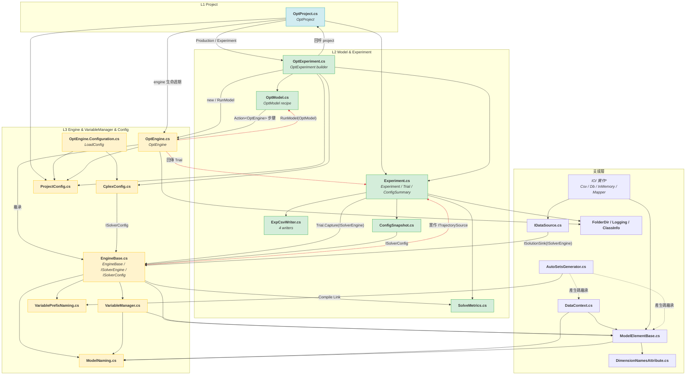

[TOC]

> **這不是 repo 的架構地圖**（那是 `CodeMap.md`）。本檔是 `/code-review` 單次審查用的地圖，review 結束即可刪除。

## 審查範圍

> ==Effort==: **high**　|　==Base==: `main`（HEAD `ea5af7d`，branch `feat/CPLEX`）　|　==Changed files==: 33（`src/` 的 `.cs`）

- `main...HEAD` 共 37 commits、445 檔（+25343 / −11726），`src/` 幾乎整個重寫，所以本次範圍 = **整個 framework 原始碼**（`src/` 33 個 `.cs`，約 10.4K 行）。
- 使用者指定焦點（effort 因此提到 high，才涵蓋 simplification）：
  1. 可再優化的部分
  2. 只用一次、沒有意義的 function → 直接寫在流程裡
  3. 解耦
  4. 依使用者的框架精神確認分層 **Project > Model & Experiment > Engine & VariableManager & Config** 方向是否正確
- 排除：`tests/`、`Templates/`、`specs/`、`*.csproj`、已刪除的舊檔（Gurobi、`DesignBases.cs` 等）。

!!! note 使用說明
    本檔為 Code Review 地圖，由 `/code-review` 自動產生。
    Phase 2 的所有 Review 評語都會引用本檔的 §section。

## File Index

分層依使用者的心智模型標註（L1 Project / L2 Model & Experiment / L3 Engine & VariableManager & Config / 支援層）。+/- 為 `git diff main...HEAD --numstat`；資料夾搬移的檔案 −0 表示舊路徑另計在刪除檔。

| 檔案 | +行 | -行 | 層 | 關鍵 Symbol |
| --- | --- | --- | --- | --- |
| `src/OptimFoundation.Cplex/OptProject.cs` | +130 | -0 | L1 | `OptProject`, `Production`, `Experiment`, `ReplaceEngine`, `NextRunId` |
| `src/OptimFoundation.Cplex/OptExperiment.cs` | +280 | -0 | L2 | `OptExperiment`, `AddProjectConfig`, `AddModel`, `AddSolverConfig`, `AddTrial`, `OnSolved`, `Run`, `RunCore` |
| `src/OptimFoundation.Cplex/OptModel.cs` | +180 | -94 | L2 | `OptModel`, `AddVariables<T>`, `AddObjective<T>`, `AddConstraints<T>`, `ReadModel`, `ReadSolution`, `AddMIPStart`, `ApplyTo` |
| `src/OptimFoundation.Core/Experiments/Experiment.cs` | +436 | -0 | L2 | `Experiment`, `ITrajectorySource`, `Trial`, `ConfigSummary`, `BaselineComparer` |
| `src/OptimFoundation.Core/Experiments/ExpCsvWriter.cs` | +493 | -0 | L2 | `CsvExperimentWriter`, `MetaCsvWriter`, `SummaryCsvWriter`, `TrajectoryCsvWriter`, `ExperimentCsv` |
| `src/OptimFoundation.Core/Experiments/SolveMetrics.cs` | +134 | -17 | L2 | `SolveMetrics`, `ConvergencePoint` |
| `src/OptimFoundation.Core/Experiments/ConfigSnapshot.cs` | +21 | -25 | L2 | `ConfigSnapshot.From` |
| `src/OptimFoundation.Core/EngineBase.cs` | +1268 | -214 | L3 | `ISolverConfig`, `ISolverEngine`, `ISpecialConstraints`, enums, `OptBounds`, `EngineBase<…>` |
| `src/OptimFoundation.Cplex/OptEngine.cs` | +603 | -495 | L3 | `OptEngine`, `RunModel`, `SolveCore`, `ReadModel`, `ExportModel`, `GetConflictConstraints`, `TrajectoryCallback`, `TeeWriter` |
| `src/OptimFoundation.Cplex/OptEngine.Configuration.cs` | +1181 | -0 | L3 | `OptEngine.LoadConfig`（partial） |
| `src/OptimFoundation.Cplex/CplexConfig.cs` | +1123 | -80 | L3 | `CplexConfig`, `Clone` |
| `src/OptimFoundation.Core/Infrastructure/ProjectConfig.cs` | +30 | -0 | L3 | `ProjectConfig`, `Clone`, `Quiet` |
| `src/OptimFoundation.Core/VariableManager.cs` | +254 | -0 | L3 | `VariableManager`, `ConvertSetsToTokens`, `ComposeNames`, `ValidateVariableDimensions` |
| `src/OptimFoundation.Core/VariablePrefixNaming.cs` | +48 | -0 | L3 | `VariablePrefixNaming.TryResolve`（Generators 以 `<Compile Link>` 共用） |
| `src/OptimFoundation.Core/ModelNaming.cs` | +227 | -0 | L3 | `ModelNaming`（`Token`, `Compose`, `ValidateComposedName`…） |
| `src/OptimFoundation.Core/DataContext.cs` | +365 | -0 | 支援·資料 | `DataValidator`, `OptData`, `DataContext`, `SetRegistration`, `ParamRegistration`, `ParameterLookupExtensions` |
| `src/OptimFoundation.Core/ModelElementBase.cs` | +131 | -0 | 支援·資料 | `ModelElementBase`, `SetRowBase`, `ParameterBase`, `VariableBase`, `ConstraintBase` |
| `src/OptimFoundation.Core/DimensionNamesAttribute.cs` | +17 | -0 | 支援·資料 | `DimensionNamesAttribute` |
| `src/OptimFoundation.Core/IO/IDataSource.cs` | +36 | -9 | 支援·IO | `IDataSource`, `ISolutionSink`, `ISolutionBatch` |
| `src/OptimFoundation.Core/IO/InMemoryDataSource.cs` | +48 | -20 | 支援·IO | `InMemoryDataSource` |
| `src/OptimFoundation.Core/IO/ModelRowMapper.cs` | +133 | -0 | 支援·IO | `ModelRowMapper`（internal） |
| `src/OptimFoundation.Core/IO/TabularData.cs` | +74 | -0 | 支援·IO | `TabularData`（internal） |
| `src/OptimFoundation.Core/IO/csv/CsvCtrl.cs` | +231 | -0 | 支援·IO | `CsvCtrl.ParseCsv`, `WriteSolution`, `WriteRows` |
| `src/OptimFoundation.Core/IO/csv/CsvDataSource.cs` | +101 | -0 | 支援·IO | `CsvDataSource`, `CsvSolutionSink` |
| `src/OptimFoundation.Core/IO/db/IDbCtrl.cs` | +12 | -3 | 支援·IO | `IDbCtrl` |
| `src/OptimFoundation.Core/IO/db/DbCtrlBase.cs` | +156 | -0 | 支援·IO | `DbCtrlBase`, `ExecuteInTransaction` |
| `src/OptimFoundation.Core/IO/db/DbDataSource.cs` | +58 | -0 | 支援·IO | `DbDataSource` |
| `src/OptimFoundation.Core/IO/db/OracleDbCtrl.cs` | +532 | -0 | 支援·IO | `OracleDbCtrl`, `OracleSolutionSink` |
| `src/OptimFoundation.Core/Infrastructure/ClassInfo.cs` | +111 | -5 | 支援·基礎 | `ReflectionHelper`, `ClassInfo` |
| `src/OptimFoundation.Core/Infrastructure/FolderDir.cs` | +63 | -28 | 支援·基礎 | `FolderDir`, `ProjFolder` |
| `src/OptimFoundation.Core/Infrastructure/Logging.cs` | +177 | -0 | 支援·基礎 | `Logging`（`Info/Warn/Error/ErrorOnce`…） |
| `src/OptimFoundation.Generators/AutoSetsGenerator.cs` | +450 | -154 | 支援·宣告 | `AutoSetsGenerator`, `OptSet/OptParam/OptVar/OptDim<T>` attributes |
| `src/OptimFoundation.Generators/IsExternalInit.cs` | +1 | -1 | 支援·宣告 | `IsExternalInit`（polyfill） |

## Dependency Graph

依實際程式碼引用（不含 XML 註解提及）。紅色虛線 = **向上依賴**（下層引用上層），是分層審查的重點。

```mermaid
flowchart TB
    subgraph L1["L1 Project"]
        PRJ["`**OptProject.cs**
        _OptProject_`"]
    end
    subgraph L2["L2 Model & Experiment"]
        EXPB["`**OptExperiment.cs**
        _OptExperiment builder_`"]
        MDL["`**OptModel.cs**
        _OptModel recipe_`"]
        EXP["`**Experiment.cs**
        _Experiment / Trial / ConfigSummary_`"]
        CSVW["`**ExpCsvWriter.cs**
        _4 writers_`"]
        MET["`**SolveMetrics.cs**`"]
        SNAP["`**ConfigSnapshot.cs**`"]
    end
    subgraph L3["L3 Engine & VariableManager & Config"]
        ENG["`**OptEngine.cs**
        _OptEngine_`"]
        ENGC["`**OptEngine.Configuration.cs**
        _LoadConfig_`"]
        BASE["`**EngineBase.cs**
        _EngineBase / ISolverEngine / ISolverConfig_`"]
        CCFG["`**CplexConfig.cs**`"]
        PCFG["`**ProjectConfig.cs**`"]
        VM["`**VariableManager.cs**`"]
        VPN["`**VariablePrefixNaming.cs**`"]
        NAM["`**ModelNaming.cs**`"]
    end
    subgraph SUP["支援層"]
        DC["`**DataContext.cs**`"]
        MEB["`**ModelElementBase.cs**`"]
        DNA["`**DimensionNamesAttribute.cs**`"]
        IDS["`**IDataSource.cs**`"]
        IOX["`**IO/* 實作**
        _Csv / Db / InMemory / Mapper_`"]
        INF["`**FolderDir / Logging / ClassInfo**`"]
        GEN["`**AutoSetsGenerator.cs**`"]
    end

    PRJ -->|"Production / Experiment"| EXPB
    PRJ -->|"engine 生命週期"| ENG
    PRJ --> EXP
    PRJ --> PCFG
    EXPB -->|"回呼 project"| PRJ
    EXPB --> MDL
    EXPB -->|"new / RunModel"| ENG
    EXPB --> CCFG
    EXPB --> PCFG
    EXPB --> EXP
    MDL -->|"Action&lt;OptEngine&gt; 步驟"| ENG
    EXP --> CSVW
    EXP --> SNAP
    EXP --> MET
    EXP -->|"Trial.Capture(ISolverEngine)"| BASE
    SNAP -->|"ISolverConfig"| BASE
    ENG -.->|"RunModel(OptModel)"| MDL
    ENG -.->|"回傳 Trial"| EXP
    BASE -.->|"實作 ITrajectorySource"| EXP
    BASE --> MET
    ENG -->|"繼承"| BASE
    ENGC --> CCFG
    ENGC --> PCFG
    ENG --> PCFG
    CCFG -->|"ISolverConfig"| BASE
    BASE --> VM
    BASE --> VPN
    BASE --> NAM
    BASE --> MEB
    VM --> NAM
    VM --> MEB
    DC --> MEB
    DC --> NAM
    MEB --> NAM
    MEB --> DNA
    IDS -->|"ISolutionSink(ISolverEngine)"| BASE
    IOX --> IDS
    IOX --> MEB
    GEN -->|"Compile Link"| VPN
    GEN -.->|"產生碼繼承"| DC
    GEN -.->|"產生碼繼承"| MEB
    ENG --> INF
    EXP --> INF

    linkStyle 16,17,18 stroke:#dc3545,stroke-width:2px

    style PRJ fill:#d1ecf1,stroke:#17a2b8
    style EXPB fill:#d4edda,stroke:#28a745
    style MDL fill:#d4edda,stroke:#28a745
    style EXP fill:#d4edda,stroke:#28a745
    style CSVW fill:#d4edda,stroke:#28a745
    style MET fill:#d4edda,stroke:#28a745
    style SNAP fill:#d4edda,stroke:#28a745
    style ENG fill:#fff3cd,stroke:#ffc107
    style ENGC fill:#fff3cd,stroke:#ffc107
    style BASE fill:#fff3cd,stroke:#ffc107
    style CCFG fill:#fff3cd,stroke:#ffc107
    style PCFG fill:#fff3cd,stroke:#ffc107
    style VM fill:#fff3cd,stroke:#ffc107
    style VPN fill:#fff3cd,stroke:#ffc107
    style NAM fill:#fff3cd,stroke:#ffc107
```

## Symbol Index

只列第一層 public / internal symbol 與入口方法；多載合併成一列。

### `src/OptimFoundation.Cplex/OptProject.cs`

| Symbol | 種類 | 行號 | 說明 |
| --- | --- | --- | --- |
| `OptProject` | class : IDisposable | L14 | 專案入口；log、輸出資料夾、保留期 |
| `OptProject(name, retentionDays)` | ctor | L19 | |
| `ReplaceEngine` | internal method | L73 | OptExperiment 換 engine 用 |
| `Dispose` | method | L82 | |
| `Production` | method | L95 | 回傳 1×1 的 `OptExperiment` |
| `Experiment` | method | L105 | 回傳 m×n 的 `OptExperiment` |
| `NextRunId` | internal static | L117 | |

### `src/OptimFoundation.Cplex/OptExperiment.cs`

| Symbol | 種類 | 行號 | 說明 |
| --- | --- | --- | --- |
| `OptExperiment` | sealed class | L16 | Production / Experiment 共用 builder |
| `OptExperiment(project, name, description, isProduction)` | internal ctor | L32 | |
| `AddProjectConfig` | method | L66 | |
| `CaptureTrajectory` | method | L83 | |
| `BeforeSolve` / `OnSolved` | method | L90 / L97 | callback 注入 |
| `AddModel` / `AddSolverConfig` / `AddTrial` | method | L104 / L115 / L131 | |
| `Run` → `RunCore` | method / private | L147 / L161 | |
| `SaveCompleted` | private | L258 | |
| `ValidateLabel` | private static | L272 | |

### `src/OptimFoundation.Cplex/OptModel.cs`

| Symbol | 種類 | 行號 | 說明 |
| --- | --- | --- | --- |
| `OptModel` | sealed class | L15 | 四組 `List<Action<OptEngine>>` 步驟 |
| `AddVariables` / `AddVariables<T>` | method | L34 / L46 | |
| `AddObjective` / `AddObjective<T>` | method | L50 / L86 | 泛型版反射建構 |
| `AddConstraints` / `AddConstraints<T>` | method | L59 / L93 | 泛型版反射建構 |
| `ModelSummary` | method | L73 | |
| `CreateBuildStep` / `TypeName` | private | L97 / L129 | |
| `ReadModel` | public static | L151 | |
| `ReadSolution` / `AddMIPStart` | method | L177 / L194 | |
| `ApplyTo` | internal | L208 | 把步驟套到 engine |

### `src/OptimFoundation.Core/Experiments/Experiment.cs`

| Symbol | 種類 | 行號 | 說明 |
| --- | --- | --- | --- |
| `Experiment` | class | L12 | `AddTrial` L63、`Save` L76、`SaveCore` L98、`PathOf` L125 |
| `ITrajectorySource` | interface | L131 | **EngineBase 實作它** |
| `Trial` | sealed class | L146 | `Capture` L179 / `CaptureCore` L202 |
| `ConfigSummary` | sealed class | L230 | `From` L287、`Summarize` L305 |
| `BaselineComparison` | internal enum | L342 | |
| `BaselineComparer` | internal static | L371 | `CompareAll` L374、`Compare` L404 |

### `src/OptimFoundation.Core/Experiments/ExpCsvWriter.cs`

| Symbol | 種類 | 行號 | 說明 |
| --- | --- | --- | --- |
| `CsvExperimentWriter` | sealed class | L14 | `Write` L58；多個 internal static helper（`FindBaselineIn`、`ConfigChanges`、`Num`、`SeedOf`、`ComparisonText`、`Cell`） |
| `MetaCsvWriter` | sealed class | L222 | `Write` L231、`RowsOf` L242 |
| `SummaryCsvWriter` | sealed class | L315 | `Write` L329 |
| `TrajectoryCsvWriter` | sealed class | L373 | `Write` L388 |
| `ExperimentCsv` | internal static | L441 | `Write` L445、`Delete` L469、`StampedPath` L483 |

### `src/OptimFoundation.Core/Experiments/SolveMetrics.cs`

| Symbol | 種類 | 行號 | 說明 |
| --- | --- | --- | --- |
| `SolveMetrics` | sealed class | L8 | |
| `ConvergencePoint` | sealed class | L136 | |

### `src/OptimFoundation.Core/Experiments/ConfigSnapshot.cs`

| Symbol | 種類 | 行號 | 說明 |
| --- | --- | --- | --- |
| `ConfigSnapshot` | sealed class | L9 | `From` L23（reflection 走訪 `ISolverConfig`）、`Put` L51 |

### `src/OptimFoundation.Core/EngineBase.cs`

| Symbol | 種類 | 行號 | 說明 |
| --- | --- | --- | --- |
| `ISolverConfig` | interface | L12 | |
| `ISolverEngine` | interface | L50 | |
| `ISpecialConstraints<TVar,TExpr>` | interface | L88 | |
| `SolveStatus` / `VarType` / `ConstraintSense` / `ObjectiveSense` / `ModelType` | enum | L107–L168 | |
| `OptBounds` | static class | L186 | |
| `EngineBase<TModel,TVar,TExpr,TConstr>` | abstract class | L196 | `ISolverEngine, ITrajectorySource` |
| `Build` / `Solve` | method | L388 / L405 | 公開邊界；`SolveCore` 為 abstract L435 |
| `BuildCVs` / `BuildIVs` / `BuildBVs` / `BuildVars`（泛型 + 字串多載） | virtual method | L569–L662 | |
| `GetAllVarNames` / `GetSetVarNames` / `GetSetVarValues` / `GetSolution` | method | L724–L755 | |
| `AddMIPStart` | method | L785 | |
| 建立統計（`RecordVariableBuild`、`RecordImportedModel`、`RecordDirect*`、`LogBuildSummary`、`WarnUnreferencedVariables`…） | private / protected | L872–L1018 | |
| `ClearPool` / `AddLHS` / `AddRHS` | method | L1035 / L1078–L1139 | expression pool |
| `CreateGreaterEqual` / `CreateLessEqual` / `CreateEqual` / `CreateRange` | method（多載） | L1173–L1260 | → `CreateLinearConstraint` L1268 / `CreateRangeCore` L1309 |
| `CreateMinimize` / `CreateMaximize` | method | L1359 / L1362 | → `SetObjectiveFromPool` L1364 |
| `Create*Soft`（LessEqual / GreaterEqual / Equal） | virtual method | L1432–L1463 | → `BuildSoft` L1468 |

### `src/OptimFoundation.Cplex/OptEngine.cs`

| Symbol | 種類 | 行號 | 說明 |
| --- | --- | --- | --- |
| `OptEngine` | partial class : EngineBase | L18 | 4 個 ctor L53–L65 |
| `RunModel(OptModel, …)` → `Trial` | internal method | L93 | **Engine 引用 Model 與 Trial** |
| `EnableTrajectory` / `TrajectoryCallback` | override / nested | L136 / L142 | |
| `SetModelName` / `ExportModel` / `ReadModel` / `ReadSolution` / `ExportSolution` | method | L189–L458 | |
| solver primitives（`AddVariable`、`LinearExpr`、`AddConstraint`…） | protected override | L502–L624 | |
| `BuildCore` / `SolveCore` | protected override | L642 / L649 | |
| `ReadRandomSeed` / `ReadBoundAndGap` / `FlushSolverLog` | private | L748–L782 | |
| `CreateVar` / `Expr` / `AddLE/GE/EQ` / `Minimize` / `Maximize` | protected | L844–L872 | 直接 CPLEX API |
| `ResetConstraint` / `Create*Thread` / `ResetThreadConstraint` | method | L894–L967 | |
| `CopyModel` / `MergeModel` / `MergeVariables` | method | L991–L1032 | |
| `RunConflictAnalysis` / `GetConflictConstraints` | private / public | L1042 / L1083 | |
| `GetCVSolution` / `GetIVSolution` / `GetBVSolution` | method | L1107–L1113 | → `GetSolutionByType` L1097 |
| `TeeWriter` | nested class | L1122 | |

### `src/OptimFoundation.Cplex/OptEngine.Configuration.cs`

| Symbol | 種類 | 行號 | 說明 |
| --- | --- | --- | --- |
| `OptEngine.LoadConfig` | public override | L26 | 1181 行的 partial；把 `CplexConfig` 逐項套到 CPLEX |

### `src/OptimFoundation.Cplex/CplexConfig.cs`

| Symbol | 種類 | 行號 | 說明 |
| --- | --- | --- | --- |
| `CplexConfig` | sealed class : ISolverConfig | L11 | 1139 行，大量 property |
| `Clone` | method | L14 | |

### `src/OptimFoundation.Core/Infrastructure/ProjectConfig.cs`

| Symbol | 種類 | 行號 | 說明 |
| --- | --- | --- | --- |
| `ProjectConfig` | sealed class | L7 | `Clone` L10、`Quiet` L13 |

### `src/OptimFoundation.Core/VariableManager.cs`

| Symbol | 種類 | 行號 | 說明 |
| --- | --- | --- | --- |
| `VariableManager` | static class | L11 | |
| `ValidateVariableDimensions<T>` | internal static | L113 | |
| `ConvertSetsToTokens` | public static | L186 | |
| `ComposeNames` | public static | L247 | |
| `CombineRows` / `ConvertSetsToRows` / `GetValueTupleElementType` / `GetDimensionTypes` / `FlattenTupleTypes` / `GetEnumElementType` | private static | L14–L232 | |

### `src/OptimFoundation.Core/VariablePrefixNaming.cs`

| Symbol | 種類 | 行號 | 說明 |
| --- | --- | --- | --- |
| `VariablePrefixNaming.TryResolve` | internal static | L17 | Core 與 Generators 共用原始檔 |

### `src/OptimFoundation.Core/ModelNaming.cs`

| Symbol | 種類 | 行號 | 說明 |
| --- | --- | --- | --- |
| `ModelNaming` | internal static | L14 | `Token` L33、`TryToken` L44、`FormatDate` L86、`Compose` L110、`ValidateComposedName` L149、`ValidateToken` L180、`DisplayValue` L207 |

### `src/OptimFoundation.Core/DataContext.cs`

| Symbol | 種類 | 行號 | 說明 |
| --- | --- | --- | --- |
| `DataIssueKind` / `DataIssue` | enum / class | L14 / L27 | |
| `DataValidator` | static class | L44 | `Validate` L50 / L66 |
| `OptData.Load<T>` | static | L137 | |
| `ParamRow` / `SetRegistration` / `ParamRegistration` | class | L165 / L182 / L203 | generator 註冊 DTO |
| `DataContext` | abstract class | L224 | `RegisterSet` L234、`RegisterParam` L248、`Initialize` L265、`Freeze` L271 |
| `ParameterLookupExtensions.FindParameterOrLog<T>` | extension | L314 | |

### `src/OptimFoundation.Core/ModelElementBase.cs`

| Symbol | 種類 | 行號 | 說明 |
| --- | --- | --- | --- |
| `ModelElementBase` | abstract class | L10 | `GetDimensions` L17、`GetColumns` L32、`InitClassBySets` L50、`InitFromDataRow` L53 |
| `SetRowBase` / `ParameterBase` / `VariableBase` / `ConstraintBase` | abstract class | L112–L126 | |

### `src/OptimFoundation.Core/DimensionNamesAttribute.cs`

| Symbol | 種類 | 行號 | 說明 |
| --- | --- | --- | --- |
| `DimensionNamesAttribute` | sealed attribute | L10 | |

### `src/OptimFoundation.Core/IO/IDataSource.cs`

| Symbol | 種類 | 行號 | 說明 |
| --- | --- | --- | --- |
| `IDataSource` | interface | L10 | |
| `ISolutionSink` | interface | L36 | `WriteSolution<T>(ISolverEngine…)` |
| `ISolutionBatch` | interface | L46 | |

### `src/OptimFoundation.Core/IO/InMemoryDataSource.cs`

| Symbol | 種類 | 行號 | 說明 |
| --- | --- | --- | --- |
| `InMemoryDataSource` | sealed class | L11 | `AddRows` L38、`LoadData` L68 |

### `src/OptimFoundation.Core/IO/ModelRowMapper.cs`

| Symbol | 種類 | 行號 | 說明 |
| --- | --- | --- | --- |
| `ModelRowMapper` | internal static | L12 | `MapTable` L14、`MapRows` L19、`ConvertCells` L72、`ConvertCell` L96 |

### `src/OptimFoundation.Core/IO/TabularData.cs`

| Symbol | 種類 | 行號 | 說明 |
| --- | --- | --- | --- |
| `TabularData` | internal static | L11 | `ToDataTable` L13、`ToRecords` L56 |

### `src/OptimFoundation.Core/IO/csv/CsvCtrl.cs`

| Symbol | 種類 | 行號 | 說明 |
| --- | --- | --- | --- |
| `CsvCtrl` | static class | L13 | `ParseCsv` L24、`WriteSolution<T>` L119、`WriteRows<T>` L159 |

### `src/OptimFoundation.Core/IO/csv/CsvDataSource.cs`

| Symbol | 種類 | 行號 | 說明 |
| --- | --- | --- | --- |
| `CsvDataSource` | sealed class | L12 | `LoadData` L33 |
| `CsvSolutionSink` | sealed class | L60 | `WriteSolution` L63、`BeginBatch` L69 |

### `src/OptimFoundation.Core/IO/db/IDbCtrl.cs`

| Symbol | 種類 | 行號 | 說明 |
| --- | --- | --- | --- |
| `IDbCtrl` | interface | L11 | |

### `src/OptimFoundation.Core/IO/db/DbCtrlBase.cs`

| Symbol | 種類 | 行號 | 說明 |
| --- | --- | --- | --- |
| `DbCtrlBase` | abstract class | L10 | `ExecuteInTransaction` L53 |

### `src/OptimFoundation.Core/IO/db/DbDataSource.cs`

| Symbol | 種類 | 行號 | 說明 |
| --- | --- | --- | --- |
| `DbDataSource` | sealed class | L12 | `Load<T>` L25、`LoadData` L36 / L40 |

### `src/OptimFoundation.Core/IO/db/OracleDbCtrl.cs`

| Symbol | 種類 | 行號 | 說明 |
| --- | --- | --- | --- |
| `OracleDbCtrl` | sealed class : DbCtrlBase | L15 | table 管理（`CreateParamTable`、`CreateResultTable`、`DropTable`…）、`SaveToDB<T>` L268、`ExecuteBatch` L317 |
| `OracleSolutionSink` | sealed class | L398 | `WriteSolution` L418、`BeginBatch` L433 |

### `src/OptimFoundation.Core/Infrastructure/ClassInfo.cs`

| Symbol | 種類 | 行號 | 說明 |
| --- | --- | --- | --- |
| `ReflectionHelper` | static class | L11 | `GetMemberNames`、`GetMemberTypes`、`GenerateSQLCols` |
| `ClassInfo` | class | L81 | `VarInsertCmd`、`ParamInsertCmd`、`VarTableCreateCmd`、`ParamTableCreateCmd` |

### `src/OptimFoundation.Core/Infrastructure/FolderDir.cs`

| Symbol | 種類 | 行號 | 說明 |
| --- | --- | --- | --- |
| `FolderDir` | class | L9 | `CreateAll` L41、`PurgeAllOutputs` L47 |
| `ProjFolder` | class | L56 | `GetPath`、`GetPathFile`、`CreateFolder`、`TryCreateFile`、`PurgeOlderThan` |

### `src/OptimFoundation.Core/Infrastructure/Logging.cs`

| Symbol | 種類 | 行號 | 說明 |
| --- | --- | --- | --- |
| `Logging` | static class | L12 | `Info/Debug/Warn/Error` L57–L66、`ErrorOnce<T>` L79、`SetLogFileName` L140、`WriteToFile` L156、`ClearLogs` L166 |

### `src/OptimFoundation.Generators/AutoSetsGenerator.cs`

| Symbol | 種類 | 行號 | 說明 |
| --- | --- | --- | --- |
| `AutoSetsGenerator` | IIncrementalGenerator | L18 | `Initialize` L137、`ExtractVar/Param/Set/DataContext` L169–L216、`ResolveDims` L415、`Emit` L486、`EmitDataContextRegister` L355 |
| `OptSetAttribute` / `OptParamAttribute` / `OptVarAttribute` / `OptDimAttribute<T>` | attribute | L107–L123 | namespace `OptimFoundation.Modeling` |
| `PropSpec` / `EmitModel` / `DimensionNameIssue` / `SetReg` / `ParamReg` / `DataContextEmitModel` | private record | L567–L579 | |

### `src/OptimFoundation.Generators/IsExternalInit.cs`

| Symbol | 種類 | 行號 | 說明 |
| --- | --- | --- | --- |
| `IsExternalInit` | internal static | L4 | netstandard2.0 polyfill |

## Review Scope Notes

!!! warning 高風險區域
    - **向上依賴**：`OptEngine.RunModel(OptModel, …)` 回傳 `Trial`（`OptEngine.cs:93`）——L3 Engine 認得 L2 的 Model 與 Experiment；`EngineBase` 實作定義在 `Experiments/Experiment.cs` 的 `ITrajectorySource`。
    - **雙向依賴**：`OptProject` ↔ `OptExperiment`（`ReplaceEngine` internal 回呼）。
    - **超大檔**：`EngineBase.cs` 1563 行（介面 + enum + 基底類別 + 建立統計 + expression pool + soft constraint 全在一檔）、`OptEngine.Configuration.cs` 1181、`CplexConfig.cs` 1139、`OptEngine.cs` 1168。
    - **IO 依賴 Engine**：`ISolutionSink` / `CsvCtrl.WriteSolution` / `OracleDbCtrl.SaveToDB` 直接吃 `ISolverEngine`。
    - **Generators 以 `<Compile Link>` 共用 `VariablePrefixNaming.cs`**，改這檔會同時影響兩個 assembly。
    - Core 內 `Logging` 為 static 全域狀態，`OptEngine.Configuration.cs` 有 186 處呼叫。

!!! info 略過範圍
    `tests/`、`Templates/`、`specs/`、`*.csproj`、`obj/` generated code、已刪除檔（Gurobi adapter、舊 `DesignBases.cs` / `Enums.cs` / `ISolverEngine.cs` 等）。
