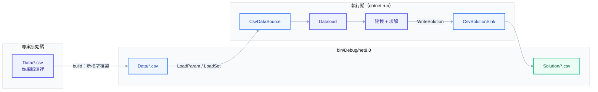

# Tutorial — 權威教學範本（未來開發照這個模式寫）

題目：家具廠**多期多班次生產規劃**（多產品、多機器、多生產日、每日兩班）。
刻意涵蓋框架**所有建模元素**（見 `Model/Tutorial_Model.md`）：
- **Set 三種元素型別**：string（Product/Machine）、DateTime（Date）、int（Shift）
- **Param 多維**：1D（UnitProfit…）、2D（MachineHours/Demand）、3D（Capacity）
- **Var 三種型別皆建立且使用**：`X_`continuous（Produce）、`B_`binary（Setup）、`I_`integer（Batch）
- **限制式四種**：`≤`（Capacity/SetupLink）、`≥`（Demand）、`=`（BatchDef）、soft 放鬆（SetupBudgetSoft）

同時展示：**模組化開發模式**、**資料讀取與輸出**（IDataSource / ISolutionSink）、**實驗框架**（Experiment/Trial）。

## 快速開始

```powershell
dotnet build
dotnet run                   # CSV 來源：solve → 讀解印計畫 → 解寫回 Solution/*.csv
dotnet run -- inmemory       # 記憶體來源：換來源只換 IDataSource，模型 code 零改動
dotnet run -- experiment     # 三組 emphasis 對照 → Experiments/*.csv / .json / -trajectory.csv
```

預期解：Optimal，objective = 500（毛利 − 開線成本 − soft penalty）。日班(shift 1)產能高、夜班(shift 2)低,Shift 維度實質影響排產；需滿足 3 產品 × 2 日需求 → 開線數 > SetupBudget(4),soft penalty 併入目標——放鬆約束實際咬合。

## 開發模式（三階段，順序不可倒）

1. **Model Design**：先寫 `Model/Tutorial_Model.md`（五段：SET/PARAM/VAR/CONSTRAINT/OBJ，LaTeX + pattern tag）。模型確認前 NEVER 寫 `.cs`。
2. **Foundation Coding**：照下方模組地圖逐條「機械轉譯」Model.md——NEVER 移項/改號/翻轉方向，Constraint/Objective 內 NEVER 出現裸數字。
3. **Foundation Tuning**（需要才做）：`experiment` 模式掃 solver 設定，Trial 紀錄自動累積。

## 模組地圖（一個概念 = 一個檔案）

```text
Tutorial/
├── Model/Tutorial_Model.md   # Phase 1 產物：數學模型（程式是它的翻譯，它才是真相）
├── Model/TutorialModel.cs    # ★ 模型積木：把 變數+目標式+限制式 組成一顆，plug 進 OptModel（solve/experiment 共用）
├── SetClass/Sets.cs          # [OptSet<T>] 積木：一顆 = 一個索引集合
├── ParameterClass/*.cs       # [OptParam]+[OptDim]：一個參數 = 一檔，值在 QTY
├── VariableClass/*.cs        # [OptVar]+[OptDim] 變數積木：前綴 load-bearing（B_=binary X_=continuous I_=integer）
├── Constraint/Constraint_*.cs       # 限制式子積木：一條（組）= 一檔，對照 Model.md 逐條可驗
├── Constraint/ObjectiveFunction.cs  # 目標式子積木
├── Data/Dataload.cs          # 顯式 ctor：逐行讀檔的家（見下）
├── Data/*.csv                # 輸入：Set_{名}.csv（無表頭）+ Parameter_{型別名}.csv（帶表頭）
├── ExperimentRunner.cs       # Phase 3：多組設定對照
└── Program.cs                # 唯一進入點（三模式）
```

> **模型積木**：`Model/TutorialModel.cs` 把整個模型包成一顆——變數/目標式/限制式仍是各自的子積木，本類只負責組裝順序（soft MUST 在 objective 之後）。Program 只要 `new TutorialModel(data)` 再交給 `OptModel`：`.AddVariables(m.CreateVariables).AddModel(m.CreateModel)`；experiment 用 `m.Build(engine)` 一次組全。

## CSV 資料流向

你只編輯**專案原始碼的 `Data/*.csv`**；build 把它複製到輸出目錄，執行期由 `CsvDataSource` 讀進 `Dataload`，解再寫回輸出的 `Solution/`。



三段規則：

1. **輸入命名**（`Data/`）：set 檔 = `Set_{名}.csv`（一行一成員、無表頭）；參數檔 = `Parameter_{型別名}.csv`（帶表頭，欄名對 class 的 property，缺欄即 fail）。
2. **複製規則**（csproj `<None Update="Data\*.csv" CopyToOutputDirectory="PreserveNewest">`）：**build 時**逐檔比時間戳——bin 缺、或原始碼較新才複製；刪掉原始碼的檔，`IncrementalClean` 下次 build 會從 bin 清掉。`dotnet run --no-build` **不 build = 不複製**，會讀到舊資料。
3. **執行期位址**（框架 `IO/FolderDir`）：讀 `<執行檔目錄>/Data/`、寫 `<執行檔目錄>/Solution/`。build 保留 `Data/` 子資料夾、框架約定讀同名 `Data/`，兩邊在資料夾名 **`Data`** 對上。

> 純換數值：改 `Data/*.csv` → **重 build**（用 `dotnet run`，別加 `--no-build`）→ 生效，模型與 code 一行不動。

## 資料讀取（顯式 ctor = 寫讀檔的家）

`Dataload(IDataSource source)` **每行一句**，一眼看得出每個 set / parameter 從哪來。慣例走預設：

- Set：`PRODUCT.Load(source, "Set_Product")` → set 名用檔名形式 `Set_{X}`（= 磁碟 `Set_Product.csv`），CSV/InMemory 統一對位（CSV 讀檔 / InMemory 當 key，見框架 `IO/SetNaming`）；省略名字走類名慣例
- Parameter（CSV / InMemory）：`source.LoadParam<Parameter_X>("Parameter_X")` → CSV 讀 `Data/Parameter_X.csv`（表頭按名對位）

**就地覆寫「吃哪個檔 / Query 哪段 SQL」**：

| 需求 | 寫法 |
|---|---|
| set 檔 / 邏輯名 ≠ 類名 | `PRODUCT.Load(source, "Set_OldProducts")` |
| CSV 參數檔 ≠ 型別名 | `source.LoadParam<Parameter_Capacity>("Parameter_Legacy")` |
| **DB 參數（唯一途徑）** | `db.LoadParam<Parameter_X>("SELECT ... WHERE data_id=:id", (":id","V1"))` |
| DB set | `PRODUCT.LoadFrom(db.LoadSet("SELECT DISTINCT ..."))` |
| inline 小集合 / 程式生成 | `PRODUCT.LoadInline("A","B")` / `LoadFrom(seq)` 直接寫在 ctor |

換來源（CSV↔InMemory）= 換傳入的 `IDataSource`，模型 code 全不動。**DB 不套這條**——DB 一律明寫 SQL（見下），故用型別化 `DbDataSource` 的專屬 ctor。

### 混合來源（DB + CSV 同時用）

`IDataSource` 是**逐次呼叫**的，所以「維度小表放 CSV、主檔數值放 Oracle」只要手上握兩個 source、每行自己點名——零特殊機制。這正是**顯式 ctor 的回報**：反射自動載入假設「單一 source」，混用會很彆扭；顯式版每行各自決定來源。

範本示範用 ctor overload `Dataload(CsvDataSource csv, DbDataSource db)`：

```csharp
PRODUCT.Load(csv, "Set_Product");                              // 維度表走 CSV
parameter_MachineHours = csv.LoadParam<Parameter_MachineHours>("Parameter_MachineHours");

// 主檔走 DB——DB 只有一條路：明寫 Query SQL（不猜表名）。欄名不符用 AS 別名對到 property。
parameter_UnitProfit = db.LoadParam<Parameter_UnitProfit>(
    "SELECT product, unit_profit AS qty FROM product_master WHERE data_id = :id", (":id", "V1"));
parameter_Capacity = db.LoadParam<Parameter_Capacity>(
    "SELECT machine, qty FROM capacity WHERE data_id = :id", (":id", "V1"));
```

> **DB 為何只給 SQL**：`SELECT * FROM 表` 的「猜表名」對真實 DB 太受限——join、條件、投影、`WHERE data_id` 都做不到。故 `DbDataSource` 是 query-only、**不實作 `IDataSource`**（第一引數是 SQL 而非名稱），但與 CSV/InMemory 共用 `LoadParam`/`LoadSet` 命名。
> 這個 ctor 純示範佈線；SQL 段假設可跑（要實跑得接真的 Oracle `IDbCtrl`），故不列入下方可跑模式。

## 解輸出

- `Dataload.WriteSolution(engine)`：印生產計畫（示範讀解 API：`GetSetVarValues<T>()` 批量取解、`GetObjectiveValue()`）
- `CsvSolutionSink.WriteSolution<T>(engine)` → `Solution/{變數型別}.csv`（帶表頭，round-trip 可讀回）；換 DB 輸出改 `OracleSolutionSink`

## 常犯錯誤（good/bad）

```csharp
// ✅ 係數先 LINQ 存變數再傳入；數值一律來自 Parameter
var cap = _capacity.First(c => c.Machine == machine).QTY;
_engine.AddRHS(cap);

// ❌ 裸數字進模型（禁止 Hardcode 天條）
_engine.AddRHS(40.0);

// ✅ Big-M 由數據推導（本題 M_p = MaxDemand_p）
// ❌ M = 99999 寫死
```
