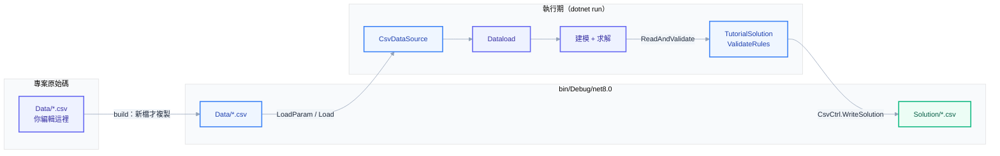

# Tutorial — 權威教學範本（未來開發照這個模式寫）

題目：家具廠**多期多班次生產規劃**（多產品、多機器、多生產日、每日兩班）。
刻意涵蓋框架**所有建模元素**（見 `Model/Tutorial_Model.md`）：
- **Set 三種元素型別**：string（Product/Machine）、DateTime（Date）、int（Shift）
- **Param 多維**：1D（UnitProfit…）、2D（MachineHours/Demand）、3D（Capacity）
- **Var 三種型別皆建立且使用**：`X_`continuous（Produce）、`B_`binary（Setup）、`I_`integer（Batch）
- **限制式三種**：`≤`（Capacity/SetupLink）、`≥`（Demand）、`=`（BatchDef）

同時展示：**`Program.cs` 單一組裝點**、**資料讀取與解驗證**（`IDataSource` + `ValidateRules`）、**實驗框架**（Experiment/Trial）。

## 快速開始

```powershell
dotnet build
dotnet run              # 正式求解：solve → ValidateRules → 解寫回 Solution/*.csv
dotnet run -- exp        # 三組 emphasis 對照 → Experiments/*.csv / .json
```

預期解：`Optimal`，objective = 510（毛利 − 開線成本）。日班(shift 1)產能高、夜班(shift 2)低，Shift 維度實質影響排產；需滿足 3 產品 × 2 日需求。求解後 `ValidateRules` 逐條把解代回 Capacity/Demand/BatchDef/SetupLink 四條限制式驗證，任一條不成立就丟例外。

## 開發模式（三階段，順序不可倒）

1. **Model Design**：先寫 `Model/Tutorial_Model.md`（五段：SET/PARAM/VAR/CONSTRAINT/OBJ，LaTeX + pattern tag）。模型確認前 NEVER 寫 `.cs`。
2. **Foundation Coding**：照下方模組地圖逐條「機械轉譯」Model.md——NEVER 移項/改號/翻轉方向，Constraint/Objective 內 NEVER 出現裸數字。
3. **Foundation Tuning**（需要才做）：`exp` 模式掃 solver 設定，Trial 紀錄自動累積。

## 模組地圖（一個概念 = 一個檔案）

```text
Tutorial/
├── Model/Tutorial_Model.md        # Phase 1 產物：數學模型（程式是它的翻譯，它才是真相）——Model/ 只放文件
├── Set/Set_*.cs                    # [OptSet<T>] 積木：一顆 = 一個索引集合，一顆一檔
├── Parameter/Parameter_*.cs        # [OptParam]+[OptDim]：一個參數 = 一檔，值在 QTY
├── Variable/Variable[B|X|I]_*.cs   # [OptVar]+[OptDim] 變數積木：前綴 load-bearing（B_=binary X_=continuous I_=integer）
├── Objective/ObjectiveFunction.cs  # 目標式子積木：建構子收資料依賴，engine 只從 Build(OptEngine) 傳入
├── Constraint/Constraint_*.cs      # 限制式子積木：一條 = 一檔，對照 Model.md 逐條可驗，engine 只從 Build(OptEngine) 傳入
├── Data/Dataload.cs                # 顯式 ctor：逐行讀檔的家（見下）
├── Data/*.csv                      # 輸入：Set_{名}.csv（無表頭）+ Parameter_{型別名}.csv（帶表頭）
├── Solution/TutorialSolution.cs    # 讀解 + ValidateRules 逐條代回驗證 + 印出 + 寫回 Solution/*.csv
└── Program.cs                      # 唯一組裝點（材料 → 模型 → 環境三段，三態 CLI）
```

> **唯一組裝點**：`Program.cs` 一條 `OptModel` fluent chain 讀完整個模型——每種變數一行 `.AddVariables(...)`、目標式一行 `.AddObjective(...)`、每條限制式一行 `.AddConstraints(...)`，NEVER 用轉呼叫的 helper/class 包裝組裝順序。

## CSV 資料流向

你只編輯**專案原始碼的 `Data/*.csv`**；build 把它複製到輸出目錄，執行期由 `CsvDataSource` 讀進 `Dataload`，解再寫回輸出的 `Solution/`。



三段規則：

1. **輸入命名**（`Data/`）：set 檔 = `Set_{名}.csv`（一行一成員、無表頭）；參數檔 = `Parameter_{型別名}.csv`（帶表頭，欄名對 class 的 property，缺欄即 fail）。
2. **複製規則**（csproj `<None Update="Data\*.csv" CopyToOutputDirectory="PreserveNewest">`）：**build 時**逐檔比時間戳——bin 缺、或原始碼較新才複製；刪掉原始碼的檔，`IncrementalClean` 下次 build 會從 bin 清掉。`dotnet run --no-build` **不 build = 不複製**，會讀到舊資料。
3. **執行期位址**（框架 `IO/FolderDir`）：讀 `<執行檔目錄>/Data/`、寫 `<執行檔目錄>/Solution/`。build 保留 `Data/` 子資料夾、框架約定讀同名 `Data/`，兩邊在資料夾名 **`Data`** 對上。

> 純換數值：改 `Data/*.csv` → **重 build**（用 `dotnet run`，別加 `--no-build`）→ 生效，模型與 code 一行不動。

## 資料讀取（顯式 ctor = 寫讀檔的家）

`Dataload(IDataSource source)` **每行一句**，一眼看得出每個 set / parameter 從哪來，且只准兩種句子：

- Set：`set_Product.Load(source, "Set_Product")` —— **唯一寫法**，名稱 MUST 顯式帶上
- Parameter：`source.LoadParam<Parameter_X>("Parameter_X")` → CSV 讀 `Data/Parameter_X.csv`（表頭按名對位）

| API | 何時用 |
|---|---|
| `Load(source, name)` | 唯一寫法，本範本全用這個 |
| `LoadFrom(...)` | 只允許兩處：不規則來源的 import ctor 內攤平 raw；DB query-only 來源（第一引數是 SQL） |
| `LoadInline` / `LoadCsv` | **NEVER**（正式專案一律落成 CSV、繞過 `IDataSource`），本範本不使用 |

換來源（CSV↔其他 `IDataSource` 實作）只換傳入 `Dataload` 建構子的 source 物件，模型 code 全不動。**DB 不套這條**——DB 一律明寫 SQL（見下），故用型別化 `DbDataSource` 的專屬 ctor。

### 混合來源（DB + CSV 同時用，示範佈線）

`IDataSource` 是**逐次呼叫**的，所以「維度小表放 CSV、主檔數值放 Oracle」只要手上握兩個 source、每行自己點名——零特殊機制。這正是**顯式 ctor 的回報**：反射自動載入假設「單一 source」，混用會很彆扭；顯式版每行各自決定來源。

假設的 ctor overload `Dataload(CsvDataSource csv, DbDataSource db)`（純示範佈線，本範本未實作）：

```csharp
set_Product.Load(csv, "Set_Product");                              // 維度表走 CSV
parameter_MachineHours = csv.LoadParam<Parameter_MachineHours>("Parameter_MachineHours");

// 主檔走 DB——DB 只有一條路：明寫 Query SQL（不猜表名）。欄名不符用 AS 別名對到 property。
parameter_UnitProfit = db.LoadParam<Parameter_UnitProfit>(
    "SELECT product, unit_profit AS qty FROM product_master WHERE data_id = :id", (":id", "V1"));
parameter_Capacity = db.LoadParam<Parameter_Capacity>(
    "SELECT machine, qty FROM capacity WHERE data_id = :id", (":id", "V1"));
```

> **DB 為何只給 SQL**：`SELECT * FROM 表` 的「猜表名」對真實 DB 太受限——join、條件、投影、`WHERE data_id` 都做不到。故 `DbDataSource` 是 query-only、**不實作 `IDataSource`**（第一引數是 SQL 而非名稱），但與 CSV 共用 `LoadParam`/`LoadSet` 命名。

## 解輸出

`Solution/TutorialSolution.cs`：

- `ReadAndValidate(engine, data)`：讀解（`GetSetVarValues<T>()`）→ `ValidateRules` 逐條把解代回 Capacity/Demand/BatchDef/SetupLink 四條限制式，任一條不成立就 `throw`，NEVER 只記 log 繼續 → `CsvCtrl.WriteSolution<T>(engine, "Tutorial", "SYSTEM")` 寫回 `Solution/{變數型別}.csv`
- `Print()`：印出非零的生產量

## 常犯錯誤（good/bad）

```csharp
// ✅ 係數先 LINQ 存變數再傳入；數值一律來自 Parameter
var cap = capacity.First(c => c.Machine == machine).QTY;
engine.AddRHS(cap);

// ❌ 裸數字進模型（禁止 Hardcode 天條）
engine.AddRHS(40.0);

// ✅ Big-M 由數據推導（本題 BigM = max Capacity / min 正的 MachineHours）
// ❌ M = 99999 寫死

// ✅ OptEngine 只從 Build(OptEngine engine) 傳入
public void Build(OptEngine engine) { ... }

// ❌ OptEngine 進建構子
public Constraint_X(..., OptEngine engine) { ... }
```
