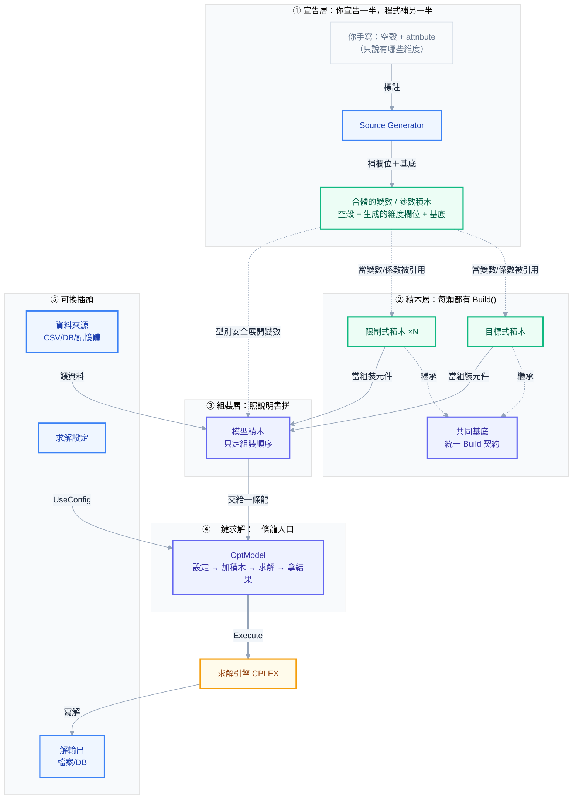
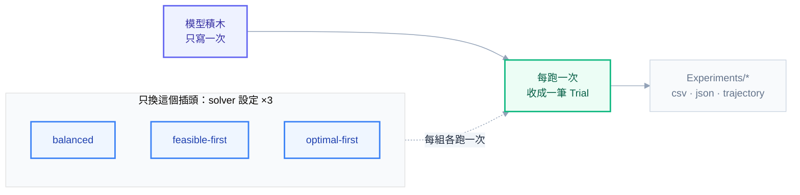

# 架構：把建模當成組樂高（新手向）

> 一句話：這個框架把「寫數學規劃模型」拆成一顆一顆小積木，你只要把現成積木照順序拼起來，就有一個能求解的模型。
> 就像組樂高——你不用自己造塑膠，只要把零件照說明書拼好。

---

## 先搞懂：什麼是「模型」？

假設你是家具廠老闆，每天要決定：**每種產品做幾件、要不要開生產線**。你想讓**利潤最大**，但又不能超過機器產能、要滿足客戶需求。

把這種「要做一堆決定、有目標、有限制」的問題，寫成電腦能算的數學，就叫**模型**。這個框架幫你把模型拆成積木來組。

---

## 積木有哪幾種？（用 Tutorial 範例）

| 積木 | 白話 | 它回答什麼 | 範例（`Templates/Tutorial`） |
|------|------|-----------|------|
| **集合積木 Set** | 你有「哪些東西」 | 產品有哪些？機器、日期、班次？ | `Set_Product` = {Desk, Chair, Table} |
| **參數積木 Parameter** | 已知的「數字」 | 每件多少利潤？每班多少產能？ | `Parameter_Capacity`（每機每日每班工時上限） |
| **變數積木 Variable** | 要「決定」的東西 | 每班生產多少？開不開線？ | `VariableX_Produce`（生產量）、`VariableB_Setup`（開不開線） |
| **限制式積木 Constraint** | 「規則」 | 不能超過產能、要滿足需求 | `Constraint_Capacity`（用量 ≤ 產能） |
| **目標式** | 你要「最好的什麼」 | 利潤最大 | `ObjectiveFunction`（max 利潤 − 成本） |
| **模型積木** | 把上面全部照順序組成一顆 | —— | `Model/TutorialModel.cs` |

> 記法：**Set = 有哪些、Parameter = 已知數字、Variable = 要決定、Constraint = 規則、目標式 = 追求什麼**。

**積木是疊上去的，有先後順序**（後面的用前面的搭）：
`集合積木` 是地基 → `參數/變數積木` 站在集合上（拿集合當維度：產品×日期×班次）→ `限制式/目標式積木` 又是拿**變數＋參數**拼出一條條式子 → `模型積木` 把它們組成一顆。
所以「限制式積木」不是憑空長出來的——它裡面每一項都是引用某個變數積木（未知數）配某個參數積木（係數）。

---

## 為什麼要拆成積木？（拆了有什麼好處）

1. **每顆只管一小塊**：`Constraint_Capacity` 只管「產能規則」，壞了一眼找到、要改只改這顆。
2. **加規則 = 加一顆積木**：想多一條「加班上限」，就多寫一顆 `Constraint_X`，其他積木完全不動。
3. **換來源像換插頭**：資料放 CSV 還是資料庫、結果寫檔還是寫 DB、solver 怎麼調——這些都是可換的「插頭」，換了**模型積木一行都不用改**。

---

## 這張圖怎麼看

由上而下就是「你組模型的順序」：**先宣告有哪些東西 → 寫每顆積木 → 照順序組起來 → 接上一條龍 API → 引擎算出答案**。左下角那三個是「可換的插頭」。

---

## 五層，一層一句白話

**① 宣告層——你只要「說」，程式幫你「寫」**
你想要一個叫 `Product` 的集合、一個叫 `Produce` 的變數，只要用 attribute 標一下有哪些維度（產品×日期×班次），程式就自動幫你生出對應的欄位和存取碼。你不用手刻那些重複樣板。
注意一個關鍵：你手寫那半是 **空殼**（`partial class ... { }`，連欄位都沒有），要跟 generator 生的那半 **合體** 才是能用的積木。所以②的限制式/目標式引用的，是這顆 **合體後** 的積木——你 `new Variable...{ Product=, Date=, Shift= }` 時填的那些欄位，全是 generator 生的那半提供的。
> 像填一張表格：你填欄位名，系統生出整張表；你手上那張空表單，要系統補完欄位才能真的拿來填。

**② 積木層——每顆積木長得一樣，而且是拿①的積木拼的**
每條限制式、每個目標式，都繼承同一個基底、都有一個 `Build()`。所以組裝的時候不用認得每顆積木的細節，只要知道「一顆一顆 Build 下去」。
更關鍵的是：**這層的積木不是憑空長出來的，而是用①宣告層的變數積木＋參數積木搭出來的**——變數是「未知數」、參數是「已知係數」，湊成一條式子。例如「用量 = Σ(工時 × 生產量) ≤ 產能」裡，生產量是變數積木、工時和產能是參數積木。這就是圖上①→②那兩條虛線的意思。
> 像樂高零件：形狀百百種但**接口都一樣**所以能互拼——而且每顆積木本身，又是用①那些更小的顆粒（變數、參數）組成的。

**③ 組裝層——說明書（`TutorialModel`）**
一個類別把積木照正確順序組起來（例如「soft 放鬆規則一定要排在目標式之後」）。它**只管順序**，不管每顆積木內部在算什麼。
> 像樂高說明書：告訴你先裝哪塊、再裝哪塊；零件本身長怎樣它不管。

**④ 一鍵求解——一條龍入口（`OptModel`）**
把「設定 solver → 加變數 → 加模型 → 求解 → 解出來要做什麼」串成一句話接下去寫，按一下就跑完。你不用自己去戳求解引擎那些細節（怎麼開、怎麼跑、跑完怎麼收）——它一手包辦。
> 像自助點餐機：一路點下去（設定→內容→送出），後面廚房怎麼運作你不用管。想自己進廚房調火候（實驗模式）時，才掀開它、直接操作引擎。

**⑤ 可換插頭——資料 / 設定 / 輸出**
資料從哪來（CSV、資料庫、記憶體）、solver 參數怎麼調、解寫去哪，全都是「插頭」。換一個插頭，模型積木一行不動。
> 像家電插頭：換插座不用換家電。

---

## 換一個東西，只需要動一處

| 想換的東西 | 只需動 | 模型 / 積木 code |
|------------|--------|------------------|
| 資料來源（檔案 ↔ 記憶體 ↔ DB） | 換傳入的資料來源 | **完全不動** |
| solver 參數（gap / 時限 / log） | 換一個設定 | **完全不動** |
| 解要寫去哪 | 換一個輸出 | **完全不動** |
| 多一條限制式 | 加一顆積木 + 組裝器登記一行 | 其他積木不動 |
| 改集合 / 維度定義 | 改積木 attribute，程式自動重產 | 手寫 code 不動 |

> 這就是 Tutorial 能用 `dotnet run` / `dotnet run -- inmemory` / `dotnet run -- experiment` 三種跑法、但**模型只寫一次**的原因。

---

## 從零到解出來，五步驟

1. **宣告積木**：Set / Parameter / Variable 用 attribute 標好維度。
2. **寫積木**：每個限制式、目標式各寫一顆，只碰自己那段數學。
3. **組裝**：`TutorialModel` 把積木照順序組成一顆完整模型。
4. **接一條龍**：`OptModel` 鏈式接上資料來源、solver 設定、解輸出 → `Execute`。
5. **求解**：引擎算，解由輸出插頭寫出去。

> 現成範例：`Templates/Tutorial/` 就是這套架構的最小可跑實作，照它的模式起手最快。

---

## 多跑幾次來比較：實驗層（Tuning 用）

前面五層講的是「把一顆模型組出來、解**一次**」。**實驗層是在外面再包一圈：把同一顆模型跑很多次，每次只換 solver 設定那個插頭，把每次結果收成一筆 Trial 存起來比較。** 這正是前面「換插頭、模型不動」設計的回報——模型只寫一次，就能被實驗層當成黑盒子反覆跑。

它做的四件事（對照 `Templates/Tutorial/ExperimentRunner.cs`）：

1. **重用同一顆模型**：每個 trial 都 `new TutorialModel(data).Build(engine)`——跟 solve 模式共用**同一顆**模型積木，模型 code 一行不改。
2. **只換 solver 設定**：三組 MIP emphasis 對照——`balanced`(0) / `feasible-first`(1) / `optimal-first`(2)，換的只有設定插頭。
3. **每次 solve 收成一筆 Trial**：`Trial.Capture` 記下當次設定（ConfigSnapshot）＋結果（狀態、目標值、耗時、收斂軌跡），不接管 engine 生命週期。
4. **存檔累積比較**：`exp.Save()` 輸出三種檔——`{name}.csv`（一列一個 trial 的摘要）、`.json`（權威版，含完整軌跡）、`-trajectory.csv`（畫收斂曲線用）。同名實驗的舊 trial 會**併入累積**，調校歷史不會被蓋掉。

> 一句話：**solve 模式 = 把模型解一次拿答案；實驗層 = 同一顆模型在不同 solver 設定下各跑一次，收集數據做 tuning 比較。** 跑法 `dotnet run -- experiment`，屬於 Phase 3（Tuning）的工具——模型正確之後，用它系統化地找「哪組 solver 設定最快 / 最好」。

---

## 進階：這其實對應哪些設計模式（新手可跳過）

> 上面用大白話講的東西，對有經驗的人來說是幾個古典 design pattern 疊出來的。想深入再看這張表：

| 層 | Design Pattern | 一句話 |
|----|----------------|--------|
| ① 宣告層 | **Declarative Codegen** + Convention over Configuration | 宣告 *what*，codegen 產 *how*，消掉維度樣板 |
| ② 積木層 | **Builder**（帶 Command 味）+ **Template Method** | 每個關注點 = 一顆自足、可依序執行的積木；骨架在基底 |
| ③ 組裝層 | **Composite** + **Director** | 子積木組成一顆完整大積木，組裝器只定順序 |
| ④ 一鍵求解 | **Fluent Builder** + **Facade** + Callback 注入 | 一條鏈接起整個求解流程；填內容外包給積木 |
| ⑤ 策略層 | **Strategy** + **Dependency Injection** | 換一個實作，模型 code 一行不動 |
