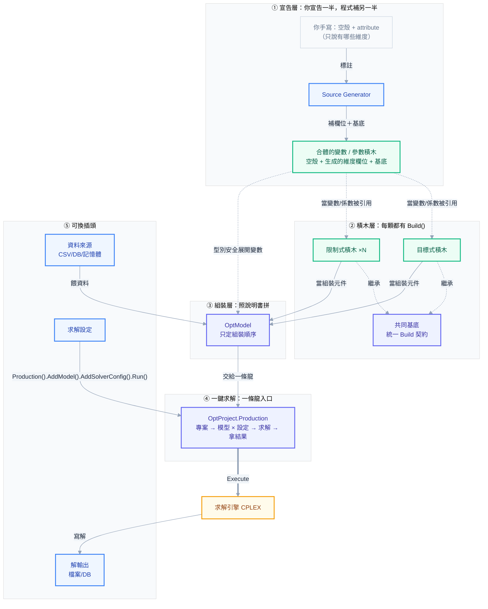
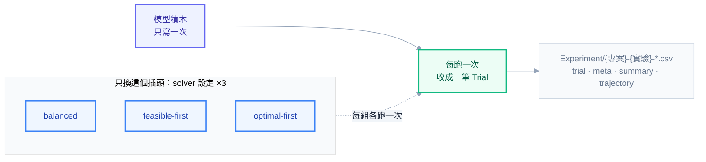

# OptimFoundation 開發指南

OptimFoundation 是以 .NET 8 建立 MILP 模型的 solver-agnostic framework，目前提供 IBM CPLEX adapter。

這是框架唯一的說明文件：概念入門、從 Model.md 寫到可執行專案的逐步教學、範本導覽與完整 public API reference 都在這一份。`Templates/Sudoku_SHC279/README.md` 只講該範本的用法。

## 怎麼讀這份文件

| 你要做的事 | 讀 |
| --- | --- |
| 第一次接觸，想先懂框架在做什麼 | 第 1–2 章 |
| 查 runtime 架構、某個任務該用哪個 API | 第 3 章 |
| 搞懂 Modeling → Coding → Tuning 的分工 | 第 4 章 |
| 把一份已確認的 `Model.md` 寫成可以 build、solve、驗證與重現的 C# 專案 | 第 5–22 章（MiniProduction 案例貫穿） |
| 找一個可以照抄的範本 | 第 23 章 |
| 查 public signature 與行為 | 文件最後的 API reference |

AI-Modeling 端給 AI 照著做的規範與檢查表：

- API 使用細節：[OptimFoundation API Guide](../../../AI-Modeling/.claude/skills/coding/optimfoundation-api-guide.md)
- 交付前逐項核對：[Coding Checklist](../../../AI-Modeling/.claude/skills/coding/checklist.md)
- 模型設計規則：[Model Design Guide](../../../AI-Modeling/.claude/skills/modeling/model-design-guide.md)
- 需要調參時：[Solver Tuning Guide](../../../AI-Modeling/.claude/skills/tuning/solver-tuning-guide.md) 與 [Tuning Checklist](../../../AI-Modeling/.claude/skills/tuning/checklist.md)

---

## 1. OptimFoundation 是什麼

| Package | 責任 |
| --- | --- |
| `OptimFoundation.Core` | 資料列、IO、命名、變數 / 限制式通用邏輯、logging、experiments；不引用任何 solver SDK |
| `OptimFoundation.Generators` | `[OptSet]` / `[OptParam]` / `[OptVar]` 的 source generator（netstandard2.0） |
| `OptimFoundation.Cplex` | IBM CPLEX adapter：engine、model、project、experiment、config |

最小範例：

```csharp
using OptimFoundation.Core;
using OptimFoundation.Core.IO;
using OptimFoundation.Modeling;
using OptimFoundation.Cplex;

[OptSet]
[OptDim<string>("Employee")]
public sealed partial class Set_Employee { }

[OptSet]
[OptDim<DateTime>("Date")]
public sealed partial class Set_Date { }

[OptVar]
[OptDim<DateTime>("Date")]
[OptDim<string>("Employee")]
public sealed partial class VariableB_Assign { }

var data = OptData.Load(() => new Dataload());

var model = new OptModel("Canonical")
    .AddVariables<VariableB_Assign>(data.set_Date, data.set_Employee)
    .AddObjective<ObjectiveFunction>(/* dependencies */)
    .AddConstraints<Constraint_Assign>(/* dependencies */);

using var project = new OptProject("Example");

// 單組（正式求解）與多組（project.Experiment(name)）寫法相同
project.Production()
    .AddProjectConfig(new ProjectConfig { ExportLP = true })
    .AddModel(model)
    .AddSolverConfig("production", new CplexConfig())
    .Run();
bool solved = project.IsSuccess;
```

Build 與測試：

```powershell
dotnet build OptimFoundation.sln
dotnet test tests/OptimFoundation.Cplex.Tests/OptimFoundation.Cplex.Tests.csproj
```

CPLEX 的 managed / native DLL 與 license 不在 repo 內，build 時由 `CplexDir`（預設 `C:\IBM\ILOG\CPLEX_Studio2211`）找；不得 commit solver DLL 或 license。

---

## 2. 把建模當成組積木（新手向）

> 一句話：這個框架把「寫數學規劃模型」拆成一顆一顆小積木，你只要把現成積木照順序拼起來，就有一個能求解的模型。
> 就像組樂高——你不用自己造塑膠，只要把零件照說明書拼好。

### 2.1 什麼是「模型」

假設你是家具廠老闆，每天要決定：**每種產品做幾件、要不要開生產線**。你想讓**利潤最大**，但又不能超過機器產能、要滿足客戶需求。

把這種「要做一堆決定、有目標、有限制」的問題，寫成電腦能算的數學，就叫**模型**。這個框架幫你把模型拆成積木來組。

### 2.2 積木有哪幾種

| 積木 | 白話 | 它回答什麼 | 範例（`Templates/Tutorial`） |
| --- | --- | --- | --- |
| **Set** | 哪些索引或索引組合存在 | 產品有哪些？哪些弧可用？ | `Set_Product` 或 `Set_Arc(From,To)` |
| **Parameter** | 已知的「數字」 | 每件多少利潤？每班多少產能？ | `Parameter_Capacity`（每機每日每班工時上限） |
| **Variable** | 要「決定」的東西 | 每班生產多少？開不開線？ | `VariableC_Produce`（生產量）、`VariableB_Setup`（開不開線） |
| **Constraint** | 「規則」 | 不能超過產能、要滿足需求 | `Constraint_Capacity`（用量 ≤ 產能） |
| **目標式** | 你要「最好的什麼」 | 利潤最大 | `ObjectiveFunction`（max 利潤 − 成本） |
| **模型** | 把上面全部照順序組成一顆 | —— | `OptModel`（Tutorial 在 `Program.cs` 組裝） |

> 記法：**Set = 有哪些、Parameter = 已知數字、Variable = 要決定、Constraint = 規則、目標式 = 追求什麼**。

**積木是疊上去的，有先後順序**（後面的用前面的搭）：
Set 是地基 → Parameter / Variable 站在 Set 上（拿 Set 當維度：產品 × 日期 × 班次）→ Constraint / 目標式又是拿**變數 + 參數**拼出一條條式子 → 模型把它們組成一顆。
所以 Constraint 不是憑空長出來的——它裡面每一項都是引用某個 Variable（未知數）配某個 Parameter（係數）。

### 2.3 為什麼要拆成積木

1. **每顆只管一小塊**：`Constraint_Capacity` 只管「產能規則」，壞了一眼找到、要改只改這顆。
2. **加規則 = 加一顆積木**：想多一條「加班上限」，就多寫一顆 `Constraint_X`，其他積木完全不動。
3. **換來源像換插頭**：資料放 CSV 還是資料庫、結果寫檔還是寫 DB、solver 怎麼調——這些都是可換的「插頭」，換了**模型積木一行都不用改**。

### 2.4 架構圖

由上而下就是「你組模型的順序」：**先宣告有哪些東西 → 寫每顆積木 → 照順序組起來 → 交給 OptProject → 引擎算出答案**。左下角那三個是「可換的插頭」。



### 2.5 五層，一層一句白話

**① 宣告層——你只要「說」，程式幫你「寫」**
你想要一個叫 `Product` 的集合、一個叫 `Produce` 的變數，只要用 attribute 標一下有哪些維度（產品 × 日期 × 班次），程式就自動幫你生出對應的欄位和存取碼。你不用手刻那些重複樣板。
注意一個關鍵：你手寫那半通常是**空殼**（`partial class ... { }`，連欄位都沒有），要跟 generator 生的那半**合體**才是能用的積木。所以②的限制式 / 目標式引用的，是這顆**合體後**的積木——你 `new Variable...{ Product=, Date=, Shift= }` 時填的那些欄位，全是 generator 生的那半提供的。
手寫那半也可以加輔助成員（例：`public bool IsWeekend => Date.DayOfWeek is DayOfWeek.Saturday or DayOfWeek.Sunday;`）：框架的維度只認 `OptDim`，名稱、key、建變數、CSV / DB 欄位都不會把它算進去。唯一例外是 Parameter：手寫的 public 可寫 property（`{ get; set; }`）會當成 QTY 以外的數值欄，跟 QTY 一樣從資料來源載入並做數值檢查。
> 像填一張表格：你填欄位名，系統生出整張表；你手上那張空表單，要系統補完欄位才能真的拿來填。

**② 積木層——每顆積木長得一樣，而且是拿①的積木拼的**
每條限制式、每個目標式都有一個 `Build()`。所以組裝的時候不用認得每顆積木的細節，只要知道「一顆一顆 Build 下去」。
更關鍵的是：**這層的積木是用①的變數積木 + 參數積木搭出來的**——變數是「未知數」、參數是「已知係數」，湊成一條式子。例如「用量 = Σ(工時 × 生產量) ≤ 產能」裡，生產量是變數積木、工時和產能是參數積木。這就是圖上①→②那兩條虛線的意思。
> 像樂高零件：形狀百百種但**接口都一樣**所以能互拼——而且每顆積木本身，又是用①那些更小的顆粒組成的。

**③ 組裝層——說明書（`OptModel`）**
`OptModel` 把積木照正確順序組起來（例如「soft 放鬆規則一定要排在目標式之後」）。它**只管順序**，不管每顆積木內部在算什麼。
> 像樂高說明書：告訴你先裝哪塊、再裝哪塊；零件本身長怎樣它不管。

**④ 一鍵求解——一條龍入口（`OptProject.Production`）**
先開一個專案 `new OptProject("名稱")`（它管 log、輸出資料夾、保留期），再 `.Solve().AddModel(模型).AddSolverConfig(名稱, 設定).OnSolved(解出來要做什麼).Run()`。實驗（第 18 章）用的是同一組動詞，只是入口換成 `.Experiment(名稱)`。你不用自己去戳求解引擎那些細節（怎麼開、怎麼跑、跑完怎麼收）——它一手包辦，還會順手把這次求解記成一筆紀錄。想比較多組設定時改走實驗層（第 18 章）。
> 像自助點餐機：一路點下去（設定 → 內容 → 送出），後面廚房怎麼運作你不用管。

**⑤ 可換插頭——資料 / 設定 / 輸出**
資料從哪來（CSV、資料庫、記憶體）、solver 參數怎麼調、解寫去哪，全都是「插頭」。換一個插頭，模型積木一行不動。
> 像家電插頭：換插座不用換家電。

### 2.6 換一個東西，只需要動一處

| 想換的東西 | 只需動 | 模型 / 積木 code |
| --- | --- | --- |
| 資料來源（檔案 ↔ 記憶體 ↔ DB） | 換傳入的資料來源 | **完全不動** |
| solver 參數（gap / 時限 / log） | 換一個設定 | **完全不動** |
| 解要寫去哪 | 換一個輸出 | **完全不動** |
| 多一條限制式 | 加一顆積木 + 組裝時登記一行 | 其他積木不動 |
| 改集合 / 維度定義 | 改積木 attribute，程式自動重產 | 手寫 code 不動 |

> 這就是同一個專案能用 `dotnet run`（正式求解）/ `dotnet run -- exp`（實驗）兩種跑法、但**模型只寫一次**的原因。

### 2.7 從零到解出來，五步驟

1. **宣告積木**：Set / Parameter / Variable 用 attribute 標好維度。
2. **寫積木**：每個限制式、目標式各寫一顆，只碰自己那段數學。
3. **組裝**：`OptModel` 把積木照順序組成一顆完整模型。
4. **接一條龍**：`project.Production().AddModel(模型).AddSolverConfig(名稱, solver 設定).OnSolved(解輸出).Run()`。
5. **求解**：引擎算，解由輸出插頭寫出去。

> 現成範例：`Templates/Template/` 是標準範本，每個積木以它示範的框架功能命名，照它的模式起手最快（第 23 章）。

### 2.8 進階：對應哪些設計模式（新手可跳過）

| 層 | Design Pattern | 一句話 |
| --- | --- | --- |
| ① 宣告層 | **Declarative Codegen** + Convention over Configuration | 宣告 *what*，codegen 產 *how*，消掉維度樣板 |
| ② 積木層 | **Builder**（帶 Command 味）+ **Template Method** | 每個關注點 = 一顆自足、可依序執行的積木 |
| ③ 組裝層 | **Composite** + **Director** | 子積木組成一顆完整大積木，組裝器只定順序 |
| ④ 一鍵求解 | **Fluent Builder** + **Facade** + Callback 注入 | 一條鏈接起整個求解流程；填內容外包給積木 |
| ⑤ 策略層 | **Strategy** + **Dependency Injection** | 換一個實作，模型 code 一行不動 |

---

## 3. Runtime 架構與 API 地圖

```text
attributes + domain rows
        │
        ▼
IDataSource ──► DataContext / OptData.Load ──► validated data
                                                    │
                                                    ▼
OptModel ── variable / objective / constraint / MIP-start recipes
                                                    │
                                                    ▼
OptProject.Production ──► OptEngine.Build ──► CPLEX solve
       │                                      │
       │                                      ├─ solution / status / metrics
       │                                      └─ import / export / conflict
       ▼
Trial / Experiment ──► trial / meta / summary / trajectory CSV
```

| 模組 | 責任 | 日常入口 |
| --- | --- | --- |
| Modeling metadata | 描述 set、parameter、variable 的維度與型別 | `[OptSet]`、`[OptParam]`、`[OptVar]`、`[OptDim<T>]` |
| Data boundary | 載入、映射、驗證資料；輸出解 | `IDataSource`、`DataContext`、`OptData.Load`、`ISolutionSink` |
| Model recipe | 保存建變數、目標式、限制式、solution file 與 warm start 步驟 | `OptModel` |
| Expression/model engine | 管理 expression pool、native model、solve 狀態與結果 | `EngineBase`、`OptEngine` |
| Application lifecycle | 建 engine、套 config、build、solve、artifact、dispose | `OptProject` |
| Execution | 正式求解與實驗共用的執行 builder：展開 model/config trials、求解並序列化結果 | `OptExecution`（`OptProduction` / `OptExperiment`）、`Experiment`、`Trial` |
| Infrastructure | 路徑、CSV、DB、logging | `ProjectConfig`、`CsvCtrl`、`IDbCtrl` |

### 3.1 典型呼叫順序

1. `OptData.Load(() => new Dataload(source))` 建立資料。
2. `new OptModel(name)` 後依序註冊 `AddVariables`、`AddObjective`、`AddConstraints`；需要 warm start 再加 `AddMIPStart`。
3. 建立 `ProjectConfig` 與 `CplexConfig`。
4. `using var project = new OptProject(name)`。
5. `project.Production().AddProjectConfig(projectConfig).AddModel(model).AddSolverConfig("production", cplexConfig).OnSolved(...).Run()`。
6. 從 `project.Engine` / `project.IsSuccess` 讀 solution、status、metrics，或在 `OnSolved` 寫入 `ISolutionSink`。
7. 要比較多組設定時把入口換成 `project.Experiment(name)`，其餘動詞相同（第 18 章）。

`Production()` 回傳 `OptProduction`、`Experiment(name)` 回傳 `OptExperiment`，兩者都繼承 `OptExecution`：公開動詞全部定義在 `OptExecution`，寫法完全相同，差別只在規則與預設值。`OptExecution` 不認得 `OptProject`；正式求解的結果由 `OptProduction` 寫進專案持有的結果，`project.Engine` / `IsSuccess` / `Trial` 只是對外提供。

| | `project.Production()` | `project.Experiment(name)` |
|---|---|---|
| 組數 | 只能 1 model × 1 config，多了 `Run()` 直接丟例外、不執行 | 一對一或多對多（m×n + `AddTrial`） |
| engine | 留在 `project.Engine` 供取解 | 每組跑完就釋放 |
| `ProjectConfig` 預設 | `new ProjectConfig()` | `ProjectConfig.Quiet()` |
| 收斂軌跡預設 | 關 | 開 |
| 紀錄 | `{專案}-production-trial.csv` + `-meta.csv`，不寫 `-summary.csv` | `{專案}-{實驗}-` 四個檔 |
| log | 專案 log | `{專案}-{實驗}_exp` |

`Production()` 配了多組時，`Run()` 在建立任何 engine 前丟 `InvalidOperationException`（log `[求解設定不合法]`）；比較多組請改用 `Experiment(name)`。`OnSolved` 或某一組丟例外時，已完成的組照存紀錄（`[試跑中斷]` WARN）後原樣拋出。

`OptProject` 是 **Recommended path**。直接建立 `OptEngine` 適合 library integration、測試或需自行控制 lifecycle 的 **Advanced API**。

### 3.2 依任務找 API

| 任務 | API |
| --- | --- |
| 載入與驗證資料 | `IDataSource.Load<T>`、`OptData.Load`、`DataValidator.Validate` |
| 宣告 domain row | `SetRowBase`、`ParameterBase`、`VariableBase`、`ConstraintBase` |
| 建立變數 | `BuildVars<TVariable>`；進階使用 `BuildCVs/BuildIVs/BuildBVs` |
| 組 expression | `AddLHS`、`AddRHS`、`PoolState`、`ClearPool` |
| 建 hard/range constraint | `CreateLessEqual`、`CreateEqual`、`CreateGreaterEqual`、`CreateRange` |
| 建 soft/special constraint | `Create*Soft`、`ISpecialConstraints<TVar,TExpr>` |
| 建 objective | `CreateMinimize`、`CreateMaximize` |
| solve | `OptProject.Production`；低階使用 `Build`、`Solve` |
| 讀 solution | `GetSolution`、`Get*Solution`、`GetVariableValue`、`LastMetrics` |
| warm start | `OptModel.AddMIPStart`、`EngineBase.AddMIPStart` |
| 匯入／匯出 | `OptModel.ReadModel/ReadSolution`、`OptEngine.ReadModel/ReadSolution/ExportModel/ExportSolution` |
| infeasible 診斷 | `GetConflictConstraints` |
| build 數量核對 | `VariableBuildCounts`、`ConstraintBuildCounts`；未引用變數由 `Production()` 前 `[變數未引用]` 警告 點名 |
| 多設定實驗 | `OptProject.Experiment`、`OptExperiment` |
| CSV／DB | `CsvDataSource`、`DbDataSource`、`IDbCtrl`、`CsvCtrl` |

### 3.3 API 使用層級

- **Recommended**：`OptData.Load`、typed `BuildVars<T>`、owner/dim constraint overload、`OptModel`、`OptProject`、`OptExecution`（`OptProduction` / `OptExperiment`）。
- **Advanced**：直接操作 `OptEngine`、string builders、bounds/reset、native CPLEX special constraints、copy/merge/thread、直接 import/export。
- **Framework integration**：generator base types、registration DTO、IO/DB contracts、CSV writers、logging 與 infrastructure helpers。

---

## 4. 三個 phase

OptimFoundation 的工作分成三個 phase。

### Phase 1：Modeling

輸入是需求、資料定義與商業規則。

輸出是已確認的 `Model/<Project>_Model.md`。

Modeling 決定：

- Set 是什麼。
- Parameter 的索引與單位是什麼。
- Variable 的 domain、型別與上下界是什麼。
- Objective 要最小化或最大化什麼。
- 每條 Constraint 的量詞、左右式與比較符號是什麼。
- 哪些規則要在解出後重新驗證。

Model.md 固定八段：

1. 問題摘要
2. Assumptions
3. Sets
4. Parameters
5. Decision Variables
6. Objective
7. Constraints
8. Validation Rules

這八段是 Coding 的契約。

Coding 不得自行移項、改號、補規則或改 domain。

### Phase 2：Coding

輸入是已確認的 Model.md。

輸出是：

- 可 build 的專案。
- 可載入且通過驗收的資料。
- 可求解的 canonical model。
- 可讀取並驗證的 solution。
- 可重現的 production baseline。

第 5–22 章就是 Phase 2。

### Phase 3：Tuning（選用）

只有 Phase 2 正確性 gate 全部通過後，才可進入 Tuning。

進入條件至少包括：

- 資料驗收通過。
- 模型可以 build。
- solver 回傳可接受狀態。
- 解值代回 Model.md 規則後全部成立。
- production baseline 的 Seed、Threads、ParallelMode 等環境已固定。

Tuning 改的是 solver config 與其證據。

Tuning 不應偷偷改 Model.md、資料語意或 constraint。

---

## 5. 案例：MiniProduction

第 5–22 章用一個小型生產規劃案例，把已確認的 `Model.md` 實作成可以 build、solve、驗證與重現的 C# 專案。

工廠要生產多種產品。

每種產品有需求量。

總產量受單一產能上限限制。

產品只要啟用，就至少生產一個單位。

允許缺貨，但缺貨有高額懲罰。

### 5.1 Sets

$$Product = \{A, B\}$$

### 5.2 Parameters

$$Demand_p \ge 0 \quad \forall p \in Product$$

$$Capacity \ge 0$$

$$FixedCost_p \ge 0 \quad \forall p \in Product$$

$$ShortagePenalty > 0$$

### 5.3 Decision Variables

$$Open_p \in \{0,1\}$$

$$Produce_p \in \mathbb{Z}_{\ge 0}$$

$$Shortage_p \in \mathbb{R}_{\ge 0}$$

### 5.4 Objective

$$\min \sum_p FixedCost_p Open_p + ShortagePenalty \sum_p Shortage_p$$

### 5.5 Constraints

需求平衡：

$$Produce_p + Shortage_p = Demand_p \quad \forall p$$

總產能：

$$\sum_p Produce_p \le Capacity$$

啟用後的最低產量：

$$Produce_p \ge Open_p \quad \forall p$$

為了讓 `Open` 真正表達是否啟用，正式模型通常還要有上界連結。

本文的小案例加入：

$$Produce_p \le Demand_p Open_p \quad \forall p$$

這條規則必須先寫回 Model.md 並經確認，不能只在 Coding 階段臨時加入。

### 5.6 Validation Rules

解出後重新檢查：

- 每個產品的 `Produce + Shortage = Demand`。
- 所有產品的 `Produce` 加總不超過 `Capacity`。
- `Produce >= Open`。
- `Produce <= Demand * Open`。
- Binary、Integer 與非負條件在 tolerance 內成立。

---

## 6. 建立固定專案結構

本文案例放在 AI-Modeling 的 `Projects/MiniProduction/`；放在 framework repo 時對應 `Templates/<Project>/`，兩者只差在 csproj 怎麼參考框架（第 7 章）。

framework repo 的標準範本是 `Templates/Template/`：同樣的八個資料夾，積木以框架功能命名；新專案從它複製起手（第 23 章）。

專案根目錄放 `Program.cs`、`<Project>.csproj` 與 `status.json`。

模型實作固定使用八個資料夾：

```text
Projects/MiniProduction/
├── Model/
├── Data/
├── Set/
├── Parameter/
├── Variable/
├── Objective/
├── Constraint/
├── Solution/
├── MiniProduction.csproj
├── Program.cs
└── status.json
```

八個資料夾的責任如下：

| 資料夾 | 內容 |
| --- | --- |
| `Model/` | 已確認的數學模型與 validation rules |
| `Data/` | canonical CSV 與 `Dataload.cs` |
| `Set/` | `[OptSet]` 宣告 |
| `Parameter/` | `[OptParam]` 宣告 |
| `Variable/` | `[OptVar]` 宣告 |
| `Objective/` | 目標式建構器 |
| `Constraint/` | 一個檔案一種 constraint |
| `Solution/` | 建模前資料驗收、解讀與解驗證 |

不要把數學式塞進 `Program.cs`。

不要把資料轉換塞進 Constraint。

不要讓 Objective 或 Constraint 接收整包 `Dataload`。

---

## 7. 設定 csproj

csproj 只差在「怎麼參考框架」與「輸入資料怎麼到 `Input/`」，依專案放在哪裡選一種。

### 7.1 AI-Modeling 專案（本文案例）

`Projects/MiniProduction/MiniProduction.csproj` 不參考 framework source，改用 AI-Modeling repo 根 `dlls/` 下預先 build 的 DLL：

```xml
<Project Sdk="Microsoft.NET.Sdk">
  <PropertyGroup>
    <OutputType>Exe</OutputType>
    <TargetFramework>net8.0</TargetFramework>
    <ImplicitUsings>enable</ImplicitUsings>
    <Nullable>enable</Nullable>
    <RootNamespace>MiniProduction</RootNamespace>
    <AssemblyName>MiniProduction</AssemblyName>
    <EmitCompilerGeneratedFiles>true</EmitCompilerGeneratedFiles>
    <CompilerGeneratedFilesOutputPath>Generated</CompilerGeneratedFilesOutputPath>
  </PropertyGroup>

  <ItemGroup>
    <Compile Remove="Generated/**/*.cs" />
  </ItemGroup>

  <ItemGroup>
    <None Remove="Data\**\*.csv" />
    <None Include="Data\**\*.csv" CopyToOutputDirectory="PreserveNewest" Link="Input\%(RecursiveDir)%(Filename)%(Extension)" />
  </ItemGroup>

  <ItemGroup>
    <Analyzer Include="..\..\dlls\OptimFoundation.Generators.dll" />
  </ItemGroup>

  <ItemGroup>
    <Reference Include="ILOG.Concert">
      <HintPath>..\..\dlls\ILOG.Concert.dll</HintPath>
    </Reference>
    <Reference Include="ILOG.CPLEX">
      <HintPath>..\..\dlls\ILOG.CPLEX.dll</HintPath>
    </Reference>
    <Reference Include="NLog">
      <HintPath>..\..\dlls\NLog.dll</HintPath>
    </Reference>
    <Reference Include="OptimFoundation.Core">
      <HintPath>..\..\dlls\OptimFoundation.Core.dll</HintPath>
    </Reference>
    <Reference Include="OptimFoundation.Cplex">
      <HintPath>..\..\dlls\OptimFoundation.Cplex.dll</HintPath>
    </Reference>
  </ItemGroup>
</Project>
```

- generator 以 `<Analyzer Include=...>` 掛入，不是一般 reference。
- `Data\**\*.csv` 複製到輸出目錄的 `Input\`：AI-Modeling 刻意保留這個設定，`Data/` 是版控的原始檔，`Input/` 是執行時的副本。
- `dlls/` 的設置與更新方式見 AI-Modeling 的 `dlls/README.md`。

### 7.2 framework repo 內的範本

`Templates/<Project>/<Project>.csproj` 直接參考 framework source：

```xml
<Project Sdk="Microsoft.NET.Sdk">
  <PropertyGroup>
    <OutputType>Exe</OutputType>
    <TargetFramework>net8.0</TargetFramework>
    <LangVersion>latest</LangVersion>
    <ImplicitUsings>enable</ImplicitUsings>
    <Nullable>enable</Nullable>
    <RootNamespace>MiniProduction</RootNamespace>
    <AssemblyName>MiniProduction</AssemblyName>
    <CplexDir Condition="'$(CplexDir)' == ''">C:\IBM\ILOG\CPLEX_Studio2211</CplexDir>
    <EmitCompilerGeneratedFiles>true</EmitCompilerGeneratedFiles>
    <CompilerGeneratedFilesOutputPath>Generated</CompilerGeneratedFilesOutputPath>
  </PropertyGroup>

  <ItemGroup>
    <Compile Remove="Generated/**/*.cs" />
  </ItemGroup>

  <ItemGroup>
    <ProjectReference Include="..\..\src\OptimFoundation.Core\OptimFoundation.Core.csproj" />
    <ProjectReference Include="..\..\src\OptimFoundation.Cplex\OptimFoundation.Cplex.csproj" />
    <ProjectReference Include="..\..\src\OptimFoundation.Generators\OptimFoundation.Generators.csproj"
                      OutputItemType="Analyzer"
                      ReferenceOutputAssembly="false" />
  </ItemGroup>

  <ItemGroup>
    <Reference Include="ILOG.Concert">
      <HintPath>$(CplexDir)\cplex\bin\x64_win64\ILOG.Concert.dll</HintPath>
    </Reference>
    <Reference Include="ILOG.CPLEX">
      <HintPath>$(CplexDir)\cplex\bin\x64_win64\ILOG.CPLEX.dll</HintPath>
    </Reference>
  </ItemGroup>
</Project>
```

- framework 內部依賴一律用 `ProjectReference`。
- Generators 的 `ProjectReference` 必須設定 `OutputItemType="Analyzer"` 與 `ReferenceOutputAssembly="false"`。
- CPLEX 從 `$(CplexDir)` 引用；DLL 與 license 不進 git。
- 不做資料複製：`Data/*.csv` 是範例資料，執行前由使用者放進 `FolderDir.Input`。

### 7.3 兩者共通

- 執行時一律讀 `FolderDir.Input`（輸出目錄下的 `Input/`），不是原始碼下的 `Data/`；資料位置一律用 `FolderDir`（例如 `FolderDir.Input.GetPathFile(...)`）決定，不在 code 裡寫死資料夾字串。
- `Generated/` 只供閱讀 generator 產物，用 `Compile Remove` 排除，不可再當一般 source 編譯。

---

## 8. 宣告 Set

`Set/Set_Product.cs`：

```csharp
using OptimFoundation.Modeling;

namespace MiniProduction;

[OptSet]
[OptDim<string>("Product")]
public sealed partial class Set_Product { }
```

`partial` 是 generator 產生 class body 的必要條件。

`OptDim<string>("Product")` 會產生 `Product` property。

Set 的 CSV 是 `Data/Set_Product.csv`：

```csv
Product
A
B
```

維度欄位名稱必須和 attribute 一致。

Key 不得重複。

多維 Set 用同一種寫法。每個 `OptDim` 生成一個 property，資料列表示「實際存在的組合」（例如可走的弧），不是笛卡兒積：

```csharp
[OptSet]
[OptDim<string>("From")]
[OptDim<string>("To")]
public sealed partial class Set_Arc { }
```

```csv
From,To
A,B
B,C
```

Set 至少一維，而且沒有 `QTY`。`OptDim<T>` 的泛型參數是 C# 資料型別（`string`、`int`、`DateTime` 等），CSV 欄位依它轉型。

寫法與 Parameter 相同：generator 產生依 `OptDim` 順序的建構子 `new Set_Arc("A", "B")`（維度值照名稱規則檢查，含保留字元會丟例外），也可以用 `new Set_Arc { From = "A", To = "B" }`。`ToString()` 是 `Set_Arc@A@B`，與 Parameter、Variable 同一格式；組變數名或限制式名時傳 Set 資料列，框架只取維度值，不帶 `Set_` 類別名。要在自己的字串裡用維度值，請讀 property（`arc.From`），不要靠 `ToString()`。

每個 `OptDim` 的名稱都會變成 property 名，所以同一個類別裡不能重複（兩個維度都是節點時各取名稱，例：`From` / `To`），要是合法的 C# 識別字，不能跟類別名或 partial class 手寫的成員同名，Parameter 的維度也不能叫 `QTY`。違反時編譯報 `OPTF009`，錯誤直接指向那個 `[OptDim]`。

---

## 9. 宣告 Parameter

### 9.1 逐產品參數

`Parameter/Parameter_Demand.cs`：

```csharp
using OptimFoundation.Modeling;

namespace MiniProduction;

[OptParam]
[OptDim<string>("Product")]
public sealed partial class Parameter_Demand { }
```

`Parameter/Parameter_FixedCost.cs`：

```csharp
using OptimFoundation.Modeling;

namespace MiniProduction;

[OptParam]
[OptDim<string>("Product")]
public sealed partial class Parameter_FixedCost { }
```

generator 會為 Parameter 產生維度 property 與數值 property `QTY`。

`Data/Parameter_Demand.csv`：

```csv
Product,QTY
A,6
B,4
```

`Data/Parameter_FixedCost.csv`：

```csv
Product,QTY
A,2
B,3
```

多維 Parameter 依 `OptDim` 順序列出各維欄位，最後一欄是 `QTY`，例如弧成本：

```csharp
[OptParam]
[OptDim<string>("From")]
[OptDim<string>("To")]
public sealed partial class Parameter_ArcCost { }
```

```csv
From,To,QTY
A,B,12.5
B,C,8
```

### 9.2 Scalar 參數

Scalar 仍然是 `[OptParam]`，只是沒有 `[OptDim<T>]`。

`Parameter/Parameter_Capacity.cs`：

```csharp
using OptimFoundation.Modeling;

namespace MiniProduction;

[OptParam]
public sealed partial class Parameter_Capacity { }
```

`Parameter/Parameter_ShortagePenalty.cs`：

```csharp
using OptimFoundation.Modeling;

namespace MiniProduction;

[OptParam]
public sealed partial class Parameter_ShortagePenalty { }
```

每個 scalar parameter 都有自己的 CSV，而且只能有一筆資料。

`Data/Parameter_Capacity.csv`：

```csv
QTY
8
```

`Data/Parameter_ShortagePenalty.csv`：

```csv
QTY
100
```

用 `.Single().QTY` 讀 scalar。

`.Single()` 也會讓零列與多列資料立即失敗。

---

## 10. 實作 Dataload

`Data/Dataload.cs`：

本案例的 `import-data` 原始檔每列是一個產品，格式如下：

```csv
Product,Demand,FixedCost,Capacity,ShortagePenalty
A,6,2,8,100
B,4,3,8,100
```

`Capacity` 與 `ShortagePenalty` 是整份 instance 共用的 scalar，所以每列必須填相同值。

import constructor 會檢查這項條件，再拆成一份 Set、兩份逐產品 Parameter 與兩份 scalar Parameter。

```csharp
using System.Globalization;
using OptimFoundation.Core;
using OptimFoundation.Core.IO;

namespace MiniProduction;

public sealed partial class Dataload : DataContext
{
    public List<Set_Product> set_Product = new();
    public List<Parameter_Demand> parameter_Demand = new();
    public List<Parameter_FixedCost> parameter_FixedCost = new();
    public List<Parameter_Capacity> parameter_Capacity = new();
    public List<Parameter_ShortagePenalty> parameter_ShortagePenalty = new();

    public Dataload() : this(new CsvDataSource()) { }

    public Dataload(IDataSource source)
    {
        set_Product = source.Load<Set_Product>("Set_Product");
        parameter_Demand = source.Load<Parameter_Demand>("Parameter_Demand");
        parameter_FixedCost = source.Load<Parameter_FixedCost>("Parameter_FixedCost");
        parameter_Capacity = source.Load<Parameter_Capacity>("Parameter_Capacity");
        parameter_ShortagePenalty = source.Load<Parameter_ShortagePenalty>("Parameter_ShortagePenalty");
    }

    public Dataload(string rawFile)
    {
        var raw = new CsvDataSource().LoadData(rawFile);
        if (raw.Rows.Count == 0)
            throw new InvalidDataException("MiniProduction raw file 至少需要一列產品。");

        static double Number(object value, string column) =>
            double.TryParse(
                value?.ToString(),
                NumberStyles.Float,
                CultureInfo.InvariantCulture,
                out double result)
                ? result
                : throw new InvalidDataException($"raw 欄位 {column} 不是有效數字：'{value}'。");

        double capacity = Number(raw.Rows[0]["Capacity"], "Capacity");
        double penalty = Number(raw.Rows[0]["ShortagePenalty"], "ShortagePenalty");

        foreach (System.Data.DataRow row in raw.Rows)
        {
            string product = row["Product"]?.ToString()?.Trim() ?? string.Empty;
            if (product.Length == 0)
                throw new InvalidDataException("raw Product 不得為空白。");

            double rowCapacity = Number(row["Capacity"], "Capacity");
            double rowPenalty = Number(row["ShortagePenalty"], "ShortagePenalty");
            if (rowCapacity != capacity || rowPenalty != penalty)
                throw new InvalidDataException(
                    "raw 每列的 Capacity 與 ShortagePenalty 必須一致。");

            set_Product.Add(new Set_Product { Product = product });
            parameter_Demand.Add(new Parameter_Demand
            {
                Product = product,
                QTY = Number(row["Demand"], "Demand"),
            });
            parameter_FixedCost.Add(new Parameter_FixedCost
            {
                Product = product,
                QTY = Number(row["FixedCost"], "FixedCost"),
            });
        }

        parameter_Capacity.Add(new Parameter_Capacity { QTY = capacity });
        parameter_ShortagePenalty.Add(new Parameter_ShortagePenalty { QTY = penalty });
    }

    public void Export()
    {
        CsvCtrl.WriteRows(set_Product, "Set_Product");
        CsvCtrl.WriteRows(parameter_Demand, "Parameter_Demand");
        CsvCtrl.WriteRows(parameter_FixedCost, "Parameter_FixedCost");
        CsvCtrl.WriteRows(parameter_Capacity, "Parameter_Capacity");
        CsvCtrl.WriteRows(parameter_ShortagePenalty, "Parameter_ShortagePenalty");
    }
}
```

`Dataload` 必須是 `public sealed partial class`，並繼承 `DataContext`。

正式載入入口是：

```csharp
var data = OptData.Load(() => new Dataload());
```

不要把裸的 `new Dataload()` 當作正式載入結果。

`OptData.Load` 會執行 generator 註冊與 framework 資料檢查。

重複 key、數值 sanity 等問題會寫入 `DataIssues` 並輸出 warning。

它不會替專案檢查全格矩陣與跨表關聯。

它也不是所有資料錯誤都 fail-fast。

因此下一行必須呼叫專案自己的 `ValidateData`。

```csharp
var data = OptData.Load(() => new Dataload());
MiniProductionSolution.ValidateData(data);
```

載入完成後，把 `data` 視為唯讀。

### 10.1 資料來源

`Load<T>` 對 Set 與 Parameter 是同一個入口，依 public property 名稱映射欄位並轉型。CSV、InMemory 與 DB 都實作 `IDataSource`；換資料來源只換傳進 `Dataload(IDataSource)` 的 source，模型 code 不動。

| Source | 名稱引數 |
| --- | --- |
| `CsvDataSource` | `FolderDir.Input` 下的檔名，例如 `"Set_Product"` 或 `"demand-2026.csv"` |
| `InMemoryDataSource` | 註冊名稱 |
| `DbDataSource` | 完整 SQL；需要 bind parameters 時用具體 `DbDataSource.Load<T>(sql, parameters)` overload |

Set 與 Parameter 讀資料是同一套規則（CSV、InMemory、DB 共用），差別只在必要欄：Set 是維度欄，Parameter 是維度欄 + `QTY` + 手寫的可寫 property。

| 項目 | 規則 |
| --- | --- |
| 表頭 | 必須有；欄名不得空白或重複 |
| 欄名對應 | 依欄名對 property，不分大小寫、不看順序；多的欄忽略，缺必要欄丟例外 |
| 欄數 | 每列欄數要和表頭一致，否則丟例外 |
| 空白列 | 整列空白（含 CSV 空行、DB 整列 null）記 `[資料列為空]` warning 後略過 |
| 值 | 去前後空白；數值與日期用 InvariantCulture 轉型，轉不過丟例外 `[資料值轉型失敗]` |
| 空白格 | `string` 收空字串；數值 / 日期丟例外；nullable 型別轉成 null |
| 日期 | 先試框架名稱格式 `2026_06_01` / `2026_06_01_08_30_00`（解檔寫出的格式可原樣讀回），再試一般格式 `2026-06-01` |
| 編碼 | CSV 一律 UTF-8（有沒有 BOM 都可以）；遇到非 UTF-8 位元組丟例外 `[CSV 編碼不合法]`，例如 Excel 預設的 CP950 / Big5，請另存成「CSV UTF-8」 |

放進 `DataContext` 欄位的資料，載入後還會檢查重複鍵、不合法鍵（Set 與 Parameter 都有），Parameter 另檢查數值（NaN、無限大、超過 1e15），都是 warning 後繼續。

import-data 產出 canonical CSV 時，Set 與 Parameter 都用 `CsvCtrl.WriteRows(rows, "TypeName")`（見上方 `Export()`）。

---

## 11. 宣告三種 Variable

Variable 類別名稱的前綴決定 solver type。

| 前綴 | 類型 | 預設界限 |
| --- | --- | --- |
| `VariableB_` | Binary | 0 到 1 |
| `VariableI_` | Integer | 0 到 1E20（CPLEX 的無上界） |
| `VariableC_` | Continuous | 0 到 1E20（CPLEX 的無上界） |

這些前綴是 generator 與 `BuildVars<T>` 的契約。

它們不是單純的命名風格。

`Variable/VariableB_Open.cs`：

```csharp
using OptimFoundation.Modeling;

namespace MiniProduction;

[OptVar]
[OptDim<string>("Product")]
public sealed partial class VariableB_Open { }
```

`Variable/VariableI_Produce.cs`：

```csharp
using OptimFoundation.Modeling;

namespace MiniProduction;

[OptVar]
[OptDim<string>("Product")]
public sealed partial class VariableI_Produce { }
```

`Variable/VariableC_Shortage.cs`：

```csharp
using OptimFoundation.Modeling;

namespace MiniProduction;

[OptVar]
[OptDim<string>("Product")]
public sealed partial class VariableC_Shortage { }
```

在 model 組裝時用 `BuildVars<T>`：

```csharp
.AddVariables<VariableB_Open>(data.set_Product)
.AddVariables<VariableI_Produce>(data.set_Product)
.AddVariables<VariableC_Shortage>(data.set_Product)
```

多維 Variable 依 `OptDim` 順序傳入各維的 domain，例如 Tutorial 的 Product × Date × Shift：

```csharp
[OptVar]
[OptDim<string>("Product")]
[OptDim<DateTime>("Date")]
[OptDim<int>("Shift")]
public sealed partial class VariableC_Produce { }

engine.BuildVars<VariableC_Produce>(data.set_Product, data.set_Date, data.set_Shift);
```

domain 也可以是一個多維 Set：`BuildVars<VariableB_UseArc>(data.set_Arc)` 只在存在的弧上建變數。傳入 domain 的維度總寬度必須等於 Variable 的維度數。

`BuildVars<T>` 依位置逐維比對 domain 與 Variable 維度的型別，型別必須完全相同：`OptDim<DateTime>` 的 Set 只能接 `OptDim<DateTime>` 的維度，`int` 與 `long` 也算不同。數量不符丟 `[變數維度數量不一致]`，型別不符丟 `[變數維度型別不一致]`，都在建立任何變數之前。框架只比對數量與型別，不比對維度名稱，也不管 domain 順序在模型上是否合理。型別取自宣告型別，空的 Set 也會比對。

零維 Variable 使用 `BuildVars<T>()`。

不要為了零維 Variable 建一個虛構的一元素 Set。

---

## 12. 實作 Objective

`Objective/ObjectiveFunction.cs`：

```csharp
using OptimFoundation.Core;
using OptimFoundation.Cplex;

namespace MiniProduction;

public sealed class ObjectiveFunction
{
    private readonly List<Set_Product> products;
    private readonly List<Parameter_FixedCost> fixedCosts;
    private readonly double shortagePenalty;

    public ObjectiveFunction(
        List<Set_Product> products,
        List<Parameter_FixedCost> fixedCosts,
        double shortagePenalty)
    {
        this.products = products;
        this.fixedCosts = fixedCosts;
        this.shortagePenalty = shortagePenalty;
    }

    public void Build(OptEngine engine)
    {
        foreach (var product in products)
        {
            double fixedCost = fixedCosts
                .FindParameterOrLog(row => row.Product == product.Product, product.Product)?.QTY ?? 0.0;

            engine.AddLHS(fixedCost, new VariableB_Open { Product = product.Product });
            engine.AddLHS(shortagePenalty, new VariableC_Shortage { Product = product.Product });
        }

        engine.CreateMinimize();
    }
}
```

Objective 的 linear expression 用 `AddLHS` 建立。

最大化改用 `CreateMaximize()`。

建構子只接這條式子需要的資料。

---

## 13. 實作 Constraints

原始 Model.md 左側的項放 `AddLHS`。

原始 Model.md 右側的項放 `AddRHS`。

不要先代數移項再寫 code。

每完成一條式子，立刻呼叫一次 `CreateXxx`。

本文三種比較符號都各自展示。

### 13.1 Equal：需求平衡

`Constraint/Constraint_DemandBalance.cs`：

```csharp
using OptimFoundation.Core;
using OptimFoundation.Cplex;

namespace MiniProduction;

public sealed class Constraint_DemandBalance : ConstraintBase
{
    private readonly List<Set_Product> products;
    private readonly List<Parameter_Demand> demands;

    public Constraint_DemandBalance(
        List<Set_Product> products,
        List<Parameter_Demand> demands)
    {
        this.products = products;
        this.demands = demands;
    }

    public void Build(OptEngine engine)
    {
        foreach (var product in products)
        {
            engine.AddLHS(1.0, new VariableI_Produce { Product = product.Product });
            engine.AddLHS(1.0, new VariableC_Shortage { Product = product.Product });

            double demand = demands
                .FindParameterOrLog(row => row.Product == product.Product, product.Product)?.QTY ?? 0.0;
            engine.AddRHS(demand);

            engine.CreateEqual(this, product.Product);
        }
    }
}
```

`CreateEqual(this, product.Product)` 建立一條單索引 constraint。

名稱會由 owner 與原始維度值產生。

不要手工拼 `Constraint_DemandBalance@A`。

### 13.2 LessEqual：總產能

`Constraint/Constraint_TotalCapacity.cs`：

```csharp
using OptimFoundation.Core;
using OptimFoundation.Cplex;

namespace MiniProduction;

public sealed class Constraint_TotalCapacity : ConstraintBase
{
    private readonly List<Set_Product> products;
    private readonly double capacity;

    public Constraint_TotalCapacity(List<Set_Product> products, double capacity)
    {
        this.products = products;
        this.capacity = capacity;
    }

    public void Build(OptEngine engine)
    {
        foreach (var product in products)
            engine.AddLHS(1.0, new VariableI_Produce { Product = product.Product });

        engine.AddRHS(capacity);
        engine.CreateLessEqual(this);
    }
}
```

這條 constraint 沒有索引，因此 `CreateLessEqual` 只傳 owner。

### 13.3 GreaterEqual：最低啟用量

`Constraint/Constraint_MinimumWhenOpen.cs`：

```csharp
using OptimFoundation.Core;
using OptimFoundation.Cplex;

namespace MiniProduction;

public sealed class Constraint_MinimumWhenOpen : ConstraintBase
{
    private readonly List<Set_Product> products;

    public Constraint_MinimumWhenOpen(List<Set_Product> products)
    {
        this.products = products;
    }

    public void Build(OptEngine engine)
    {
        foreach (var product in products)
        {
            engine.AddLHS(1.0, new VariableI_Produce { Product = product.Product });
            engine.AddRHS(1.0, new VariableB_Open { Product = product.Product });
            engine.CreateGreaterEqual(this, product.Product);
        }
    }
}
```

這裡保留 Model.md 的方向：`Produce` 在左，`Open` 在右。

### 13.4 LessEqual：啟用上界連結

`Constraint/Constraint_ProduceOnlyWhenOpen.cs`：

```csharp
using OptimFoundation.Core;
using OptimFoundation.Cplex;

namespace MiniProduction;

public sealed class Constraint_ProduceOnlyWhenOpen : ConstraintBase
{
    private readonly List<Set_Product> products;
    private readonly List<Parameter_Demand> demands;

    public Constraint_ProduceOnlyWhenOpen(
        List<Set_Product> products,
        List<Parameter_Demand> demands)
    {
        this.products = products;
        this.demands = demands;
    }

    public void Build(OptEngine engine)
    {
        foreach (var product in products)
        {
            double demand = demands
                .FindParameterOrLog(row => row.Product == product.Product, product.Product)?.QTY ?? 0.0;

            engine.AddLHS(1.0, new VariableI_Produce { Product = product.Product });
            engine.AddRHS(demand, new VariableB_Open { Product = product.Product });
            engine.CreateLessEqual(this, product.Product);
        }
    }
}
```

三個 hard constraint 完成 API 的核心對應：

| Model.md | API |
| --- | --- |
| 左側常數或變數項 | `AddLHS` |
| 右側常數或變數項 | `AddRHS` |
| `=` | `CreateEqual` |
| `<=` | `CreateLessEqual` |
| `>=` | `CreateGreaterEqual` |

### 13.5 限制式命名

`CreateXxx(this, dims...)` 傳 owner 與原始維度值，framework 以 owner 類別名與維度值組出 canonical 名稱（例如 `Constraint_DemandBalance@A`），不要手工拼。

日期維度在模型名稱裡寫成 `yyyy_MM_dd`，帶時分秒時為 `yyyy_MM_dd_HH_mm_ss`；CSV 的日期對應 `yyyy-MM-dd` 與 `yyyy-MM-dd HH:mm:ss`。粒度到秒，秒以下精度會被拒絕（捨去後不同時刻會撞名）。

名稱規則依 CPLEX 匯出 `.lp` 的實測：只要有一個名稱 CPLEX 不接受，整份 `.lp` 的名稱都會被改成 `名稱#序號`，讀回後全部對不上。所以框架在建立變數與限制式時就擋下，記錯誤日誌後丟 `ArgumentException`：

| 位置 | 擋下 |
| --- | --- |
| 任何位置 | `+ - * / ^ < > = : \ [ ] \|`、`@`（維度分隔符）、空白、控制字元 |
| 名稱開頭（類別名或明確傳入的名稱） | 數字、`.`、`e` / `E`（例：`Energy`）、UTF-16 低位元組落在控制字元區的非 ASCII 字（例：`上`、`三`，CPLEX 建模直接報 Error 1236） |
| 整個名稱 | 超過 254 位元組（UTF-8）；`.lp` 讀回時會截斷 |

其餘都放行，例如 `,`、`! " # $ % & ' ( ) ; ? _ { } ~`、不在開頭的 `.`、中文。中文靠 `CplexConfig.FileEncoding`：沒指定時框架設成 UTF-8（CPLEX 本身預設 ISO-8859-1，會把中文改成 `_`）。

---

## 14. 實作資料驗收與解驗證

`Solution/MiniProductionSolution.cs`：

```csharp
using OptimFoundation.Core;
using OptimFoundation.Core.IO;
using OptimFoundation.Cplex;

namespace MiniProduction;

public sealed class MiniProductionSolution
{
    private const double Tolerance = 1e-6;

    public static void ValidateData(Dataload data)
    {
        if (data.DataIssues.Count > 0)
            throw new InvalidOperationException($"Framework 資料檢查發現 {data.DataIssues.Count} 個問題。");

        foreach (var product in data.set_Product)
        {
            Require(
                data.parameter_Demand.Any(row => row.Product == product.Product),
                $"Parameter_Demand 缺少 {product.Product}");
            Require(
                data.parameter_FixedCost.Any(row => row.Product == product.Product),
                $"Parameter_FixedCost 缺少 {product.Product}");

            double demand = data.parameter_Demand
                .Single(row => row.Product == product.Product).QTY;
            double fixedCost = data.parameter_FixedCost
                .Single(row => row.Product == product.Product).QTY;
            Require(demand >= 0.0, $"{product.Product} 的 Demand 不得為負數");
            Require(fixedCost >= 0.0, $"{product.Product} 的 FixedCost 不得為負數");
        }

        double capacity = data.parameter_Capacity.Single().QTY;
        double penalty = data.parameter_ShortagePenalty.Single().QTY;

        Require(capacity >= 0.0, "Capacity 不得為負數");
        Require(penalty > 0.0, "ShortagePenalty 必須大於零");
    }

    public static void ReadAndValidate(OptEngine engine, Dataload data)
    {
        var open = engine.GetSetVarValues<VariableB_Open>();
        var produce = engine.GetSetVarValues<VariableI_Produce>();
        var shortage = engine.GetSetVarValues<VariableC_Shortage>();

        ValidateRules(open, produce, shortage, data);

        CsvCtrl.WriteSolution<VariableB_Open>(engine, "MiniProduction", "SYSTEM");
        CsvCtrl.WriteSolution<VariableI_Produce>(engine, "MiniProduction", "SYSTEM");
        CsvCtrl.WriteSolution<VariableC_Shortage>(engine, "MiniProduction", "SYSTEM");
    }

    private static void ValidateRules(
        Dictionary<string, double> open,
        Dictionary<string, double> produce,
        Dictionary<string, double> shortage,
        Dataload data)
    {
        double totalProduce = 0.0;

        foreach (var product in data.set_Product)
        {
            string key = product.Product;
            double openValue = ValueOf(open, $"VariableB_Open@{key}");
            double produceValue = ValueOf(produce, $"VariableI_Produce@{key}");
            double shortageValue = ValueOf(shortage, $"VariableC_Shortage@{key}");
            double demand = data.parameter_Demand
                .FindParameterOrLog(row => row.Product == key, key)?.QTY ?? 0.0;

            Require(
                Math.Abs(produceValue + shortageValue - demand) <= Tolerance,
                $"{key} 違反需求平衡");
            Require(
                produceValue + Tolerance >= openValue,
                $"{key} 違反最低啟用量");
            Require(
                produceValue <= demand * openValue + Tolerance,
                $"{key} 違反啟用上界連結");
            Require(
                Math.Abs(openValue - Math.Round(openValue)) <= Tolerance &&
                openValue >= -Tolerance && openValue <= 1.0 + Tolerance,
                $"{key} 的 Open 不是 binary");
            Require(
                Math.Abs(produceValue - Math.Round(produceValue)) <= Tolerance &&
                produceValue >= -Tolerance,
                $"{key} 的 Produce 不是非負整數");
            Require(shortageValue >= -Tolerance, $"{key} 的 Shortage 為負數");

            totalProduce += produceValue;
        }

        double capacity = data.parameter_Capacity.Single().QTY;
        Require(totalProduce <= capacity + Tolerance, "總產量超過 Capacity");
    }

    private static double ValueOf(Dictionary<string, double> values, string key) =>
        values.TryGetValue(key, out double value) ? value : 0.0;

    private static void Require(bool condition, string message)
    {
        if (!condition)
            throw new InvalidOperationException($"[解驗證失敗] {message}");
    }
}
```

資料驗收發生在建模前。

解驗證發生在 solve 成功後。

兩者都要丟例外阻止錯誤結果繼續流動。

第一次完成 `ValidateRules` 後，要故意改壞一個 key 或比較符號。

確認驗證確實會失敗，再把修改還原。

---

## 15. 組裝 OptModel

canonical model 集中在一個方法：

```csharp
private static OptModel BuildModel(Dataload data)
{
    double capacity = data.parameter_Capacity.Single().QTY;
    double shortagePenalty = data.parameter_ShortagePenalty.Single().QTY;

    return new OptModel("Canonical")
        .AddVariables<VariableB_Open>(data.set_Product)
        .AddVariables<VariableI_Produce>(data.set_Product)
        .AddVariables<VariableC_Shortage>(data.set_Product)
        .AddObjective<ObjectiveFunction>(
            data.set_Product,
            data.parameter_FixedCost,
            shortagePenalty)
        .AddConstraints<Constraint_DemandBalance>(
            data.set_Product,
            data.parameter_Demand)
        .AddConstraints<Constraint_TotalCapacity>(
            data.set_Product,
            capacity)
        .AddConstraints<Constraint_MinimumWhenOpen>(
            data.set_Product)
        .AddConstraints<Constraint_ProduceOnlyWhenOpen>(
            data.set_Product,
            data.parameter_Demand);
}
```

`OptModel` 不會立即建模：每個 `AddXxx` 只記下一段「在 engine 上怎麼建」的步驟，在 `OptProject.Production` 建好 engine 後才執行。這讓資料依賴固定在組裝點，Objective / Constraint 類別只收到自己需要的材料。

- `AddVariables<T>(sets...)` 記下一次 `engine.BuildVars<T>(sets...)`，sets 依 `OptDim` 順序傳入，零維變數不傳。
- `AddObjective<X>(args...)` / `AddConstraints<X>(args...)` 在組裝時以 args 建立 X（建構子只存資料參考），`X.Build(OptEngine)` 在 engine 建好後才呼叫。引數依建構子參數順序傳入，型別在執行期才比對：build 會過，執行到組裝那一行才丟 `[模型定義不合法]`，log 列出傳入型別與可用建構子。實驗的每個 trial 都對同一個物件呼叫 `Build`，所以類別欄位維持 `readonly`、`Build` 內不改欄位。
- 要讓建構子引數在編譯期就檢查，改寫 `AddConstraints(new X(...).Build)`，效果相同。
- 步驟不是一個類別時（例：求解前匯出 `.sav`），照樣寫 `AddConstraints(engine => ...)`。

完整執行順序：

1. `AddVariables`
2. `AddObjective`
3. `AddConstraints`
4. `BeforeSolve`（builder 上的 hook；例如檢查建好的模型）
5. CPLEX 求解
6. `OnSolved`（只在有可用解時執行；讀解、驗證、寫出）

Objective 要在 Constraints 之前加入：soft constraint 的 penalty 依目標方向加入目標式。

每種 variable、objective 與 constraint 各占一個 fluent call。

正式求解與實驗共用同一顆 model（第 16 章）。

---

## 16. Program：兩軸 CLI

`import-data` 是獨立的資料前處理；其餘是「模型來源 × 執行方式」兩軸自由組合：

| 軸 | 預設 | 另一個選項 |
| --- | --- | --- |
| 模型來源 | 讀 `FolderDir.Input` 的 CSV 建構 canonical model | `read-model <file>`：讀既有模型檔（.lp / .mps / .sav，相對路徑以 `FolderDir.Model` 為基準），不讀 CSV |
| 執行方式 | 用 production baseline 正式求解 | `exp`：同一顆 model 跑實驗 |

| 指令 | 行為 |
| --- | --- |
| `dotnet run` | CSV → canonical model → 正式求解 → 解驗證 |
| `dotnet run -- exp` | CSV → canonical model → R0 實驗 |
| `dotnet run -- read-model <file>` | 模型檔 → 正式求解（沒有資料，不跑解驗證） |
| `dotnet run -- read-model <file> exp` | 模型檔 → 實驗 |
| `dotnet run -- import-data <raw>` | 整理 raw 資料成 canonical CSV，完成後立即離開 |

`Program.cs` 固定四段：1. import-data、2. 設定、3. 模型來源、4. 環境。exp 與正式求解都只拿 `model`，不管它從哪來。

```csharp
using OptimFoundation.Core;
using OptimFoundation.Cplex;

namespace MiniProduction;

internal static class Program
{
    private static int Main(string[] args)
    {
        // 1. import-data：整理 raw 資料成 canonical CSV，完成後立即離開
        if (args.Length >= 2 && args[0] == "import-data")
        {
            var imported = OptData.Load(() => new Dataload(args[1]));
            MiniProductionSolution.ValidateData(imported);
            imported.Export();
            return 0;
        }

        bool isExperiment = args.Any(arg =>
            string.Equals(arg, "exp", StringComparison.OrdinalIgnoreCase));
        int readModelAt = Array.IndexOf(args, "read-model");
        string? modelFile = readModelAt >= 0 && readModelAt + 1 < args.Length ? args[readModelAt + 1] : null;
        if (readModelAt >= 0 && modelFile == null)
        {
            Console.Error.WriteLine("read-model 需要模型檔路徑，例：dotnet run -- read-model <file> [exp]");
            return 2;
        }

        using var project = new OptProject("MiniProduction");

        // 2. 設定
        var projectConfig = new ProjectConfig
        {
            EnableSolverLog = true,
            ExportLP = true,
            ExportSol = true,
        };

        var productionBaseline = new CplexConfig
        {
            MipGap = 0.01,
            TimeLimit = 300,
            Threads = 8,
            ParallelMode = 1,
            Seed = 11,
        };

        // 3. 模型來源：read-model 讀模型檔、不讀 CSV；否則資料 → 資料驗收 → canonical model
        Dataload? data = null;
        OptModel model;
        if (modelFile != null)
        {
            model = OptModel.ReadModel(modelFile);
        }
        else
        {
            data = OptData.Load(() => new Dataload());
            MiniProductionSolution.ValidateData(data);
            model = BuildModel(data);
        }

        // 4. 環境
        if (isExperiment)
        {
            // read-model 的實驗名加上模型名，紀錄檔跟 canonical 同一輪的分得開
            string experimentName = modelFile == null ? "tuning-r0" : $"tuning-r0-{model.Name}";
            var experiment = project.Experiment(experimentName, "R0 校準：baseline x 5 seeds");
            experiment.AddModel(model);

            foreach (int seed in new[] { 11, 22, 33, 44, 55 })
            {
                var config = productionBaseline.Clone();
                config.Seed = seed;
                experiment.AddSolverConfig($"r0-baseline-s{seed}", config);
            }

            var result = experiment.Run();
            foreach (var trial in result.Trials)
            {
                Logging.Info(
                    $"[試跑完成] 名稱={trial.Label} " +
                    $"狀態={trial.Metrics.Status} " +
                    $"耗時毫秒={trial.Metrics.SolveTimeMs:F0}");
            }

            return 0;
        }

        // 正式求解；read-model 沒有資料，不跑解驗證
        project.Production()
            .AddProjectConfig(projectConfig)
            .AddModel(model)
            .AddSolverConfig("production", productionBaseline)
            .OnSolved(data == null ? null : engine => MiniProductionSolution.ReadAndValidate(engine, data))
            .Run();
        return project.IsSuccess ? 0 : 1;
    }

    private static OptModel BuildModel(Dataload data)
    {
        double capacity = data.parameter_Capacity.Single().QTY;
        double shortagePenalty = data.parameter_ShortagePenalty.Single().QTY;

        return new OptModel("Canonical")
            .AddVariables<VariableB_Open>(data.set_Product)
            .AddVariables<VariableI_Produce>(data.set_Product)
            .AddVariables<VariableC_Shortage>(data.set_Product)
            .AddObjective<ObjectiveFunction>(
                data.set_Product,
                data.parameter_FixedCost,
                shortagePenalty)
            .AddConstraints<Constraint_DemandBalance>(
                data.set_Product,
                data.parameter_Demand)
            .AddConstraints<Constraint_TotalCapacity>(
                data.set_Product,
                capacity)
            .AddConstraints<Constraint_MinimumWhenOpen>(
                data.set_Product)
            .AddConstraints<Constraint_ProduceOnlyWhenOpen>(
                data.set_Product,
                data.parameter_Demand);
    }
}
```

### 16.1 import-data

```powershell
dotnet run --project .\Projects\MiniProduction\MiniProduction.csproj -- import-data raw-source
```

讀取 `Input/raw-source.csv`，依第 10 章定義的 raw schema 拆成 canonical Set 與 Parameter CSV，輸出後立即 `return 0`。

不要在同一次執行接著 build model 或 solve。

### 16.2 exp

```powershell
dotnet run --project .\Projects\MiniProduction\MiniProduction.csproj -- exp
```

使用同一份 data、同一顆 model 與 baseline clone。R0 先固定其他條件，只改 Seed。

### 16.3 正式求解

```powershell
dotnet run --project .\Projects\MiniProduction\MiniProduction.csproj
```

`project.Production()` 載入 `ProjectConfig`、配上 production `CplexConfig` 正式求解；`OnSolved` 讀取並驗證解。

### 16.4 read-model

```powershell
dotnet run --project .\Projects\MiniProduction\MiniProduction.csproj -- read-model MiniProduction_LP_<時間戳>.lp
dotnet run --project .\Projects\MiniProduction\MiniProduction.csproj -- read-model MiniProduction_LP_<時間戳>.lp exp
```

模型從檔案來，不讀 CSV，所以正式求解不跑需要資料的解驗證。兩條模型來源共用同一組 `projectConfig` / `productionBaseline`，新舊模型的 Trial 可以直接對照。

---

## 17. ProjectConfig 與 CplexConfig

兩種 config 管不同層級。

### 17.1 ProjectConfig

`ProjectConfig` 管專案輸出行為。

本文使用：

```csharp
var projectConfig = new ProjectConfig
{
    EnableSolverLog = true,
    ExportLP = true,
    ExportSol = true,
};
```

`EnableSolverLog` 控制 solver log。

`ExportLP` 控制模型匯出。

`ExportSol` 控制 solution 匯出。

### 17.2 CplexConfig

`CplexConfig` 管求解器參數。

本文 baseline 明確設定：

- `MipGap`
- `TimeLimit`
- `Threads`
- `ParallelMode`
- `Seed`

production 只保留一個 baseline/champion。

Experiment 對 baseline 呼叫 `Clone()`，再改本輪唯一的實驗因子。

不要讓 production config 與 experiment config 各自從零建立而逐漸漂移。

---

## 18. 實驗層與 Experiment 紀錄檔

前面各章是「把一顆模型組出來、解**一次**」。實驗層是同一個專案底下的另一種用法：把同一顆模型跑很多次，每次只換 solver 設定（也可以多個模型交叉），每次結果收成一筆 Trial 存起來比較。模型只寫一次，就能被實驗層當成黑盒子反覆跑。

```text
OptProject：專案（名稱、輸出資料夾、log、保留期）
├─ Solve：跑 1 次 → 交出解 + 留一筆 Trial
└─ Experiment：N 個模型 × M 組設定 → 只留 Trial
兩者底層都是同一條「跑一次」路徑：建 engine → 套模型 → 求解 → 記成 Trial
```



以 `Templates/Tutorial/Program.cs` 的 exp 分支為例（`project.Experiment("tuning-r1", ...)`），實驗層做四件事：

1. **重用同一顆模型**：每個 trial 都在全新的 engine 上套用同一個 `OptModel`，跟正式求解共用**同一顆**模型，模型 code 一行不改。
2. **只換 solver 設定**：三組 MIP emphasis 對照——`balanced`(0) / `feasible-first`(1) / `optimal-first`(2)，換的只有設定插頭。
3. **每次 solve 收成一筆 Trial**：記下當次設定（`ConfigSnapshot`）+ 結果（狀態、目標值、耗時、收斂軌跡）。收斂軌跡的 callback 會改變 solver 搜尋路徑，要和正式求解對照的驗證用 `.CaptureTrajectory(false)` 關掉。
4. **存檔比較**：`Run()` 把這個實驗寫成一組四個 CSV（18.1–18.5）。

> 一句話：**正式求解 = 把模型解一次拿答案；實驗層 = 同一顆模型在不同 solver 設定下各跑一次，收集數據做 tuning 比較。** 屬於 Phase 3（Tuning）的工具——模型正確之後，用它系統化地找「哪組 solver 設定最快 / 最好」。

### 18.1 紀錄檔

`Experiment.Run()` 與 `OptProject.Production()` 都在 `FolderDir.Experiment` 下為這個實驗寫一組四個檔：

- `{專案名}-{實驗名}-trial.csv`：主表，一列一個 trial。
- `{專案名}-{實驗名}-meta.csv`：說明檔。
- `{專案名}-{實驗名}-summary.csv`：彙總，每組設定一列；正式求解不寫。
- `{專案名}-{實驗名}-trajectory.csv`：收斂軌跡，一列一個軌跡點；有軌跡點才寫。

`{專案名}-{實驗名}` 就是 `OptExecution.FullName`；正式求解的實驗名是 `production`，檔名為 `{專案名}-production-trial.csv` 等。

欄位固定，只有一種格式，沒有版本號。

同名實驗再跑一次整組覆寫，並留 `[實驗紀錄覆寫]` 警告；這次沒寫到的舊檔（例：上次有軌跡、這次沒有）一併刪掉，檔裡只有最後一次的紀錄。

要留住某一輪的結果，換一個實驗名（例：`tuning-r1` → `tuning-r2`），或跑完就把四個檔複製到 archive。

寫不進去（例：檔案被 Excel 開著）時，這次改寫到 `{檔名}-locked-<時間>.csv`，並留 `[實驗檔被占用]` 警告。

保留期清理不清 Experiment。

### 18.2 主表：18 欄

主表（`-trial.csv`）欄位依序為：

1. `TrialId`
2. `Model`
3. `ModelType`
4. `TrialLabel`
5. `ConfigChanges`
6. `Seed`
7. `VsBaseline`
8. `Status`
9. `ObjectiveValue`
10. `BestBound`
11. `Gap`
12. `BuildAndSolveTimeMs`
13. `SolveTimeMs`
14. `FirstSolutionMs`
15. `LastBoundChangeMs`
16. `BoundChange`
17. `NodeCount`
18. `IterationCount`

`VsBaseline` 是 framework 對同 seed baseline 的比較結果。

不要自行重算並覆寫它。

比法依序：有沒有找到解 → 有沒有證明最佳 → 都證明最佳比 `SolveTimeMs` → 都沒證明比 `Gap`。

`Gap` 是求解結果實際達到的 gap，不是 `CplexConfig.MipGap` 那個停止門檻。

`SolveTimeMs` 只計 `Production()`；`BuildAndSolveTimeMs` = 建模 + 求解，只有經由 `OptExecution.Run`（`OptProduction` / `OptExperiment`）才有值，自己呼叫 `Trial.Capture` 時是 null（CSV 寫 `n/a`）。

基準是誰，看同一個實驗 `-meta.csv` 的 `baseline.label`；模型結構數量（varCount、constraintCount 等）同一模型每列一樣，看 `-meta.csv` 的 `model.<Model>.*`。

缺值語意由 `-meta.csv` 的 legend 解釋。

### 18.3 Summary：14 欄

`-summary.csv` 欄位依序為：

1. `Model`
2. `Config`
3. `IsBaseline`
4. `Trials`
5. `Seeds`
6. `Optimal`
7. `Feasible`
8. `NoSolution`
9. `Failed`
10. `FoundSolution`
11. `Wins`
12. `Losses`
13. `Ties`
14. `NotCompared`

Summary 提供 status count 與同 seed 的 W/L/T/NotCompared count。

它沒有 sgm、PAR10、theta、gap 平均或 improvement 欄位；framework 不算這些統計，勝負直接看 `Wins` / `Losses`。

### 18.4 Meta

`-meta.csv` 欄位為 `Section`、`Key`、`Value`。

內容：`legend`、`experiment.description`、`run.startedAt`、`run.trialCount`、`model.*`（含 `objectiveSense`）、`environment.*`、`baseline.*`。

### 18.5 Trajectory 的條件

`-trajectory.csv` 欄位為 `TrialId`、`TrialLabel`、`PointIndex`、`ElapsedMs`、`ObjectiveValue`、`BestBound`、`Gap`；`TrialId` 對回同一個實驗主表那一列。

Trajectory 只有在該 trial 啟用 trajectory 收集、且 CPLEX 實際呼叫 callback 時才有資料。

沒有 trajectory 檔案或點數為零，不等於 solver 沒有運行。

比較 `FirstSolutionMs`、`LastBoundChangeMs` 或 `BoundChange` 前，先確認該輪確實啟用且資料完整。

---

## 19. Build、Run 與驗證順序

### 19.1 Build

```powershell
dotnet build .\Projects\MiniProduction\MiniProduction.csproj
```

先處理 compiler error 與 generator diagnostic。

常見檢查：

- class 是否為 `partial`。
- attribute 是否正確。
- Variable 名稱是否有合法 B/C/I 前綴。
- 框架參考是否正確（AI-Modeling：`dlls/` 的 HintPath；framework 範本：`ProjectReference` 路徑）。
- generator 是否以 Analyzer 掛入。
- `Generated/` 是否被排除編譯。

### 19.2 確認 generator 產物

build 後查看 `Generated/`。

確認 Set、Parameter、Variable 產生預期 property。

確認 Dataload 產生註冊碼。

執行時的資料載入摘要不應顯示 `Sets（0）` 或 `Parameters（0）`。

### 19.3 Run production

```powershell
dotnet run --project .\Projects\MiniProduction\MiniProduction.csproj
```

檢查：

- Input CSV 成功載入。
- `DataIssues` 為空。
- `ValidateData` 通過。
- model build 完成。
- solver 狀態可接受。
- `ReadAndValidate` 沒有丟例外。
- LP 與 solution 輸出符合 `ProjectConfig`。

### 19.4 Run experiment

```powershell
dotnet run --project .\Projects\MiniProduction\MiniProduction.csproj -- exp
```

檢查：

- 五個 seed 都有 trial。
- `{專案名}-{實驗名}-trial.csv` 正好是 18.2 的 18 欄，第一欄是 `TrialId`。
- summary 正好是 14 欄。
- metadata 的 legend 存在。
- trajectory 只在啟用時出現。

### 19.5 反向驗證

至少做一次刻意破壞：

1. 將 `ValidateRules` 的 `<= Capacity` 暫時改成錯誤比較。
2. 執行一個已知解。
3. 確認程式丟出驗證例外。
4. 還原程式碼。

這能證明 validation 不是只會成功的裝飾。

---

## 20. 除錯路線

### 20.1 找不到 CSV

先看輸出目錄的 `Input/`（`FolderDir.Input`），不要只看 source 的 `Data/`。

AI-Modeling 專案缺檔時，檢查 csproj 的 `None Include`、`Link` 與 `CopyToOutputDirectory`；framework 範本不自動複製，要自己把 CSV 放進 `Input/`。

### 20.2 Set 或 Parameter 數量是零

檢查：

- `Dataload` 是否 `partial`。
- `Dataload` 是否繼承 `DataContext`。
- Set 是否有 `[OptSet]`。
- Parameter 是否有 `[OptParam]`。
- generator 是否以 Analyzer 掛入。

### 20.3 `OPTF001` 或 variable type 錯誤

檢查類名是否以 `VariableB_`、`VariableI_` 或 `VariableC_` 開頭。

一般建立一律先用 `BuildVars<T>`。

### 20.4 Constraint 數值不對

逐條對照 Model.md：

1. 量詞的迴圈是否完整。
2. domain 是否正確。
3. 左側是否全部使用 `AddLHS`。
4. 右側是否全部使用 `AddRHS`。
5. 比較符號是否選對 `CreateXxx`。
6. `FindParameterOrLog` 的 key 是否完整。
7. `CreateXxx(this, dims)` 的 dims 是否使用原始值。

### 20.5 解值看起來都是零

先看 solver status 與 objective。

再確認讀取 key 的格式。

多維 key 必須依 property 順序組成。

日期維度使用 `yyyy_MM_dd`。

不要直接內插整個 row object。

### 20.6 Solve 失敗

保留 solver log 與匯出的 LP。

先辨認 infeasible、unbounded、time limit 或執行期例外。

不要用放寬 constraint 的方式掩蓋未知原因。

若懷疑資料，回到 `ValidateData` 與 Input CSV。

若懷疑模型，從最小資料集逐條啟用 constraint。

---

## 21. 禁用與不建議 API

新程式碼不要使用舊縮寫名稱：

| 不使用 | 使用 |
| --- | --- |
| `CreateLe` | `CreateLessEqual` |
| `CreateGe` | `CreateGreaterEqual` |
| `CreateEq` | `CreateEqual` |
| `CreateLeSoft` | `CreateLessEqualSoft` |
| `CreateGeSoft` | `CreateGreaterEqualSoft` |
| `CreateEqSoft` | `CreateEqualSoft` |

canonical hard model 不使用 soft constraint API。

只有 Model.md 明確定義 soft constraint 與 penalty 時，才可使用 soft API。

一般 variable 建立不優先使用 `BuildBVs`、`BuildIVs`、`BuildCVs`。

新程式碼使用 `BuildVars<T>`，讓類名前綴成為單一型別來源。

不要使用裸 `new Dataload()` 取代 `OptData.Load`。

不要在 Program 手工建立 CPLEX expression。

不要手工組 constraint name。

不要手工組日期 constraint key。

不要把缺少的 Parameter 默認成零後當作正常結果。

`FindParameterOrLog(predicate, keyValues)? .QTY ?? 0.0` 的 fallback 只避免組模時空參考。

真正的缺格必須在 `ValidateData` 擋下來。

不要在 Phase 2 未過 gate 時開始 tuning。

---

## 22. 交付前檢查

### 22.1 Modeling 契約

- [ ] Model.md 已確認。
- [ ] 固定八段齊全。
- [ ] 每個 Set、Parameter、Variable 都能對到 code。
- [ ] Objective 的方向與係數一致。
- [ ] 每條 Constraint 的量詞、domain、左右式與比較符號一致。
- [ ] Validation Rules 已轉成可執行檢查。

### 22.2 專案結構

- [ ] 固定八資料夾存在。
- [ ] csproj 參考框架的方式符合第 7 章（AI-Modeling 用 `dlls/`，framework 範本用 `ProjectReference`）。
- [ ] generator 以 Analyzer 掛入。
- [ ] `Generated/**/*.cs` 不重複編譯。
- [ ] 執行時的 CSV 在 `FolderDir.Input`（AI-Modeling 由 csproj 複製；framework 範本手動放）。

### 22.3 資料與 generator

- [ ] Set、Parameter、Variable 類別都是 `partial`。
- [ ] Set / Parameter class、CSV 與 Dataload 一一對應。
- [ ] `OptDim` 名稱、型別、順序與 CSV 表頭一致。
- [ ] Dataload 是 `public sealed partial` 並繼承 `DataContext`。
- [ ] 正式入口使用 `OptData.Load`。
- [ ] `ValidateData` 緊接在 Load 後。
- [ ] 資料載入摘要的 Set/Parameter 數量正確。
- [ ] `DataIssues` 已處理。

### 22.4 模型

- [ ] Variable 使用合法 B/C/I 前綴。
- [ ] 一般建立使用 `BuildVars<T>`。
- [ ] Variable 維度總寬度與 `BuildVars` 傳入的 domain 一致，逐維型別相同。
- [ ] Objective 在 Constraints 前加入。
- [ ] 左式使用 `AddLHS`。
- [ ] 右式使用 `AddRHS`。
- [ ] `=`, `<=`, `>=` 使用正確的完整 API 名稱。
- [ ] `CreateXxx` 直接接收原始維度值。
- [ ] 每條限制式可逐條反推回 Model.md 原式。

### 22.5 執行與驗證

- [ ] import-data 完成後立即結束。
- [ ] exp 與正式求解共用同一顆 model（來源是 CSV 或 read-model 都一樣）。
- [ ] production baseline 唯一且可重現。
- [ ] 解值逐條代回 Validation Rules。
- [ ] 已做一次刻意破壞驗證。
- [ ] build 成功。
- [ ] production run 成功。
- [ ] experiment 輸出符合第 18 章的固定欄位。

### 22.6 Tuning gate

- [ ] Phase 2 正確性 gate 全部通過。
- [ ] R0 baseline 使用多個 seed。
- [ ] 每輪只改已聲明的實驗因子。
- [ ] 直接使用 summary 的 count 與 W/L/T。
- [ ] 不另算平均或統計指標（sgm、PAR10 等）；勝負只看主表 `VsBaseline` 與 summary 的 `Wins` / `Losses`。

完成這份檢查後，才把專案交給 production 或 Phase 3 Tuning。

---

## 23. 範本導覽

`Templates/Template/` 是標準範本：每個積木以它示範的框架功能命名（例如 `Set_SparsePair`、`Constraint_LessEqualSoft`），數學意義只寫在 `Model/Template_Model.md`。新專案從它複製起手。

其他資料夾是以實際題目寫成的舊範例，同樣可以直接 build、run：

| 範本 | 示範什麼 |
| --- | --- |
| `Tutorial` | 最小可跑：B/C/I 三種變數、Product × Date × Shift 三維參數與變數、標準組裝；`exp` 比較三組 MIP emphasis |
| `RosteringProblem` | 排班限制式與解驗證；`import` 以固定種子產生排班 CSV |
| `FJSP_BASIC_BRICK` | 彈性製程排程、soft constraint 與 IIS |
| `Sudoku_SHC279` | 多維集合與題盤匯入（用法見該範本 `README.md`） |
| `TSP_MultiDimSet` | 稀疏弧集合（多維 Set）與 TSP；資料直接維護在 CSV |

### 23.1 Template 功能對照

| 框架功能 | 檔案 | API |
| --- | --- | --- |
| 一維 Set | `Set/Set_StringKey.cs` | `[OptSet]` + `[OptDim<string>]` |
| DateTime 維度 | `Set/Set_DateKey.cs` | `[OptDim<DateTime>]`；CSV 寫 `yyyy-MM-dd`，模型名稱轉成 `yyyy_MM_dd` |
| 稀疏多維 Set | `Set/Set_SparsePair.cs` | 兩個 `OptDim`；資料列只放實際存在的組合 |
| Scalar / 一維 / 二維 Parameter | `Parameter/Parameter_Scalar.cs`、`Parameter_OneDim.cs`、`Parameter_TwoDim.cs` | `[OptParam]`；scalar 用 `.Single().QTY`，其餘用 `FindParameterOrLog` 查 |
| B / I / C 三種變數 | `Variable/VariableB_Binary.cs`、`VariableI_Integer.cs`、`VariableC_Continuous.cs` | 類別名前綴決定型別 |
| 稀疏 domain、笛卡兒積 domain、零維變數 | `Program.cs` 的 `BuildModel` | `BuildVars<T>(set_SparsePair)`、`BuildVars<T>(set_StringKey, set_DateKey)`、`BuildVars<T>()` |
| 目標式 | `Objective/ObjectiveFunction.cs` | `AddLHS` + `CreateMinimize`（最大化用 `CreateMaximize`） |
| `=`、`<=`、`>=` | `Constraint/Constraint_Equal.cs`、`Constraint_LessEqual.cs`、`Constraint_GreaterEqual.cs` | `AddLHS` / `AddRHS` + `CreateEqual` / `CreateLessEqual` / `CreateGreaterEqual(this, dims...)` |
| 範圍限制式 | `Constraint/Constraint_Range.cs` | `CreateRange(lb, ub, this)`；只吃 `AddLHS` |
| 軟性限制式 | `Constraint/Constraint_LessEqualSoft.cs` | `CreateLessEqualSoft(rhs, penalty, this)`；違反量罰分由框架加進目標式 |
| 資料載入與 import-data | `Data/Dataload.cs` | `IDataSource.Load<T>`、`CsvDataSource.LoadData`、`CsvCtrl.WriteRows` |
| 記憶體資料來源 | `Data/Dataload.cs` 的 `CreateScaledSource` | `InMemoryDataSource.AddRows<T>`，交給 `Dataload(IDataSource)` |
| 資料驗收 | `Program.cs`、`Solution/TemplateSolution.cs` | `OptData.Load(() => new Dataload())` 後由 `ValidateData` 先看 `DataIssues`，再檢查全格矩陣與跨表關聯 |
| 解驗證 | `Solution/TemplateSolution.cs` | `GetSetVarValues<T>`；變數全名用 `new VariableX { ... }.ToString()` 取得，不手工拼 |
| 解輸出 | `Program.cs` 的 `OnSolved`、`Solution/TemplateSolution.cs` | `.OnSolved(...)` 傳入 `CsvSolutionSink`；`ISolutionSink.BeginBatch` → `Write<T>` → `Commit`；改寫 DB 只換傳入的 sink |
| 輸出設定與 solver 設定 | `Program.cs` | `ProjectConfig` + `.AddProjectConfig(projectConfig)`；`productionBaseline` 是唯一的 `CplexConfig`，實驗用 `Clone()` 後改 Seed |
| Warm start | `TemplateSolution.CreateStartValues` + `BuildModel` | `OptModel.AddMIPStart` |
| 收斂軌跡 | `Program.cs` | 正式求解與實驗都用 `.CaptureTrajectory(true)`（正式求解預設關、實驗預設開） |
| 兩軸 CLI | `Program.cs` | 模型來源二選一：`OptModel.ReadModel(file)` 或 CSV → `BuildModel`；exp 與正式求解只拿 `model`（第 16 章） |
| 多模型實驗 | `Program.cs` 的 exp | `AddModel` 兩次（Canonical、Scaled）× `AddSolverConfig` 五個 seed，共 10 個 trial |

```powershell
dotnet run # CSV → 正式求解 → 解驗證 → 解寫到 Output/
dotnet run -- exp # Canonical、Scaled 兩個模型 × 5 seeds
dotnet run -- import-data raw-source # Input/raw-source.csv 拆成 canonical CSV
dotnet run -- read-model <file> exp # 讀模型檔做實驗；不加 exp 就是正式求解
```

### 23.2 從 Template 起手新專案

1. 複製整個資料夾（不含 `bin/`、`obj/`、`Generated/`），資料夾改成新專案名。
2. 檔名與檔案內容裡的 `Template` 全部換成新專案名：csproj 檔名與 `RootNamespace` / `AssemblyName`、`namespace`、`new OptProject(...)`、`TemplateSolution.cs` 與類別名、`Model/Template_Model.md`、`BeginBatch` 的 dataId、錯誤訊息。換完用搜尋確認一處不剩。
3. 依新的 Model.md 逐個積木替換：從 23.1 找到同類功能的檔案，複製後改成業務名；用不到的功能（soft、range、MIP start、Scaled 實驗等）整段刪掉，`BuildModel` 與 `TemplateSolution` 跟著改。
4. framework 範本不自動複製資料，第一次執行前把 CSV 放進輸出目錄：`New-Item -ItemType Directory -Force .\bin\Debug\net8.0\Input; Copy-Item .\Data\*.csv .\bin\Debug\net8.0\Input\`。

---

## 24. Log 與例外訊息規範

框架與範本自己寫的 log、例外訊息一律中文，格式與用詞照本章。CPLEX 自己印的 solver log 與 .NET 執行環境的文字（例如 `Unhandled exception.`）不在此限。

### 24.1 一行 log 的格式

```text
2026-10-04 09:30:12 | 警告 | [限制式為空] 名稱=Constraint_Equal@K1 常數=0 右側項數量=0 右側常數=1 原因=左式沒有任何項 結果=略過
2026-10-04 09:30:13 | 警告 | [實驗紀錄覆寫] 同名實驗已有紀錄 | 名稱=Template-tuning-r0 結果=覆寫
```

| 部分 | 規則 |
| --- | --- |
| 時間 | `yyyy-MM-dd HH:mm:ss` |
| 等級 | `資訊`、`警告`、`錯誤`、`除錯` |
| `[事件]` | 中文事件名，見 24.2（求解器指標例外） |
| 說明 | 選填；只寫事件名沒說到的資訊，不加句號 |
| ` \| ` | 說明與欄位都有時才寫，用來分隔兩者；沒有說明時 `[事件]` 後直接接欄位 |
| 欄位 | `欄位=值`，欄位之間單一空白；欄位名查 24.3 |
| 結果 | 警告與錯誤必帶 `結果=`，值查 24.4；資訊不帶 |

- 值照原樣、不翻譯：類別名、屬性名、CPLEX 參數名、檔名、路徑、數字；單位字照原樣（秒、MB、ticks）。
- 框架自己寫的值（例如 `原因=`）不含空白，避免和下一個欄位黏在一起；路徑與執行時例外原文照原樣。
- 是非值寫 `是` / `否`，開關寫 `開` / `關`；null 寫 `<空值>`。
- `[CPLEX 參數設定]` 以 `CplexConfig` 屬性名或 CPLEX 參數名當欄位名，例如 `[CPLEX 參數設定] Threads=8`。
- `Logging.ErrorOnce` 自動組出 `[事件] 說明 | 位置= 值= 原因= … 結果=中止`。

### 24.2 事件名

- 寫成「對象 + 狀態」，例如 `變數建立完成`、`限制式為空`、`實驗設定不合法`、`模型匯出失敗`。
- 狀態詞優先用：開始、完成、摘要、設定、取得、初始化、略過、覆寫、重複、為空、已存在、找不到、不合法、不一致、失敗、未引用、已停用、過大、被占用。都不適用時用最短的描述詞，並補進這張清單。
- 不合法 = 呼叫端給的輸入不符合規則；失敗 = 輸入合法、執行時出錯。
- 求解器指標沿用英文術語，不翻譯：事件名 `[Bound And Gap]`，欄位 `BestBound`、`MIPGap`（與 `SolveMetrics.BestBound`、範本解輸出同拼法，不含空白）；不是 MILP、沒有 gap 時寫 `MIPGap=NA 原因=非MILP`。例：`[Bound And Gap] 模型類型=BP BestBound=16 MIPGap=0`、`[Bound And Gap] 模型類型=LP BestBound=6 MIPGap=NA 原因=非MILP`、`[求解完成] 狀態=Optimal 目標值=16 BestBound=16 MIPGap=0`。
- 同一件事只用一個事件名；不拿 C# 類別名當事件名（不寫 `[OptEngine]`），需要時把類別或方法放進 `位置=`。

### 24.3 欄位名

| 欄位 | 意義 |
| --- | --- |
| `位置` | 出事的方法或步驟 |
| `值` | 出問題的輸入值 |
| `原因` | 中文短語；執行時例外照原文 |
| `結果` | 見 24.4 |
| `名稱` | 限制式、變數、實驗、資料表、設定等的名稱 |
| `變數類別` | 變數的 C# 類別名 |
| `限制式類別` | 限制式的 C# 類別名 |
| `型別` | .NET 型別 |
| `模型類型` | LP / MILP / IP / BP |
| `數量` | 個數；跟預期比對時寫 `實際/預期` |
| `路徑` | 完整檔案路徑 |
| `資料夾` | 資料夾路徑 |
| `檔案` | 多個檔名 |
| `狀態` | 求解狀態 |
| `目標值` | 目標式的值 |
| `BestBound` | best bound（求解器指標，沿用英文，見 24.2） |
| `MIPGap` | 相對 MIP gap；不是 MILP 時寫 `NA`，並以 `原因=非MILP` 說明 |
| `種子` | random seed |
| `耗時毫秒` | 經過時間，單位毫秒 |
| `範例` | 前幾筆樣本 |
| `格式` | 檔案格式；`支援格式` 列出可接受的格式 |
| `模型名稱` | `OptModel` 的名稱 |
| `新名稱` | 自動改名後的名稱 |
| `替代路徑` | 原檔案無法寫入時改寫的路徑 |
| `鍵` | 參數查找用的維度值組合 |
| `索引` | 集合或參數的維度欄名 |
| `序號` | 第幾個引數或元素 |
| `屬性` | C# 屬性名 |
| `方向` | 目標式或限制式的方向（`Minimize`、`LessEqual` 等） |
| `常數` | 式子裡的常數項；`右側常數`、`右側值` 指右側 |
| `懲罰` | 軟性限制式每單位違反量的罰分 |
| `範圍` | 變數上下界 `[下界,上界]` |
| `門檻` | 觸發警告的上限 |
| `保留天數` | 輸出檔保留期 |
| `細節` | 無法拆成欄位的補充說明 |
| `覆寫`、`多模型`、`收斂軌跡` | 是非或開關欄位，值為 是/否、開/關 |

- 計數一律叫 `數量`；同一行有多個計數時寫 `{對象}數量`，例如 `集合數量`、`連續變數數量`、`模型內變數數量`、`項數量`。
- 型別一律叫 `型別`；需要區分時寫 `{修飾}型別`，例如 `例外型別`、`宣告型別`、`指定型別`；`變數型別` 專指 Binary / Integer / Continuous。
- 表上沒有、也套不進上面兩條的欄位，用中文名詞命名並先補進這張表再使用；同一個意思只用一個欄位名。
- 一個欄位有多個值時用 `|`（前後不加空白）分隔。

### 24.4 結果值

| 結果 | 用在 |
| --- | --- |
| `中止` | 錯誤：丟出例外 |
| `略過` | 這一項不做，其他照常 |
| `繼續` | 有問題但照常執行 |
| `保留原值` | 遇到重複時保留先前那一份 |
| `覆寫` | 新內容取代舊內容 |
| `回傳空值` | 查不到，回傳 null 交給呼叫端 |
| `改用替代檔` | 原檔案無法寫入，改寫到另一個檔 |
| `保留舊檔` | 舊檔案刪不掉，留在原處，流程照常 |
| `改名` | 名稱衝突，自動改用另一個名稱 |

### 24.5 用詞表

| 概念 | 用 | 不用 |
| --- | --- | --- |
| 建立模型元件 | 建立 | 建構、建置、產生、生成 |
| `ReadModel` / `ReadSolution`（檔案讀進引擎） | 讀入 | 匯入、讀取 |
| `IDataSource.Load`（資料來源） | 載入 | 讀取、匯入 |
| `import-data`（raw 整理成標準 CSV） | 匯入 | |
| `ExportModel` / `ExportSolution`（solver 檔） | 匯出 | 輸出 |
| CSV、資料庫、sink 寫資料列 | 寫出 | 寫入、輸出 |
| 不做這一項 | 略過 | 跳過、忽略、捨棄 |
| 新取代舊 | 覆寫 | 取代、覆蓋 |
| 查不到 | 找不到 | 查無、不存在、缺少、未找到 |
| constraint | 限制式 | 約束、條件 |
| variable | 變數 | 變量 |
| objective | 目標式 | 目標函數 |
| solve | 求解 | 解題 |
| solver | 求解器（指 CPLEX 本身時寫 CPLEX） | solver |
| experiment | 實驗 | 試驗 |
| trial | 試跑 | trial、組合 |
| MIP start | 起始解 | MIP start、warm start |
| solution | 解 | 解答 |
| `.sol` 檔 | 解檔 | |
| `.lp` / `.mps` / `.sav` 檔 | 模型檔 | 模型文件 |
| Set | 集合 | |
| Parameter | 參數 | |
| row | 資料列 | 列、row |
| column | 欄 | 欄位（欄位專指 log 的 `欄位=值`） |
| config | 設定 | 配置 |
| file | 檔案 | 檔、file |
| table（資料庫） | 資料表 | 表格、table |
| CSV / 記憶體的二維資料（`TabularData`） | 表格資料 | |
| expression pool（`AddLHS` / `AddRHS` 累積處） | 暫存區 | pool |
| log（訊息文字內） | 日誌 | log |
| duplicate | 重複 | |
| expected / actual | 預期 / 實際 | |

### 24.6 例外訊息

- 中文，不加句號；用詞與 24.5 相同，和同一處 `ErrorOnce` 的事件名、原因說同一件事。
- 有細節時寫「主旨：細節」，例如 `找不到資料表：Set_Item`。
- `ArgumentNullException` 不只傳 `nameof(參數)`，補中文訊息：`new ArgumentNullException(nameof(rows), "rows 不得為 null")`。

---

## API reference 使用規則

以下 catalog 完整保留目前 source 的 public signature，並依 source module 分組。搭配前面的架構章節閱讀：

- **Recommended**：`OptData.Load`、typed `BuildVars<T>`、owner/dim constraint overload、`OptModel`、`OptProject`、`OptExecution`（`OptProduction` / `OptExperiment`）。
- **Advanced**：直接控制 `OptEngine`、string builders、bounds/reset、special constraints、import/export、conflict、copy/merge/thread。
- **Framework integration**：generator base types、registration DTO、IO/DB contracts、CSV writers、logging 與 infrastructure helpers。

方法共同前置條件：builder 需在 solve 前；solution getter 需在有 incumbent 後；檔案 API 會讀寫磁碟；DB transaction API 可能 commit/rollback；native CPLEX API 要求 objects 屬於相容且未 dispose 的 engine。DTO property 是狀態快照或設定，不會自行觸發 solve。

### 高風險 lifecycle 摘要

- `AddLHS`、`AddRHS` 共用 expression pool；每個 `Create*` 消耗 pool。用 `HasPool`、`PoolState` 檢查，`ClearPool` 放棄未完成式子。
- `BuildVars<T>` 是一般入口；`BuildCVs/IVs/BVs` 與 string overload 用於需要直接控制型別、bounds 或動態 schema 時。
- `Build()` 後、`Production()` 前加入 MIP start；key 使用 canonical variable name。
- `EnableTrajectory()` 在 solve 前呼叫；先查 `SupportsTrajectory`。
- `VariableBuildCounts`、`ConstraintBuildCounts` 提供各群組 expected/actual；宣告了卻沒被引用的變數由 `Production()` 前的 `[變數未引用]` 警告 點名。
- `ExportModel`、`ExportSolution` 的父目錄應先存在；`ReadSolution` 需要相容模型。
- `GetConflictConstraints()` 用於 infeasible 診斷。copy/merge/thread/reset APIs 都是進階 stateful 操作。
- `Experiment.Save()` 是一般輸出入口；writers 的 `Write` 供 framework integration。`ConfigSummary` 只有 status/incumbent/W-L-T counts。

## Consumer-callable interface contracts

Interface members 沒有重複寫 `public`，但仍是 consumer-callable API。以下八組契約另外納入 coverage。

### `ISolverConfig`

| Signature | 行為與使用時機 |
| --- | --- |
| `double? TimeLimit { get; set; }` | 求解秒數上限；null 保留 solver default。 |
| `double? MipGap { get; set; }` | 相對 MIP gap；建 engine/solve 前設定。 |
| `int? Threads { get; set; }` | solver thread 數；null 交由 solver 決定。 |
| `int? Seed { get; set; }` | random seed；需要重現時固定。 |
| `int? Emphasis { get; set; }` | solver-specific MIP emphasis 整數。 |
| `double? FeasibilityTol { get; set; }` | primal feasibility tolerance。 |
| `double? OptimalityTol { get; set; }` | optimality tolerance。 |
| `int? RootAlgorithm { get; set; }` | root LP algorithm 的 solver-specific 值。 |
| `int? Presolve { get; set; }` | presolve 設定；0 表示關閉。 |
| `double? HeuristicEffort { get; set; }` | heuristic effort。 |
| `double? MemoryLimitMb { get; set; }` | solver work memory 上限 MB。 |

這些 properties 由 solver config 實作。讀寫本身不建立模型；`LoadConfig`/`Build` 才把值套進 solver。

### `ISolverEngine`

| Signature | 行為、state 與回傳值 |
| --- | --- |
| `ISolverConfig SolverConfig { get; }` | 目前 engine 設定。 |
| `SolveStatus Status { get; }` | 最近求解狀態；尚未 solve 為 `NotSolved`。 |
| `SolveMetrics LastMetrics { get; }` | 最近一次 solve snapshot；尚未 solve 為 null。 |
| `ModelType ModelType { get; }` | 依目前 native model 判定 LP/MILP/IP/BP；build 後可讀。 |
| `void Build()` | 建立 solver model 並套 config；建立變數、讀模型或限制式前呼叫。 |
| `bool Solve()` | 求解並更新 status/metrics；只有 Optimal 或 Feasible 回傳 true。 |
| `double GetObjectiveValue()` | 有可用 solution 後回傳 objective value，否則依 implementation 拋例外。 |
| `double GetVariableValue(string name)` | 以 canonical full name 取值；要求有 solution 且名稱存在。 |
| `IReadOnlyDictionary<string, double> GetSolution(string varTypeName = null)` | 回傳全部解，或依 variable type prefix 篩選；不修改模型。 |
| `int AddMIPStart(IReadOnlyDictionary<string, double> values, string name = null)` | build 完、solve 前加入 warm start，回傳實際套用變數數；LP 會警告並回傳 0。 |
| `void Dispose()` | 釋放 solver/native resources；dispose 後不可再使用 engine。 |

### `ISpecialConstraints<TVar, TExpr>`

這是目前 source 中承擔 advanced constraint backend 的 public contract；目前沒有名為 `IAdvancedConstraintBackend` 的 public type。若其他文件使用 `IAdvancedConstraintBackend`，對應的實際 API 是這個介面。

| Signature | 行為、時機與副作用 |
| --- | --- |
| `void AddSOS1(IEnumerable<TVar> vars)` | build 後、solve 前把 native variables 加成 SOS1；最多一個非零，會修改 native model。 |
| `void AddSOS2(IEnumerable<TVar> vars)` | build 後、solve 前建立 SOS2；最多兩個相鄰項非零，variables 必須屬於目前 engine。 |
| `void AddIndicator(TVar binary, TExpr expr, ConstraintSense sense, double rhs)` | 建立 `binary = 1` 時強制 expression 成立的 indicator；binary/expr 必須來自目前 native model。 |
| `void AddLazyConstraint(TExpr expr, ConstraintSense sense, double rhs)` | 註冊候選解階段才檢查的 lazy constraint；會改變 solve callback/model 行為，solve 前呼叫。 |

`TVar`、`TExpr` 是 solver-native types。這些方法沒有 framework expression-pool 回傳值，也不消耗 `AddLHS`/`AddRHS` pool。

### `IDataSource`

| Signature | 行為與使用時機 |
| --- | --- |
| `DataTable LoadData(string sourceName)` | 直接載入表格；CSV 將名稱解為 input file、DB 將它視為 SQL、memory source 將它視為 registration name。 |
| `List<T> Load<T>(string sourceName = null) where T : ModelElementBase, new()` | default method；省略名稱時使用 `typeof(T).Name`，以 public property 名映射 rows 並回傳 typed list。 |

兩者都可能讀檔或查 DB；schema/型別不相容會在 mapping 階段失敗。

### `ISolutionSink`

| Signature | 行為與使用時機 |
| --- | --- |
| `void WriteSolution<TVariableClass>(ISolverEngine engine, string dataId = null, string userId = null)` | 有 solution 後輸出指定 variable class；CSV 寫檔，Oracle 寫 DB。 |
| `ISolutionBatch BeginBatch(string dataId = null, string userId = null)` | 建立多 variable class 的 batch；回傳物件需要 `Commit`/`Dispose`。 |

### `ISolutionBatch`

| Signature | 行為與使用時機 |
| --- | --- |
| `void Write<TVariableClass>(ISolverEngine engine)` | 將指定 class 的 solution 加入 batch；Oracle 延後到 commit，CSV implementation 可立即寫檔。 |
| `void Commit()` | 完成 batch；Oracle 在同一 transaction 寫入且失敗 rollback，CSV 已寫內容不回復。 |
| `void Dispose()` | 釋放 batch；Oracle 未 commit 的 pending writes 會捨棄。 |

### `IDbCtrl`

| Signature | 行為、回傳與交易副作用 |
| --- | --- |
| `void Open()` | 開啟連線；provider 可採每次操作自行取 pool connection。 |
| `void Close()` | 關閉 controller 連線；`Dispose` 預設會呼叫。 |
| `DataTable Query(string sql, params (string name, object value)[] parameters)` | 執行 parameterized SELECT 並回傳結果集。 |
| `void NonQuery(string sql, params (string name, object value)[] parameters)` | 執行不需要 row count 的 DDL/DML。 |
| `int Execute(string sql, params (string name, object value)[] parameters)` | 執行 INSERT/UPDATE/DELETE 並回傳受影響列數。 |
| `TResult QueryScalar<TResult>(string sql, params (string name, object value)[] parameters)` | 執行 scalar query 並轉成 TResult。 |
| `void ExecuteInTransaction(Action<IDbCtrl> work)` | 同一 transaction 執行 callback；成功 commit，例外 rollback 並重拋。 |
| `void ExecuteBatch(string sql, IReadOnlyList<(string name, object value)[]> rows)` | 同一 SQL 批次套用多列參數；transaction 內須沿用現有 connection/transaction。 |
| `void Dispose()` | 釋放 controller，通常關閉連線。 |

### `ITrajectorySource`

| Signature | 行為與必要 state |
| --- | --- |
| `bool SupportsTrajectory { get; }` | 表示 implementation 能否記錄收斂軌跡。 |
| `void EnableTrajectory()` | solve 前開啟記錄；不支援的 engine 不做事。 |
| `IReadOnlyList<ConvergencePoint> Trajectory { get; }` | 最近一次 solve 的軌跡；未開啟、不支援或未 solve 時為空。 |

舊 inventory 將最後一項記成 `GetTrajectory`；目前 source 的 consumer-callable signature 是 `Trajectory` property，沒有 `GetTrajectory()` method。

### Source-generated attributes

| Signature | 用途與時機 |
| --- | --- |
| `sealed class OptSetAttribute : Attribute` | 編譯期標記 set declaration，讓 generator 建 registration code。 |
| `sealed class OptParamAttribute : Attribute` | 編譯期標記 parameter declaration。 |
| `sealed class OptVarAttribute : Attribute` | 編譯期標記 variable declaration。 |
| `sealed class OptDimAttribute<T> : Attribute` | 宣告一個型別化 dimension。 |
| `string OptDimAttribute<T>.Name { get; }` | dimension 的明確名稱，由 constructor 保存。 |
| `OptDimAttribute<T>(string name)` | 建 attribute 並保存 dimension name；只影響 generated metadata，runtime 不建立變數。 |

<!-- PUBLIC API REFERENCE GENERATED FROM INVENTORY -->

## 完整 public API catalog

`Guide` means only that the current guide contains the symbol text; it does not prove full behavioral or overload coverage. Public classes with no explicit constructor have the normal implicit public parameterless constructor unless static/abstract; the source line is the class declaration.

### `OptimFoundation.Core/DataContext.cs`

- `public enum DataIssueKind` | `OptimFoundation.Core/DataContext.cs:13`
- `public sealed class DataIssue` | `OptimFoundation.Core/DataContext.cs:15`
- `public DataIssueKind Kind` | `OptimFoundation.Core/DataContext.cs:17`
- `public string Parameter` | `OptimFoundation.Core/DataContext.cs:18`
- `public string Detail` | `OptimFoundation.Core/DataContext.cs:19`
- `public DataIssue(DataIssueKind kind, string parameter, string detail)` | `OptimFoundation.Core/DataContext.cs:20` | 建立含 Kind、Parameter、Detail 的驗證問題物件；只保存資料，不做 IO。
- `public static class DataValidator` | `OptimFoundation.Core/DataContext.cs:25`
- `public const double MaxMagnitude = 1e15;` | `OptimFoundation.Core/DataContext.cs:27`
- `public static IReadOnlyList<DataIssue> Validate( IReadOnlyList<SetRegistration> sets, IReadOnlyList<ParamRegistration> parameters)` | `OptimFoundation.Core/DataContext.cs:30` | 用途：檢查資料或模型輸入；build/solve 前呼叫，不應改變 domain data。
- `public static IReadOnlyList<DataIssue> Validate(IReadOnlyList<ParamRegistration> parameters)` | `OptimFoundation.Core/DataContext.cs:46` | 用途：檢查資料或模型輸入；build/solve 前呼叫，不應改變 domain data。
- `public static class OptData` | `OptimFoundation.Core/DataContext.cs:114`
- `public static T Load<T>(System.Func<T> factory)` | `OptimFoundation.Core/DataContext.cs:116` | 從目前 source/factory 載入並回傳 typed data；呼叫前來源需可用，驗證或映射失敗會拋例外或留下 DataIssues。
- `public sealed class ParamRow` | `OptimFoundation.Core/DataContext.cs:144`
- `public object[] Index` | `OptimFoundation.Core/DataContext.cs:146`
- `public (string Name, double Value)[] Numbers` | `OptimFoundation.Core/DataContext.cs:147`
- `public ParamRow(object[] index, (string Name, double Value)[] numbers)` | `OptimFoundation.Core/DataContext.cs:148` | 建立對應資料 registration DTO，保存索引、欄位與 rows；供 DataContext/generator 整合，不觸發求解。
- `public sealed class SetRegistration` | `OptimFoundation.Core/DataContext.cs:156`
- `public string Name` | `OptimFoundation.Core/DataContext.cs:159`
- `public string[] IndexFields` | `OptimFoundation.Core/DataContext.cs:161`
- `public IReadOnlyList<object[]> Rows` | `OptimFoundation.Core/DataContext.cs:163`
- `public int RowCount` | `OptimFoundation.Core/DataContext.cs:165`
- `public SetRegistration(string name, string[] indexFields, IReadOnlyList<object[]> rows)` | `OptimFoundation.Core/DataContext.cs:168` | 建立對應資料 registration DTO，保存索引、欄位與 rows；供 DataContext/generator 整合，不觸發求解。
- `public sealed class ParamRegistration` | `OptimFoundation.Core/DataContext.cs:176`
- `public string Name` | `OptimFoundation.Core/DataContext.cs:178`
- `public string[] IndexFields` | `OptimFoundation.Core/DataContext.cs:179`
- `public IReadOnlyList<ParamRow> Rows` | `OptimFoundation.Core/DataContext.cs:180`
- `public int RowCount` | `OptimFoundation.Core/DataContext.cs:181`
- `public ParamRegistration(string name, string[] indexFields, IReadOnlyList<ParamRow> rows)` | `OptimFoundation.Core/DataContext.cs:182` | 建立對應資料 registration DTO，保存索引、欄位與 rows；供 DataContext/generator 整合，不觸發求解。
- `public abstract class DataContext` | `OptimFoundation.Core/DataContext.cs:191`
- `public IReadOnlyList<DataIssue> DataIssues` | `OptimFoundation.Core/DataContext.cs:198`
- `public static class ParameterLookupExtensions` | `OptimFoundation.Core/DataContext.cs:266`
- `public static T FindParameterOrLog<T>( this IEnumerable<T> rows, Func<T, bool> predicate, params object[] keyValues) where T : ParameterBase` | `OptimFoundation.Core/DataContext.cs:272` | 以 predicate 找 parameter row；找不到時以 keyValues 留下診斷並回傳空結果，組模查參數時使用。

### `OptimFoundation.Core/DimensionNamesAttribute.cs`

- `public sealed class DimensionNamesAttribute : Attribute` | `OptimFoundation.Core/DimensionNamesAttribute.cs:13` | generator 依 `OptDim` 宣告順序標在 Set / Parameter / Variable 類別上；框架的名稱、key、建變數、CSV / DB 欄位只認這份維度清單。開發者不要自己標。
- `public IReadOnlyList<string> Names` | `OptimFoundation.Core/DimensionNamesAttribute.cs:16`
- `public DimensionNamesAttribute(params string[] names)` | `OptimFoundation.Core/DimensionNamesAttribute.cs:19`

### `OptimFoundation.Core/ModelElementBase.cs`

- `public abstract class ModelElementBase` | `OptimFoundation.Core/ModelElementBase.cs:10`
- `public void InitClassBySets(params object[] values)` | `OptimFoundation.Core/ModelElementBase.cs:52` | 依資料欄順序轉型並填值：維度（`OptDim` 宣告順序）在前，Parameter 再接 QTY 與手寫可寫 property；數量或型別不合會拋例外。只有維度欄照名稱規則驗 token（Set 與 Parameter 相同），QTY 與其他數值欄不驗，負數、科學記號都可以；generator 為 Set 與 Parameter 產生的 `(params object[])` 建構子（例：`new Set_Arc("A", "B")`、`new Parameter_ArcCost("A", "B", 12.5)`）都走這裡。沒有 generator 標記的手寫類別沿用 public 可讀寫 property 的宣告順序。
- `public override string ToString()` | `OptimFoundation.Core/ModelElementBase.cs:112` | 回傳由型別名與維度 token 組成的 canonical name，Set / Parameter / Variable 同一格式（例：`Set_Arc@A@B`、`Parameter_ArcCost@A@B`、`VariableB_UseArc@A@B`），供 variable/constraint lookup、log 與輸出使用。限制式名稱傳入 Set 資料列時只展開維度值（`Constraint_Cap@A@B`），不帶 `Set_` 類別名。
- `public abstract class SetRowBase : ModelElementBase` | `OptimFoundation.Core/ModelElementBase.cs:117`
- `public abstract class ParameterBase : ModelElementBase` | `OptimFoundation.Core/ModelElementBase.cs:91`
- `public abstract class VariableBase : ModelElementBase` | `OptimFoundation.Core/ModelElementBase.cs:93`
- `public abstract class ConstraintBase : ModelElementBase` | `OptimFoundation.Core/ModelElementBase.cs:94`

### `OptimFoundation.Core/EngineBase.cs`

- `public interface ISolverConfig` | `OptimFoundation.Core/EngineBase.cs:13`
- `public interface ISolverEngine : IDisposable` | `OptimFoundation.Core/EngineBase.cs:54`
- `public interface ISpecialConstraints<TVar, TExpr>` | `OptimFoundation.Core/EngineBase.cs:92`
- `public enum SolveStatus` | `OptimFoundation.Core/EngineBase.cs:111`
- `public enum VarType` | `OptimFoundation.Core/EngineBase.cs:136`
- `public enum ConstraintSense` | `OptimFoundation.Core/EngineBase.cs:149`
- `public enum ObjectiveSense` | `OptimFoundation.Core/EngineBase.cs:162`
- `public enum ModelType` | `OptimFoundation.Core/EngineBase.cs:172`
- `public static class OptBounds` | `OptimFoundation.Core/EngineBase.cs:190`
- `public const double Infinity = 1E20;` | `OptimFoundation.Core/EngineBase.cs:193`
- `public abstract class EngineBase<TModel, TVar, TExpr, TConstr> : ISolverEngine, ITrajectorySource` | `OptimFoundation.Core/EngineBase.cs:203`
- `public int VariableCount` | `OptimFoundation.Core/EngineBase.cs:215`
- `public ModelType ModelType` | `OptimFoundation.Core/EngineBase.cs:229`
- `public ISolverConfig SolverConfig` | `OptimFoundation.Core/EngineBase.cs:218`
- `public SolveStatus Status` | `OptimFoundation.Core/EngineBase.cs:235`
- `public double BestObjValue` | `OptimFoundation.Core/EngineBase.cs:238`
- `public double MIPGap` | `OptimFoundation.Core/EngineBase.cs:241`
- `public SolveMetrics LastMetrics` | `OptimFoundation.Core/EngineBase.cs:244`
- `public virtual int ConstraintCount` | `OptimFoundation.Core/EngineBase.cs:247`
- `public IReadOnlyDictionary<string, (int Expected, int Actual)> VariableBuildCounts` | `OptimFoundation.Core/EngineBase.cs:284`
- `public IReadOnlyDictionary<string, (int Expected, int Actual)> ConstraintBuildCounts` | `OptimFoundation.Core/EngineBase.cs:288`
- `public virtual bool SupportsTrajectory` | `OptimFoundation.Core/EngineBase.cs:314`
- `public virtual void EnableTrajectory()` | `OptimFoundation.Core/EngineBase.cs:317` | 用途：啟用或擷取 solve/trajectory；enable 在 solve 前，capture/get 在 engine lifecycle 內。
- `public virtual IReadOnlyList<ConvergencePoint> Trajectory` | `OptimFoundation.Core/EngineBase.cs:320`
- `public (int LhsTerms, double LhsConst, int RhsTerms, double RhsConst) PoolState` | `OptimFoundation.Core/EngineBase.cs:343`
- `public ObjectiveSense ObjectiveSense` | `OptimFoundation.Core/EngineBase.cs:347`
- `public int ObjectiveTermCount` | `OptimFoundation.Core/EngineBase.cs:350`
- `public double ObjectiveConstant` | `OptimFoundation.Core/EngineBase.cs:353`
- `public int SoftConstraintCount` | `OptimFoundation.Core/EngineBase.cs:356`
- `public int SoftPenaltyTermCount` | `OptimFoundation.Core/EngineBase.cs:359`
- `public abstract void LoadConfig(ISolverConfig config);` | `OptimFoundation.Core/EngineBase.cs:394` | 用途：套用設定；build、solve 或 experiment run 前呼叫，設定型別必須相容。
- `public void Build()` | `OptimFoundation.Core/EngineBase.cs:451` | 用途：完成 engine build lifecycle；所有 recipe 已註冊後、solve 前呼叫。
- `public bool Solve()` | `OptimFoundation.Core/EngineBase.cs:469` | 用途：執行求解；模型與設定必須完成，會更新 status、metrics 與 solution state。
- `public abstract double GetObjectiveValue();` | `OptimFoundation.Core/EngineBase.cs:516` | 用途：讀取解；solve 成功或 solution 已載入後呼叫，不會修改模型。
- `public abstract double GetVariableValue(string name);` | `OptimFoundation.Core/EngineBase.cs:519` | 用途：讀取解；solve 成功或 solution 已載入後呼叫，不會修改模型。
- `public abstract void Dispose();` | `OptimFoundation.Core/EngineBase.cs:522` | 用途：釋放 native/IO resources；scope 結束時呼叫，之後不可再使用 instance。
- `public virtual void BuildCVs<TVariable>(params object[] sets)` | `OptimFoundation.Core/EngineBase.cs:581` | 用途：建立決策變數；在 objective/constraint/solve 前呼叫。依位置逐維比對 sets 與變數維度的數量與型別（不符拋例外），再以類別名轉呼叫同名 string 版。
- `public virtual void BuildCVs<TVariable>(double lb, double ub, params object[] sets)` | `OptimFoundation.Core/EngineBase.cs:589` | 用途：建立決策變數；在 objective/constraint/solve 前呼叫。依位置逐維比對 sets 與變數維度的數量與型別（不符拋例外），再以類別名轉呼叫同名 string 版。
- `public virtual void BuildIVs<TVariable>(params object[] sets)` | `OptimFoundation.Core/EngineBase.cs:597` | 用途：建立決策變數；在 objective/constraint/solve 前呼叫。依位置逐維比對 sets 與變數維度的數量與型別（不符拋例外），再以類別名轉呼叫同名 string 版。
- `public virtual void BuildIVs<TVariable>(double lb, double ub, params object[] sets)` | `OptimFoundation.Core/EngineBase.cs:605` | 用途：建立決策變數；在 objective/constraint/solve 前呼叫。依位置逐維比對 sets 與變數維度的數量與型別（不符拋例外），再以類別名轉呼叫同名 string 版。
- `public virtual void BuildBVs<TVariable>(params object[] sets)` | `OptimFoundation.Core/EngineBase.cs:613` | 用途：建立決策變數；在 objective/constraint/solve 前呼叫。依位置逐維比對 sets 與變數維度的數量與型別（不符拋例外），再以類別名轉呼叫同名 string 版。
- `public virtual void BuildVars<TVariable>(params object[] sets)` | `OptimFoundation.Core/EngineBase.cs:674` | 用途：建立決策變數；在 objective/constraint/solve 前呼叫。先由類別名前綴判型、依位置逐維比對 sets 與變數維度的數量與型別（不符拋例外），再以類別名轉呼叫 string 版 `BuildVars`。
- `public virtual void BuildCVs(string setName, params object[] sets)` | `OptimFoundation.Core/EngineBase.cs:627` | 用途：建立決策變數；在 objective/constraint/solve 前呼叫，dimensions 與 bounds 必須合法。
- `public virtual void BuildCVs(string setName, double lb, double ub, params object[] sets)` | `OptimFoundation.Core/EngineBase.cs:631` | 用途：建立決策變數；在 objective/constraint/solve 前呼叫，dimensions 與 bounds 必須合法。
- `public virtual void BuildIVs(string setName, params object[] sets)` | `OptimFoundation.Core/EngineBase.cs:635` | 用途：建立決策變數；在 objective/constraint/solve 前呼叫，dimensions 與 bounds 必須合法。
- `public virtual void BuildIVs(string setName, double lb, double ub, params object[] sets)` | `OptimFoundation.Core/EngineBase.cs:639` | 用途：建立決策變數；在 objective/constraint/solve 前呼叫，dimensions 與 bounds 必須合法。
- `public virtual void BuildBVs(string setName, params object[] sets)` | `OptimFoundation.Core/EngineBase.cs:643` | 用途：建立決策變數；在 objective/constraint/solve 前呼叫，dimensions 與 bounds 必須合法。
- `public virtual void BuildVars(string setName, VarType type, params object[] sets)` | `OptimFoundation.Core/EngineBase.cs:650` | 用途：建立決策變數；在 objective/constraint/solve 前呼叫，dimensions 與 bounds 必須合法。
- `public string[] GetAllVarNames()` | `OptimFoundation.Core/EngineBase.cs:825` | 用途：列出變數池全部變數名（含軟性限制式彈性變數與匯入變數）；variables 建立或模型匯入後呼叫。
- `public string[] GetSetVarNames<TVariable>()` | `OptimFoundation.Core/EngineBase.cs:837` | 用途：查詢 canonical variable names；variables 建立或模型匯入後呼叫。
- `public string[] GetSetVarNames(string setName)` | `OptimFoundation.Core/EngineBase.cs:841` | 用途：查詢 canonical variable names；variables 建立或模型匯入後呼叫。
- `public Dictionary<string, double> GetSetVarValues<TVariable>()` | `OptimFoundation.Core/EngineBase.cs:849` | 用途：讀取解；solve 成功或 solution 已載入後呼叫，不會修改模型。
- `public Dictionary<string, double> GetSetVarValues(string setName)` | `OptimFoundation.Core/EngineBase.cs:853` | 用途：讀取解；solve 成功或 solution 已載入後呼叫，不會修改模型。
- `public virtual IReadOnlyDictionary<string, double> GetSolution(string varTypeName = null)` | `OptimFoundation.Core/EngineBase.cs:870` | 用途：讀取解；solve 成功或 solution 已載入後呼叫，不會修改模型。
- `public int AddMIPStart(IReadOnlyDictionary<string, double> values, string name = null)` | `OptimFoundation.Core/EngineBase.cs:911` | 用途：加入 warm start；solve 前呼叫，key 必須是目前模型的 canonical variable name。
- `public bool HasPool` | `OptimFoundation.Core/EngineBase.cs:1348`
- `public void ClearPool()` | `OptimFoundation.Core/EngineBase.cs:1354` | 用途：清除指定 framework/engine state；進階重用或錯誤復原時呼叫，既有 references 可能失效。
- `public bool AddLHS(double coeff, object varSpec)` | `OptimFoundation.Core/EngineBase.cs:1397` | 用途：加入 expression term/constant；建式時呼叫，會修改共用 pool，稍後由 Create* 消耗。
- `public bool AddLHS(double constant)` | `OptimFoundation.Core/EngineBase.cs:1422` | 用途：加入 expression term/constant；建式時呼叫，會修改共用 pool，稍後由 Create* 消耗。
- `public bool AddRHS(double coeff, object varSpec)` | `OptimFoundation.Core/EngineBase.cs:1434` | 用途：加入 expression term/constant；建式時呼叫，會修改共用 pool，稍後由 Create* 消耗。
- `public bool AddRHS(double constant)` | `OptimFoundation.Core/EngineBase.cs:1459` | 用途：加入 expression term/constant；建式時呼叫，會修改共用 pool，稍後由 Create* 消耗。
- `public bool CreateGreaterEqual(string name)` | `OptimFoundation.Core/EngineBase.cs:1494` | 驗證明確 name，將 pool 正規化為 `(LHS terms - RHS terms) >= (RhsConst - LhsConst)` 並加入 solver model。兩側都沒有變數項時記 `[限制式為空]` warning（列出被丟掉的常數）、清空 pool（含常數）並回傳 false；同名 duplicate 不新增 model object但記 warning、清 pool並回傳 true；成功也清 pool並回傳 true。
- `public bool CreateGreaterEqual(ConstraintBase owner, params object[] dims)` | `OptimFoundation.Core/EngineBase.cs:1498` | 由 owner type 與 dims 組 canonical name，再把 LHS/RHS pool 建成 `>=` constraint並加入 model。空 variable pool 時 warning、清空 pool 並回傳 false；duplicate 或成功都記 build count、清 pool並回傳 true。
- `public bool CreateGreaterEqual(double rhs, string name)` | `OptimFoundation.Core/EngineBase.cs:1506` | 驗證 name；LHS 沒有變數項時 warning、清空 pool（含 RHS 變數項與常數）並回傳 false。否則用 `rhs` 覆寫先前 `AddRHS(constant)` 的 RHS constant，既有 RHS variable terms 仍移到左側，再建立 `>=` constraint；duplicate/成功後清 pool並回傳 true。
- `public bool CreateLessEqual(string name)` | `OptimFoundation.Core/EngineBase.cs:1525` | 驗證明確 name，建立 `(LHS terms - RHS terms) <= (RhsConst - LhsConst)` 並加入 solver model。兩側無變數項時 warning、清空 pool 並回傳 false；duplicate 不新增但清 pool並回傳 true；成功加入 model後同樣清 pool。
- `public bool CreateLessEqual(ConstraintBase owner, params object[] dims)` | `OptimFoundation.Core/EngineBase.cs:1529` | 由 owner+dims 產生 canonical name，使用完整 LHS/RHS pool 建 `<=` constraint。空 variable pool 時 warning、清空 pool 並回傳 false；duplicate 或成功都清 pool並回傳 true。
- `public bool CreateLessEqual(double rhs, string name)` | `OptimFoundation.Core/EngineBase.cs:1534` | 驗證 name；若 LHS 沒有變數項則 warning、清空 pool 並回傳 false。否則 `rhs` 取代既有 RHS constant，RHS variable terms 保留並以負係數移到左側，建立 `<=` constraint；duplicate/成功後清 pool並回傳 true。
- `public bool CreateEqual(string name)` | `OptimFoundation.Core/EngineBase.cs:1553` | 驗證明確 name，把兩側 pool 正規化後建立 equality並加入 solver model。沒有 LHS/RHS variable terms 時 warning、清空 pool 並回傳 false；duplicate 略過新增但清 pool並回傳 true；成功也清 pool。
- `public bool CreateEqual(ConstraintBase owner, params object[] dims)` | `OptimFoundation.Core/EngineBase.cs:1557` | 由 owner type 與 dims 命名，將完整 pool 建成 equality。空 variable pool 時 warning、清空 pool 並回傳 false；同名 duplicate 或成功建立都記錄結果、清 pool並回傳 true。
- `public bool CreateEqual(double rhs, string name)` | `OptimFoundation.Core/EngineBase.cs:1562` | 驗證 name；LHS 沒有變數項時 warning、清空 pool 並回傳 false。否則用參數 `rhs` 覆寫 RHS constant，仍納入原 RHS variable terms，建立 equality；duplicate/成功後清 pool並回傳 true。
- `public bool CreateRange(double lb, double ub, string name)` | `OptimFoundation.Core/EngineBase.cs:1579` | 只取 LHS terms 建 `lb - LhsConst <= LHS <= ub - LhsConst` 並使用明確 name；RHS terms/constant 不參與，若存在會記 `[右側暫存區略過]` 警告 後捨棄。LHS 沒有變數項時清空 pool 並回傳 false；成功或 duplicate skip 後也清空整個 pool並回傳 true。
- `public bool CreateRange(double lb, double ub, ConstraintBase owner, params object[] dims)` | `OptimFoundation.Core/EngineBase.cs:1583` | 先由 owner+dims 產生 canonical name，再只消耗 LHS 建範圍限制式；任何 RHS pool 內容都會 warning 並忽略。LHS 空時清 pool、記 build failure 並回傳 false；其他完成路徑清 pool並回傳 true。
- `public void CreateMinimize()` | `OptimFoundation.Core/EngineBase.cs:1682` | 只取 LHS terms、LHS constant 與已累積 soft penalty terms，設定 `ObjectiveSense.Minimize` 並以 `SetObjective` 取代 solver objective；RHS pool 若有內容會記 `[右側暫存區略過]` 警告 後捨棄。LHS 與 soft penalty 都空時不建立 objective，即使只有 constant 也 skip；所有正常返回路徑都清 pool。方法無回傳值，成功會更新 objective terms/constant/sense 與 model stats state。
- `public void CreateMaximize()` | `OptimFoundation.Core/EngineBase.cs:1685` | 只以 LHS terms、LHS constant 及 soft penalty terms建立 `ObjectiveSense.Maximize` objective，並取代 solver 目前 objective；任何 RHS terms/constant 都 warning 後忽略。沒有 LHS terms且沒有 soft penalty時 skip建立並清 pool；成功更新 objective tracking/state後也清 pool。方法回傳 void，建置例外會記錄後重拋。
- `public virtual bool SupportsSoftConstraints` | `OptimFoundation.Core/EngineBase.cs:1756`
- `public virtual bool CreateLessEqualSoft(double rhs, double penalty)` | `OptimFoundation.Core/EngineBase.cs:1759` | 自動命名後建立 nonnegative continuous slack `Surplus_*`，把它以 -1 加入式子形成 `LHS - slack <= rhs`；目標最小化加入 `+penalty*slack`，最大化加入負 penalty。pool 空時 warning、清空 pool 並回傳 false；成功會重設 objective、清 pool並回傳 true。
- `public virtual bool CreateLessEqualSoft(double rhs, double penalty, string name)` | `OptimFoundation.Core/EngineBase.cs:1763` | 驗證 name，以 `Surplus_{name}` 建非負 continuous slack，建立 `LHS - slack <= rhs`，並依 objective sense 加入 `+penalty` 或 `-penalty` slack term；修改 variable、constraint 與 objective state，完成後清 pool。
- `public virtual bool CreateLessEqualSoft(double rhs, double penalty, ConstraintBase owner, params object[] dims)` | `OptimFoundation.Core/EngineBase.cs:1768` | 由 owner+dims 組 canonical name，建立 surplus slack 允許 LHS 超過 rhs；slack 係數為 -1，違反量以 penalty 加入最小化 objective、從最大化 objective 扣除，成功後清 pool。
- `public virtual bool CreateGreaterEqualSoft(double rhs, double penalty)` | `OptimFoundation.Core/EngineBase.cs:1772` | 自動命名並建立 nonnegative continuous `Deficit_*`，形成 `LHS + slack >= rhs`；不足量以 penalty 懲罰，最小化加正項、最大化加負項。pool 空時 warning、清空 pool 並回傳 false，成功修改 variable/constraint/objective 後清 pool。
- `public virtual bool CreateGreaterEqualSoft(double rhs, double penalty, string name)` | `OptimFoundation.Core/EngineBase.cs:1776` | 驗證 name，以 `Deficit_{name}` 建非負 slack，建立 `LHS + slack >= rhs`，並依 objective direction 加入 penalty slack term；會以 `SetObjective` 重設目前 objective並清 pool。
- `public virtual bool CreateGreaterEqualSoft(double rhs, double penalty, ConstraintBase owner, params object[] dims)` | `OptimFoundation.Core/EngineBase.cs:1781` | 由 owner+dims 命名，建立 deficit slack 允許 LHS 低於 rhs；最小化加 `penalty*slack`、最大化扣除，成功會新增一個 variable、一條 constraint、修改 objective並清 pool。
- `public virtual bool CreateEqualSoft(double rhs, double penalty, string name)` | `OptimFoundation.Core/EngineBase.cs:1785` | 驗證 name，建立兩個 nonnegative continuous slacks `Delta_Neg_{name}`、`Delta_Pos_{name}`，形成 `LHS + negativeSlack - positiveSlack = rhs`；兩個偏差量都按 penalty 加入最小化 objective或從最大化 objective扣除，成功後清 pool。
- `public virtual bool CreateEqualSoft(double rhs, double penalty, ConstraintBase owner, params object[] dims)` | `OptimFoundation.Core/EngineBase.cs:1790` | 由 owner+dims 命名，新增正負兩個偏差 slack 與 equality constraint；兩個 slack 都套用相同 penalty，方向由 objective sense 決定。會新增兩個 variables、修改 objective並在完成後清 pool。

### `OptimFoundation.Core/Experiments/ConfigSnapshot.cs`

- `public sealed class ConfigSnapshot` | `OptimFoundation.Core/Experiments/ConfigSnapshot.cs:13`
- `public string Solver` | `OptimFoundation.Core/Experiments/ConfigSnapshot.cs:16`
- `public Dictionary<string, object> Tunable` | `OptimFoundation.Core/Experiments/ConfigSnapshot.cs:19`
- `public Dictionary<string, object> SolverSpecific` | `OptimFoundation.Core/Experiments/ConfigSnapshot.cs:22`
- `public static ConfigSnapshot From(ISolverConfig config)` | `OptimFoundation.Core/Experiments/ConfigSnapshot.cs:27` | 反射 ISolverConfig 建立 ConfigSnapshot，分成 Tunable 與 SolverSpecific；不修改原 config。

### `OptimFoundation.Core/Experiments/ExpCsvWriter.cs`

- `public sealed class CsvExperimentWriter` | `OptimFoundation.Core/Experiments/ExpCsvWriter.cs:20`
- `public const string Off = "off";` | `OptimFoundation.Core/Experiments/ExpCsvWriter.cs:27`
- `public const string None = "none";` | `OptimFoundation.Core/Experiments/ExpCsvWriter.cs:30`
- `public const string NotAvailable = "n/a";` | `OptimFoundation.Core/Experiments/ExpCsvWriter.cs:34`
- `public const string Baseline = "baseline";` | `OptimFoundation.Core/Experiments/ExpCsvWriter.cs:37`
- `public const string Win = "win";` | `OptimFoundation.Core/Experiments/ExpCsvWriter.cs:44`
- `public const string Lose = "lose";` | `OptimFoundation.Core/Experiments/ExpCsvWriter.cs:47`
- `public const string Tie = "tie";` | `OptimFoundation.Core/Experiments/ExpCsvWriter.cs:50`
- `public void Write(Experiment experiment, string path)` | `OptimFoundation.Core/Experiments/ExpCsvWriter.cs:67` | 讀取 `experiment.Trials`、各 trial 的 config/metrics 與同 run baseline comparison，一列一 trial 整檔寫到 `path`（`{專案}-{實驗}-trial.csv`），同名舊檔覆寫；不建立 Experiment result 或執行求解。
- `public sealed class MetaCsvWriter` | `OptimFoundation.Core/Experiments/ExpCsvWriter.cs:235`
- `public void Write(Experiment experiment, string path)` | `OptimFoundation.Core/Experiments/ExpCsvWriter.cs:244` | 把 legend、描述、開始時間與 trial 數、model、環境與 baseline config 寫成一份 Section/Key/Value，整檔寫到 `path`；只序列化既有資料，不修改 trials。
- `public sealed class SummaryCsvWriter` | `OptimFoundation.Core/Experiments/ExpCsvWriter.cs:333`
- `public void Write(Experiment experiment, string path)` | `OptimFoundation.Core/Experiments/ExpCsvWriter.cs:347` | 讀取每次存取時由 `experiment.Trials` 計算的 `Summaries`，每個 model/config 一列的 status、incumbent 與 W/L/T 整檔寫到 `path`；不回寫 summary 或 trial state。
- `public sealed class TrajectoryCsvWriter` | `OptimFoundation.Core/Experiments/ExpCsvWriter.cs:393`
- `public void Write(Experiment experiment, string path)` | `OptimFoundation.Core/Experiments/ExpCsvWriter.cs:410` | 逐一讀取 `experiment.Trials[*].Metrics.Convergence`，跳過沒有軌跡的 trial，一列一 sampling point（含 TrialId）整檔寫到 `path`；整個實驗沒有點就不建檔並刪掉同名舊檔；NaN/Infinity 寫成 `#N/A`，不補造取樣點。

### `OptimFoundation.Core/Experiments/Experiment.cs`

- `public class Experiment` | `OptimFoundation.Core/Experiments/Experiment.cs:14`
- `public string Project` | `OptimFoundation.Core/Experiments/Experiment.cs:18`
- `public string Name` | `OptimFoundation.Core/Experiments/Experiment.cs:20`
- `public string Description` | `OptimFoundation.Core/Experiments/Experiment.cs:22`
- `public bool WriteSummary` | `OptimFoundation.Core/Experiments/Experiment.cs:29`
- `public DateTime CreatedAt` | `OptimFoundation.Core/Experiments/Experiment.cs:21`
- `public List<Trial> Trials` | `OptimFoundation.Core/Experiments/Experiment.cs:23`
- `public IReadOnlyList<ConfigSummary> Summaries` | `OptimFoundation.Core/Experiments/Experiment.cs:29`
- `public Experiment(string project, string name, string description)` | `OptimFoundation.Core/Experiments/Experiment.cs:41` | 驗證 project 與 name（都不可空白、不可含非法檔名字元：兩者組成檔名）、設定 CreatedAt 並初始化 Trials；建立容器時不求解也不寫檔。
- `public void AddTrial(Trial trial)` | `OptimFoundation.Core/Experiments/Experiment.cs:45` | 驗證 `trial` 非 null 後，只把既有 `Trial` reference 加入 `Trials`；不呼叫 `Run`、不求解、不複製 trial，也不寫檔。
- `public void Save()` | `OptimFoundation.Core/Experiments/Experiment.cs:81` | 建立 Experiment 目錄，把 trials 寫成 `{Project}-{Name}-trial.csv` / `-meta.csv` / `-summary.csv`（`WriteSummary` 時）/ `-trajectory.csv`（有點才寫）；同名實驗整組覆寫並留 `[實驗紀錄覆寫]` 警告，這次沒寫到的舊檔一併刪掉；寫不進去改寫 `-locked-<時間>` 並留 WARN；沒有 trial 只留 WARN；失敗記 log 後重拋。
- `public interface ITrajectorySource` | `OptimFoundation.Core/Experiments/Experiment.cs:103`
- `public sealed class Trial` | `OptimFoundation.Core/Experiments/Experiment.cs:118`
- `public string Label` | `OptimFoundation.Core/Experiments/Experiment.cs:121`
- `public string ExperimentId` | `OptimFoundation.Core/Experiments/Experiment.cs:125`
- `public int TrialId` | `OptimFoundation.Core/Experiments/Experiment.cs:128`
- `public string Model` | `OptimFoundation.Core/Experiments/Experiment.cs:131`
- `public DateTime RunTime` | `OptimFoundation.Core/Experiments/Experiment.cs:134`
- `public ConfigSnapshot Config` | `OptimFoundation.Core/Experiments/Experiment.cs:137`
- `public SolveMetrics Metrics` | `OptimFoundation.Core/Experiments/Experiment.cs:140`
- `public static Trial Capture(ISolverEngine engine, string label, Func<bool> solveAction, bool captureTrajectory = true)` | `OptimFoundation.Core/Experiments/Experiment.cs:182` | 要求非 null engine 與 action；先從 `engine.SolverConfig` 建 `ConfigSnapshot`，若要求 trajectory 且 engine 實作並支援 `ITrajectorySource`，在求解前呼叫 `EnableTrajectory()`。接著實際呼叫一次 `solveAction()`；其 bool 回傳不決定是否建 Trial。action 正常返回後讀 `engine.LastMetrics`，若為 null 則以當下 `engine.Status` 建最小 metrics，再連同 label、目前時間、snapshot 組成新 Trial；trajectory 由 solve 後的 `LastMetrics.Convergence` 一併保存。action 或 capture 失敗時記 `[試跑擷取失敗]` 並原例外重拋，不回傳 Trial；此方法不呼叫 `Dispose()`，engine lifecycle 仍由呼叫端管理。
- `public sealed class ConfigSummary` | `OptimFoundation.Core/Experiments/Experiment.cs:246`
- `public string RunId` | `OptimFoundation.Core/Experiments/Experiment.cs:249` | 批次識別（同 `Trial.ExperimentId`），不寫進 CSV。
- `public string Model` | `OptimFoundation.Core/Experiments/Experiment.cs:220`
- `public string Config` | `OptimFoundation.Core/Experiments/Experiment.cs:223`
- `public bool IsBaseline` | `OptimFoundation.Core/Experiments/Experiment.cs:226`
- `public int Trials` | `OptimFoundation.Core/Experiments/Experiment.cs:229`
- `public string Seeds` | `OptimFoundation.Core/Experiments/Experiment.cs:232`
- `public int Optimal` | `OptimFoundation.Core/Experiments/Experiment.cs:235`
- `public int Feasible` | `OptimFoundation.Core/Experiments/Experiment.cs:238`
- `public int NoSolution` | `OptimFoundation.Core/Experiments/Experiment.cs:264`
- `public int Failed` | `OptimFoundation.Core/Experiments/Experiment.cs:267`
- `public int FoundSolution` | `OptimFoundation.Core/Experiments/Experiment.cs:270`
- `public int? Wins` | `OptimFoundation.Core/Experiments/Experiment.cs:250`
- `public int? Losses` | `OptimFoundation.Core/Experiments/Experiment.cs:253`
- `public int? Ties` | `OptimFoundation.Core/Experiments/Experiment.cs:256`
- `public int? NotCompared` | `OptimFoundation.Core/Experiments/Experiment.cs:259`

### `OptimFoundation.Core/Experiments/SolveMetrics.cs`

- `public sealed class SolveMetrics` | `OptimFoundation.Core/Experiments/SolveMetrics.cs:9`
- `public SolveStatus Status` | `OptimFoundation.Core/Experiments/SolveMetrics.cs:12`
- `public double ObjectiveValue` | `OptimFoundation.Core/Experiments/SolveMetrics.cs:15`
- `public double BestBound` | `OptimFoundation.Core/Experiments/SolveMetrics.cs:18`
- `public double Gap` | `OptimFoundation.Core/Experiments/SolveMetrics.cs:21` | 求解結束時實際達到的相對 gap（不是 `CplexConfig.MipGap` 那個停止門檻）；無解時為 NaN。
- `public double SolveTimeMs` | `OptimFoundation.Core/Experiments/SolveMetrics.cs:24` | 純求解耗時，只計 `Production()`、不含建模；用 CPLEX 時鐘。
- `public double? BuildAndSolveTimeMs` | `OptimFoundation.Core/Experiments/SolveMetrics.cs:30` | 建模 + 求解 = 把 OptModel 套進 CPLEX 的時間（讀模型檔時含讀檔與建立查找索引）+ `SolveTimeMs`，兩段都用 CPLEX 時鐘；不含 beforeSolve、匯出模型 / 解檔、IIS 分析；只有經由 `OptExecution.Run`（`OptProduction` / `OptExperiment`）才有值，自己呼叫 `Trial.Capture` 時是 null（CSV 寫 `n/a`）。
- `public long? NodeCount` | `OptimFoundation.Core/Experiments/SolveMetrics.cs:27`
- `public long? IterationCount` | `OptimFoundation.Core/Experiments/SolveMetrics.cs:30`
- `public int? Seed` | `OptimFoundation.Core/Experiments/SolveMetrics.cs:33`
- `public bool TrajectoryEnabled` | `OptimFoundation.Core/Experiments/SolveMetrics.cs:36`
- `public ModelType? ModelType` | `OptimFoundation.Core/Experiments/SolveMetrics.cs:41`
- `public int VarCount` | `OptimFoundation.Core/Experiments/SolveMetrics.cs:44`
- `public int? BinaryVarCount` | `OptimFoundation.Core/Experiments/SolveMetrics.cs:47`
- `public int? IntegerVarCount` | `OptimFoundation.Core/Experiments/SolveMetrics.cs:50`
- `public int? ContinuousVarCount` | `OptimFoundation.Core/Experiments/SolveMetrics.cs:53`
- `public int? SemiContinuousVarCount` | `OptimFoundation.Core/Experiments/SolveMetrics.cs:56`
- `public int? SemiIntegerVarCount` | `OptimFoundation.Core/Experiments/SolveMetrics.cs:59`
- `public int ConstraintCount` | `OptimFoundation.Core/Experiments/SolveMetrics.cs:62`
- `public int? QuadraticConstraintCount` | `OptimFoundation.Core/Experiments/SolveMetrics.cs:65`
- `public int? IndicatorConstraintCount` | `OptimFoundation.Core/Experiments/SolveMetrics.cs:68`
- `public int? SosCount` | `OptimFoundation.Core/Experiments/SolveMetrics.cs:71`
- `public int? LazyConstraintCount` | `OptimFoundation.Core/Experiments/SolveMetrics.cs:74`
- `public int? UserCutCount` | `OptimFoundation.Core/Experiments/SolveMetrics.cs:77`
- `public List<ConvergencePoint> Convergence` | `OptimFoundation.Core/Experiments/SolveMetrics.cs:83`
- `public int TrajectoryPoints` | `OptimFoundation.Core/Experiments/SolveMetrics.cs:89`
- `public double? FirstSolutionMs` | `OptimFoundation.Core/Experiments/SolveMetrics.cs:101` | 第一次找到可行解的時間。
- `public double? BoundChange` | `OptimFoundation.Core/Experiments/SolveMetrics.cs:114` | 界從頭到尾總共變了多少。
- `public double? LastBoundChangeMs` | `OptimFoundation.Core/Experiments/SolveMetrics.cs:125` | 界最後一次變動的時間。
- `public sealed class ConvergencePoint` | `OptimFoundation.Core/Experiments/SolveMetrics.cs:140`
- `public double ElapsedMs` | `OptimFoundation.Core/Experiments/SolveMetrics.cs:143`
- `public double ObjectiveValue` | `OptimFoundation.Core/Experiments/SolveMetrics.cs:146`
- `public double BestBound` | `OptimFoundation.Core/Experiments/SolveMetrics.cs:149`
- `public double Gap` | `OptimFoundation.Core/Experiments/SolveMetrics.cs:152`

### `OptimFoundation.Core/Infrastructure/ClassInfo.cs`

- `public static class ReflectionHelper` | `OptimFoundation.Core/Infrastructure/ClassInfo.cs:11`
- `public static string[] GetMemberNames(Type type)` | `OptimFoundation.Core/Infrastructure/ClassInfo.cs:44` | 反射 type 並回傳可映射成員名稱，順序供 CSV/DB schema 使用；不修改 type。
- `public static Type[] GetMemberTypes(Type type)` | `OptimFoundation.Core/Infrastructure/ClassInfo.cs:53` | 反射 type 並回傳與 member names 同順序的型別陣列；不做 IO。
- `public static string GenerateSQLCols(Type type)` | `OptimFoundation.Core/Infrastructure/ClassInfo.cs:67` | 把 type 成員轉成 SQL 欄位定義 fragment 並回傳；不執行 SQL。
- `public class ClassInfo` | `OptimFoundation.Core/Infrastructure/ClassInfo.cs:95`
- `public Type Type` | `OptimFoundation.Core/Infrastructure/ClassInfo.cs:98`
- `public string TypeName` | `OptimFoundation.Core/Infrastructure/ClassInfo.cs:101`
- `public string[] SetNames` | `OptimFoundation.Core/Infrastructure/ClassInfo.cs:94` | Set / Parameter / Variable 類別回傳資料欄（維度，Parameter 另含 QTY 與手寫可寫 property）；其他型別沿用 `GetMemberNames`。
- `public Type[] PropertyTypes` | `OptimFoundation.Core/Infrastructure/ClassInfo.cs:99` | 與 `SetNames` 同順序的型別。
- `public string ColNames` | `OptimFoundation.Core/Infrastructure/ClassInfo.cs:110`
- `public string ParamPlaceholders` | `OptimFoundation.Core/Infrastructure/ClassInfo.cs:113`
- `public string SQLColsDefinition` | `OptimFoundation.Core/Infrastructure/ClassInfo.cs:116`
- `public ClassInfo(Type type)` | `OptimFoundation.Core/Infrastructure/ClassInfo.cs:119` | 快取指定 type 的成員與 SQL metadata，供 DB schema/command 產生器使用。
- `public string VarInsertCmd(string tableName)` | `OptimFoundation.Core/Infrastructure/ClassInfo.cs:122` | 依快取 schema 與 tableName 回傳 parameterized INSERT SQL；不連線、不執行命令。
- `public string ParamInsertCmd(string tableName)` | `OptimFoundation.Core/Infrastructure/ClassInfo.cs:126` | 依快取 schema 與 tableName 回傳 parameterized INSERT SQL；不連線、不執行命令。
- `public string VarTableCreateCmd(string tableName)` | `OptimFoundation.Core/Infrastructure/ClassInfo.cs:130` | 依快取 schema 與 tableName 回傳 CREATE TABLE SQL；不直接建立資料表。
- `public string ParamTableCreateCmd(string tableName)` | `OptimFoundation.Core/Infrastructure/ClassInfo.cs:134` | 依快取 schema 與 tableName 回傳 CREATE TABLE SQL；不直接建立資料表。

### `OptimFoundation.Core/Infrastructure/FolderDir.cs`

- `public class FolderDir` | `OptimFoundation.Core/Infrastructure/FolderDir.cs:11`
- `public static ProjFolder Input = new ProjFolder("Input");` | `OptimFoundation.Core/Infrastructure/FolderDir.cs:14` | 保存相對 AppDomain BaseDirectory 的 folderName；建構時不建立目錄。
- `public static ProjFolder Output = new ProjFolder("Output");` | `OptimFoundation.Core/Infrastructure/FolderDir.cs:17` | 保存相對 AppDomain BaseDirectory 的 folderName；建構時不建立目錄。
- `public static ProjFolder Log = new ProjFolder("Log");` | `OptimFoundation.Core/Infrastructure/FolderDir.cs:20` | 保存相對 AppDomain BaseDirectory 的 folderName；建構時不建立目錄。
- `public static ProjFolder Model = new ProjFolder("Model");` | `OptimFoundation.Core/Infrastructure/FolderDir.cs:23` | 保存相對 AppDomain BaseDirectory 的 folderName；建構時不建立目錄。
- `public static ProjFolder IIS = new ProjFolder("IIS");` | `OptimFoundation.Core/Infrastructure/FolderDir.cs:26` | 保存相對 AppDomain BaseDirectory 的 folderName；建構時不建立目錄。
- `public static ProjFolder Solution = new ProjFolder("Solution");` | `OptimFoundation.Core/Infrastructure/FolderDir.cs:29` | 保存相對 AppDomain BaseDirectory 的 folderName；建構時不建立目錄。
- `public static ProjFolder Experiment = new ProjFolder("Experiment");` | `OptimFoundation.Core/Infrastructure/FolderDir.cs:32` | 保存相對 AppDomain BaseDirectory 的 folderName；建構時不建立目錄。
- `public static void CreateAll()` | `OptimFoundation.Core/Infrastructure/FolderDir.cs:44` | 建立七個 framework 目錄；已存在時保留原內容。
- `public static int PurgeAllOutputs(int retentionDays)` | `OptimFoundation.Core/Infrastructure/FolderDir.cs:50` | retentionDays > 0 時清 Log/Model/Solution/IIS/Output 逾期檔並回傳刪除總數；不清 Input/Experiment，非正值回傳 0。
- `public class ProjFolder` | `OptimFoundation.Core/Infrastructure/FolderDir.cs:59`
- `public static string ProjectPath` | `OptimFoundation.Core/Infrastructure/FolderDir.cs:62`
- `public ProjFolder(string folderName)` | `OptimFoundation.Core/Infrastructure/FolderDir.cs:67` | 保存相對 AppDomain BaseDirectory 的 folderName；建構時不建立目錄。
- `public string GetPath()` | `OptimFoundation.Core/Infrastructure/FolderDir.cs:73` | 回傳 ProjectPath 與 folderName 組成的完整目錄路徑；不檢查存在。
- `public string GetPathFile(string fileName)` | `OptimFoundation.Core/Infrastructure/FolderDir.cs:76` | 回傳目錄與 fileName 合成路徑；不建立目錄或檔案。
- `public void CreateFolder()` | `OptimFoundation.Core/Infrastructure/FolderDir.cs:81` | 以 Directory.CreateDirectory 建目錄；已存在時不清內容。
- `public bool TryCreateFile(string fileName)` | `OptimFoundation.Core/Infrastructure/FolderDir.cs:88` | 確保目錄後建立空檔；已存在回傳 false，新建成功回傳 true。
- `public int PurgeOlderThan(int retentionDays)` | `OptimFoundation.Core/Infrastructure/FolderDir.cs:98` | 刪除本目錄逾期檔並回傳數量；目錄不存在回 0，IO/權限錯誤會警告並跳過。

### `OptimFoundation.Core/Infrastructure/Logging.cs`

- `public static class Logging` | `OptimFoundation.Core/Infrastructure/Logging.cs:13`
- `public static void Info(string message)` | `OptimFoundation.Core/Infrastructure/Logging.cs:58` | 以 Info level 寫 framework log；訊息可能輸出至 console 與已設定 log file。
- `public static void Debug(string message)` | `OptimFoundation.Core/Infrastructure/Logging.cs:61` | 以 Debug level 寫 framework log；訊息可能輸出至 console 與已設定 log file。
- `public static void Warn(string message)` | `OptimFoundation.Core/Infrastructure/Logging.cs:64` | 以 Warn level 寫 framework log；訊息可能輸出至 console 與已設定 log file。
- `public static void Error(string message)` | `OptimFoundation.Core/Infrastructure/Logging.cs:67` | 以 Error level 寫 framework log；訊息可能輸出至 console 與已設定 log file。
- `public static TException ErrorOnce<TException>(TException exception, string eventName, string description, string context, object value, string reason, string details = null) where TException : Exception` | `OptimFoundation.Core/Infrastructure/Logging.cs:73` | 同一 Exception instance 僅記一次結構化錯誤，在 exception.Data 標記後回傳原例外供原樣重拋。
- `public static void Info(string message, Stopwatch sw)` | `OptimFoundation.Core/Infrastructure/Logging.cs:125` | 以 Info level 寫 framework log；訊息可能輸出至 console 與已設定 log file。
- `public static void SetLogFileName(string name)` | `OptimFoundation.Core/Infrastructure/Logging.cs:138` | 設定後續 file logging 的檔名；應在首次寫檔前呼叫。
- `public static void WriteToFile(string message)` | `OptimFoundation.Core/Infrastructure/Logging.cs:156` | 把訊息附加到目前 log file，會建立並寫入 Log 目錄。
- `public static void ClearLogs()` | `OptimFoundation.Core/Infrastructure/Logging.cs:166` | 清除目前 log 輸出與狀態；新 run 或測試初始化時使用，具檔案副作用。

### `OptimFoundation.Core/Infrastructure/ProjectConfig.cs`

- `public sealed class ProjectConfig` | `OptimFoundation.Core/Infrastructure/ProjectConfig.cs:10`
- `public ProjectConfig Clone()` | `OptimFoundation.Core/Infrastructure/ProjectConfig.cs:13` | 回傳目前 config 的獨立副本，供 project/trial 修改且不改原 instance。
- `public static ProjectConfig Quiet()` | `OptimFoundation.Core/Infrastructure/ProjectConfig.cs:16` | 回傳降低一般輸出的 ProjectConfig preset，供測試或批次 run 使用。
- `public bool EnableSolverLog` | `OptimFoundation.Core/Infrastructure/ProjectConfig.cs:19`
- `public bool ExportLP` | `OptimFoundation.Core/Infrastructure/ProjectConfig.cs:22`
- `public bool ExportMPS` | `OptimFoundation.Core/Infrastructure/ProjectConfig.cs:25`
- `public bool ExportSol` | `OptimFoundation.Core/Infrastructure/ProjectConfig.cs:28`
- `public bool ExportIIS` | `OptimFoundation.Core/Infrastructure/ProjectConfig.cs:31`

### `OptimFoundation.Core/IO/csv/CsvCtrl.cs`

- `public static class CsvCtrl` | `OptimFoundation.Core/IO/csv/CsvCtrl.cs:13`
- `public static IEnumerable<string[]> ParseCsv(TextReader reader)` | `OptimFoundation.Core/IO/csv/CsvCtrl.cs:25` | 逐列解析 TextReader 的 CSV quoting 並 yield string[]；reader lifetime 由呼叫端管理。
- `public static void WriteSolution<TVariable>(ISolverEngine engine, string dataId, string userId)` | `OptimFoundation.Core/IO/csv/CsvCtrl.cs:120` | 從已有 solution 的 engine 讀 variable rows 並寫入 CSV/DB sink；會產生外部寫入。
- `public static void WriteRows<T>(IReadOnlyList<T> rows, string fileName = null) where T : ModelElementBase` | `OptimFoundation.Core/IO/csv/CsvCtrl.cs:163` | 把 ModelElementBase rows 序列化到 CSV；會建立或覆寫 Output 檔案。

### `OptimFoundation.Core/IO/csv/CsvDataSource.cs`

- `public sealed class CsvDataSource : IDataSource` | `OptimFoundation.Core/IO/csv/CsvDataSource.cs:13`
- `public CsvDataSource()` | `OptimFoundation.Core/IO/csv/CsvDataSource.cs:20` | 建立無狀態 CSV source；LoadData 時才開檔。
- `public DataTable LoadData(string fileName)` | `OptimFoundation.Core/IO/csv/CsvDataSource.cs:36` | 讀取指定 CSV、DB query 或 memory dataset 並回傳 DataTable；來源必須存在且 schema 可解析。
- `public sealed class CsvSolutionSink : ISolutionSink` | `OptimFoundation.Core/IO/csv/CsvDataSource.cs:63`
- `public void WriteSolution<TVariableClass>(ISolverEngine engine, string dataId = null, string userId = null)` | `OptimFoundation.Core/IO/csv/CsvDataSource.cs:66` | 從已有 solution 的 engine 讀 variable rows 並寫入 CSV/DB sink；會產生外部寫入。
- `public ISolutionBatch BeginBatch(string dataId = null, string userId = null)` | `OptimFoundation.Core/IO/csv/CsvDataSource.cs:73` | 建立暫存多組 solution 的 batch；直到 Commit 才完成寫入。

### `OptimFoundation.Core/IO/db/DbCtrlBase.cs`

- `public abstract class DbCtrlBase : IDbCtrl` | `OptimFoundation.Core/IO/db/DbCtrlBase.cs:12`
- `public abstract void Open();` | `OptimFoundation.Core/IO/db/DbCtrlBase.cs:32` | 用途：控制資料庫或 batch lifecycle；需要有效連線，可能 commit、rollback 或寫入外部資料。
- `public abstract void Close();` | `OptimFoundation.Core/IO/db/DbCtrlBase.cs:35` | 用途：控制資料庫或 batch lifecycle；需要有效連線，可能 commit、rollback 或寫入外部資料。
- `public abstract DataTable Query(string sql, params (string name, object value)[] parameters);` | `OptimFoundation.Core/IO/db/DbCtrlBase.cs:38` | 執行參數化查詢並回傳 DataTable；需要有效 DB connection。
- `public abstract int Execute(string sql, params (string name, object value)[] parameters);` | `OptimFoundation.Core/IO/db/DbCtrlBase.cs:41` | 用途：控制資料庫或 batch lifecycle；需要有效連線，可能 commit、rollback 或寫入外部資料。
- `public abstract TResult QueryScalar<TResult>(string sql, params (string name, object value)[] parameters);` | `OptimFoundation.Core/IO/db/DbCtrlBase.cs:44` | 執行參數化 scalar query 並轉成 TResult；需要有效 DB connection。
- `public abstract void ExecuteBatch(string sql, IReadOnlyList<(string name, object value)[]> rows);` | `OptimFoundation.Core/IO/db/DbCtrlBase.cs:47` | 用途：控制資料庫或 batch lifecycle；需要有效連線，可能 commit、rollback 或寫入外部資料。
- `public void ExecuteInTransaction(Action<IDbCtrl> work)` | `OptimFoundation.Core/IO/db/DbCtrlBase.cs:58` | 用途：控制資料庫或 batch lifecycle；需要有效連線，可能 commit、rollback 或寫入外部資料。
- `public virtual void NonQuery(string sql, params (string name, object value)[] parameters)` | `OptimFoundation.Core/IO/db/DbCtrlBase.cs:152` | 委派 Execute 執行無結果 SQL；需要 open connection，可能修改 DB。
- `public virtual void Dispose()` | `OptimFoundation.Core/IO/db/DbCtrlBase.cs:156` | 用途：釋放 native/IO resources；scope 結束時呼叫，之後不可再使用 instance。

### `OptimFoundation.Core/IO/db/DbDataSource.cs`

- `public sealed class DbDataSource : IDataSource` | `OptimFoundation.Core/IO/db/DbDataSource.cs:14`
- `public DbDataSource(IDbCtrl db)` | `OptimFoundation.Core/IO/db/DbDataSource.cs:19` | 保存非 null IDbCtrl 供後續查詢與 row mapping；建構時不開連線。
- `public List<T> Load<T>(string sql, params (string name, object value)[] parameters) where T : ModelElementBase, new()` | `OptimFoundation.Core/IO/db/DbDataSource.cs:28` | 從目前 source/factory 載入並回傳 typed data；呼叫前來源需可用，驗證或映射失敗會拋例外或留下 DataIssues。
- `public DataTable LoadData(string sql)` | `OptimFoundation.Core/IO/db/DbDataSource.cs:39` | 讀取指定 CSV、DB query 或 memory dataset 並回傳 DataTable；來源必須存在且 schema 可解析。
- `public DataTable LoadData(string sql, params (string name, object value)[] parameters)` | `OptimFoundation.Core/IO/db/DbDataSource.cs:43` | 讀取指定 CSV、DB query 或 memory dataset 並回傳 DataTable；來源必須存在且 schema 可解析。

### `OptimFoundation.Core/IO/db/IDbCtrl.cs`

- `public interface IDbCtrl : IDisposable` | `OptimFoundation.Core/IO/db/IDbCtrl.cs:13`

### `OptimFoundation.Core/IO/db/OracleDbCtrl.cs`

- `public sealed class OracleDbCtrl : DbCtrlBase` | `OptimFoundation.Core/IO/db/OracleDbCtrl.cs:16`
- `public OracleDbCtrl(string connectionString) : base(connectionString)` | `OptimFoundation.Core/IO/db/OracleDbCtrl.cs:19` | 以 connection string 建 Oracle controller；Open 前不建立連線。
- `public override void Open()` | `OptimFoundation.Core/IO/db/OracleDbCtrl.cs:26` | 用途：控制資料庫或 batch lifecycle；需要有效連線，可能 commit、rollback 或寫入外部資料。
- `public override void Close()` | `OptimFoundation.Core/IO/db/OracleDbCtrl.cs:29` | 用途：控制資料庫或 batch lifecycle；需要有效連線，可能 commit、rollback 或寫入外部資料。
- `public override DataTable Query(string sql, params (string name, object value)[] parameters)` | `OptimFoundation.Core/IO/db/OracleDbCtrl.cs:32` | 執行參數化查詢並回傳 DataTable；需要有效 DB connection。
- `public override int Execute(string sql, params (string name, object value)[] parameters)` | `OptimFoundation.Core/IO/db/OracleDbCtrl.cs:53` | 用途：控制資料庫或 batch lifecycle；需要有效連線，可能 commit、rollback 或寫入外部資料。
- `public override TResult QueryScalar<TResult>(string sql, params (string name, object value)[] parameters)` | `OptimFoundation.Core/IO/db/OracleDbCtrl.cs:73` | 執行參數化 scalar query 並轉成 TResult；需要有效 DB connection。
- `public static string BuildConnectionString( string host, string port, string sid = "", string serviceName = "", string userId = "", string password = "")` | `OptimFoundation.Core/IO/db/OracleDbCtrl.cs:165` | 由 host/port 與 SID 或 service name 組 Oracle connection string；只回傳字串。
- `public bool CheckHasTable(string tableName)` | `OptimFoundation.Core/IO/db/OracleDbCtrl.cs:183` | 查 Oracle metadata 並回傳 tableName 是否存在；需要有效連線。
- `public void CreateParamTable<TParameter>(string tableName)` | `OptimFoundation.Core/IO/db/OracleDbCtrl.cs:194` | 依 TParameter reflection schema 執行 CREATE TABLE；會修改 DB schema。
- `public void CreateResultTable<TVariable>(string tableName)` | `OptimFoundation.Core/IO/db/OracleDbCtrl.cs:210` | 依 TVariable reflection schema 執行 CREATE TABLE；會修改 DB schema。
- `public void DropTable(string tableName)` | `OptimFoundation.Core/IO/db/OracleDbCtrl.cs:226` | 執行 DROP TABLE 並移除資料與 schema；屬 destructive DB 操作。
- `public void DeleteTable(string tableName, params string[] conditions)` | `OptimFoundation.Core/IO/db/OracleDbCtrl.cs:244` | 依 conditions 刪除 rows；會修改 DB，呼叫端需確認條件不為空或過寬。
- `public void TruncateTable(string tableName)` | `OptimFoundation.Core/IO/db/OracleDbCtrl.cs:258` | 執行 TRUNCATE TABLE 清空資料；不回傳 rows。
- `public void SaveToDB<TVariable>(ISolverEngine engine, string dataId, string tableName, string userId)` | `OptimFoundation.Core/IO/db/OracleDbCtrl.cs:274` | 從已有 solution 的 engine 讀 TVariable 並寫入指定 Oracle table；需要相容 schema。
- `public override void ExecuteBatch(string sql, IReadOnlyList<(string name, object value)[]> rows)` | `OptimFoundation.Core/IO/db/OracleDbCtrl.cs:325` | 用途：控制資料庫或 batch lifecycle；需要有效連線，可能 commit、rollback 或寫入外部資料。
- `public sealed class OracleSolutionSink : ISolutionSink` | `OptimFoundation.Core/IO/db/OracleDbCtrl.cs:413`
- `public OracleSolutionSink(IDbCtrl db, string tableName)` | `OptimFoundation.Core/IO/db/OracleDbCtrl.cs:420` | 綁定 IDbCtrl 與 tableName；建構時不寫 DB，Write/Commit 才寫入。
- `public void WriteSolution<TVariableClass>(ISolverEngine engine, string dataId = null, string userId = null)` | `OptimFoundation.Core/IO/db/OracleDbCtrl.cs:434` | 從已有 solution 的 engine 讀 variable rows 並寫入 CSV/DB sink；會產生外部寫入。
- `public ISolutionBatch BeginBatch(string dataId = null, string userId = null)` | `OptimFoundation.Core/IO/db/OracleDbCtrl.cs:449` | 建立暫存多組 solution 的 batch；直到 Commit 才完成寫入。

### `OptimFoundation.Core/IO/IDataSource.cs`

- `public interface IDataSource` | `OptimFoundation.Core/IO/IDataSource.cs:11`
- `public interface ISolutionSink` | `OptimFoundation.Core/IO/IDataSource.cs:40`
- `public interface ISolutionBatch : IDisposable` | `OptimFoundation.Core/IO/IDataSource.cs:50`

### `OptimFoundation.Core/IO/InMemoryDataSource.cs`

- `public sealed class InMemoryDataSource : IDataSource` | `OptimFoundation.Core/IO/InMemoryDataSource.cs:12`
- `public InMemoryDataSource AddRows<T>(IEnumerable<T> rows) where T : ModelElementBase, new()` | `OptimFoundation.Core/IO/InMemoryDataSource.cs:17` | 把 typed 或 named rows 登錄到 in-memory source 並回傳 this；供測試或程式內資料載入。
- `public InMemoryDataSource AddRows(string name, IEnumerable<string[]> rows)` | `OptimFoundation.Core/IO/InMemoryDataSource.cs:39` | 把 typed 或 named rows 登錄到 in-memory source 並回傳 this；供測試或程式內資料載入。
- `public DataTable LoadData(string name)` | `OptimFoundation.Core/IO/InMemoryDataSource.cs:69` | 讀取指定 CSV、DB query 或 memory dataset 並回傳 DataTable；來源必須存在且 schema 可解析。

### `OptimFoundation.Core/VariableManager.cs`

- `public static class VariableManager` | `OptimFoundation.Core/VariableManager.cs:14` | 變數的把關與索引，與 solver 無關、不建 engine 就能測。Engine 的 `BuildVars` / `Build*Vs` / `GetSetVarNames` / `GetSetVarValues` / `GetSolution(type)` 內部都轉給它，Engine 只拿算好的名稱去建 solver 變數、登記與讀值。
- `public static VarType ValidateVariableClass<TVariable>(VarType? requestedType, string operation, object[] sets)` | `OptimFoundation.Core/VariableManager.cs:27` | 把關：決定變數型別並比對維度。`requestedType` 為 null（`BuildVars`）時由類別名前綴判型，判不出丟 `[變數型別不合法]`；有值（`BuildCVs` 等）時前綴宣告不同丟 `[變數型別不一致]`；sets 的維度數量或型別與 `TVariable` 不同丟 `[變數維度數量不一致]` / `[變數維度型別不一致]`。回傳要建立的型別。
- `public static List<string> SkipDuplicates(string typeName, IReadOnlyList<string> names, Func<string, bool> exists)` | `OptimFoundation.Core/VariableManager.cs:58` | 把關：批內重複或已在變數池（`exists` 回 true）的名稱略過，記 `[變數重複]` 警告；回傳要新建的名稱，順序不變。
- `public static IEnumerable<string> GetNamesOfType(string typeName, IEnumerable<string> allNames)` | `OptimFoundation.Core/VariableManager.cs:81` | 索引：名稱等於型別名（0 維）或以「型別名@」開頭的變數名；`typeName` 為 null 回空。
- `public static string GetTypeName(string variableName)` | `OptimFoundation.Core/VariableManager.cs:89` | 索引：變數名第一個 `@` 之前的型別名；空白名稱回 `<未命名>`。
- `public static List<string>[] ConvertSetsToTokens(params object[] sets)` | `OptimFoundation.Core/VariableManager.cs:271` | 把 DateTime/int/long/double/decimal/string/enum enumerable 轉成 invariant tokens；null、裸 string 或不支援型別會拋例外。
- `public static IEnumerable<string> ComposeNames(string typeName, object[] sets)` | `OptimFoundation.Core/VariableManager.cs:332` | 索引：將 sets 轉成 canonical names（typeName@v1@v2…）；不檢查維度數量與型別，泛型 Build*Vs 先經 `ValidateVariableClass` 把關再以類別名呼叫這裡。

### `OptimFoundation.Cplex/CplexConfig.cs`

- `public sealed class CplexConfig : ISolverConfig` | `OptimFoundation.Cplex/CplexConfig.cs:47`
- `public CplexConfig Clone()` | `OptimFoundation.Cplex/CplexConfig.cs:50` | 回傳目前 config 的獨立副本，供 project/trial 修改且不改原 instance。
- `public double? AbsoluteMipGap` | `OptimFoundation.Cplex/CplexConfig.cs:62`
- `public double? BarrierConvergeTol` | `OptimFoundation.Cplex/CplexConfig.cs:69`
- `public long? BarrierIterationLimit` | `OptimFoundation.Cplex/CplexConfig.cs:76`
- `public double? BarrierQcpConvergeTol` | `OptimFoundation.Cplex/CplexConfig.cs:83`
- `public double? DeterministicTimeLimit` | `OptimFoundation.Cplex/CplexConfig.cs:89`
- `public double? FeasOptRelaxTolerance` | `OptimFoundation.Cplex/CplexConfig.cs:96`
- `public double? FeasibilityTol` | `OptimFoundation.Cplex/CplexConfig.cs:102`
- `public long? IntegerSolutionLimit` | `OptimFoundation.Cplex/CplexConfig.cs:110`
- `public double? IntegralityTolerance` | `OptimFoundation.Cplex/CplexConfig.cs:116`
- `public double? LinearizationTolerance` | `OptimFoundation.Cplex/CplexConfig.cs:122`
- `public double? LowerCutoff` | `OptimFoundation.Cplex/CplexConfig.cs:128`
- `public double? LowerObjectiveStop` | `OptimFoundation.Cplex/CplexConfig.cs:134`
- `public double? MipGap` | `OptimFoundation.Cplex/CplexConfig.cs:141`
- `public double? NetworkFeasibilityTol` | `OptimFoundation.Cplex/CplexConfig.cs:148`
- `public long? NetworkIterationLimit` | `OptimFoundation.Cplex/CplexConfig.cs:154`
- `public double? NetworkOptimalityTol` | `OptimFoundation.Cplex/CplexConfig.cs:161`
- `public long? NodeLimit` | `OptimFoundation.Cplex/CplexConfig.cs:168`
- `public double? ObjectiveDifference` | `OptimFoundation.Cplex/CplexConfig.cs:175`
- `public double? OptimalityTol` | `OptimFoundation.Cplex/CplexConfig.cs:182`
- `public double? RelativeObjectiveDifference` | `OptimFoundation.Cplex/CplexConfig.cs:189`
- `public long? SiftingIterationLimit` | `OptimFoundation.Cplex/CplexConfig.cs:196`
- `public long? SimplexIterationLimit` | `OptimFoundation.Cplex/CplexConfig.cs:203`
- `public double? SimplexLowerObjectiveLimit` | `OptimFoundation.Cplex/CplexConfig.cs:210`
- `public double? SimplexUpperObjectiveLimit` | `OptimFoundation.Cplex/CplexConfig.cs:217`
- `public double? TimeLimit` | `OptimFoundation.Cplex/CplexConfig.cs:224`
- `public double? UpperCutoff` | `OptimFoundation.Cplex/CplexConfig.cs:230`
- `public double? UpperObjectiveStop` | `OptimFoundation.Cplex/CplexConfig.cs:236`
- `public int? AuxiliaryRootThreads` | `OptimFoundation.Cplex/CplexConfig.cs:250`
- `public string CpuMask` | `OptimFoundation.Cplex/CplexConfig.cs:258`
- `public bool? MemoryEmphasis` | `OptimFoundation.Cplex/CplexConfig.cs:265`
- `public double? MemoryLimitMb` | `OptimFoundation.Cplex/CplexConfig.cs:271`
- `public int? NodeFileStrategy` | `OptimFoundation.Cplex/CplexConfig.cs:277`
- `public int? ParallelMode` | `OptimFoundation.Cplex/CplexConfig.cs:284`
- `public int? Threads` | `OptimFoundation.Cplex/CplexConfig.cs:291`
- `public double? TreeMemoryLimitMb` | `OptimFoundation.Cplex/CplexConfig.cs:298`
- `public string WorkDir` | `OptimFoundation.Cplex/CplexConfig.cs:305`
- `public int? ClockType` | `OptimFoundation.Cplex/CplexConfig.cs:318`
- `public int? Seed` | `OptimFoundation.Cplex/CplexConfig.cs:326`
- `public int? AdvancedStart` | `OptimFoundation.Cplex/CplexConfig.cs:340`
- `public double? BacktrackTolerance` | `OptimFoundation.Cplex/CplexConfig.cs:347`
- `public long? BestBoundInterval` | `OptimFoundation.Cplex/CplexConfig.cs:354`
- `public int? BranchDirection` | `OptimFoundation.Cplex/CplexConfig.cs:360`
- `public int? DiveType` | `OptimFoundation.Cplex/CplexConfig.cs:367`
- `public int? Emphasis` | `OptimFoundation.Cplex/CplexConfig.cs:374`
- `public int? KappaStatistics` | `OptimFoundation.Cplex/CplexConfig.cs:381`
- `public int? MipSearch` | `OptimFoundation.Cplex/CplexConfig.cs:388`
- `public int? NodeSelect` | `OptimFoundation.Cplex/CplexConfig.cs:395`
- `public bool? NumericalEmphasis` | `OptimFoundation.Cplex/CplexConfig.cs:402`
- `public int? OptimalityTarget` | `OptimFoundation.Cplex/CplexConfig.cs:410`
- `public int? PriorityOrderType` | `OptimFoundation.Cplex/CplexConfig.cs:417`
- `public int? Probe` | `OptimFoundation.Cplex/CplexConfig.cs:424`
- `public int? SolutionType` | `OptimFoundation.Cplex/CplexConfig.cs:431`
- `public int? StrongBranchingCandidateLimit` | `OptimFoundation.Cplex/CplexConfig.cs:439`
- `public long? StrongBranchingIterationLimit` | `OptimFoundation.Cplex/CplexConfig.cs:446`
- `public bool? UsePriorityOrder` | `OptimFoundation.Cplex/CplexConfig.cs:453`
- `public int? VariableSelect` | `OptimFoundation.Cplex/CplexConfig.cs:460`
- `public int? CardinalityLocalSearch` | `OptimFoundation.Cplex/CplexConfig.cs:474`
- `public int? FeasibilityPumpHeuristic` | `OptimFoundation.Cplex/CplexConfig.cs:481`
- `public double? HeuristicEffort` | `OptimFoundation.Cplex/CplexConfig.cs:488`
- `public long? HeuristicFrequency` | `OptimFoundation.Cplex/CplexConfig.cs:495`
- `public bool? LocalBranchingHeuristic` | `OptimFoundation.Cplex/CplexConfig.cs:502`
- `public double? PolishAfterAbsoluteMipGap` | `OptimFoundation.Cplex/CplexConfig.cs:509`
- `public double? PolishAfterDetTime` | `OptimFoundation.Cplex/CplexConfig.cs:516`
- `public double? PolishAfterMipGap` | `OptimFoundation.Cplex/CplexConfig.cs:523`
- `public long? PolishAfterNodes` | `OptimFoundation.Cplex/CplexConfig.cs:530`
- `public long? PolishAfterSolutions` | `OptimFoundation.Cplex/CplexConfig.cs:538`
- `public double? PolishAfterTime` | `OptimFoundation.Cplex/CplexConfig.cs:545`
- `public long? RepairTries` | `OptimFoundation.Cplex/CplexConfig.cs:552`
- `public long? RinsHeuristicFrequency` | `OptimFoundation.Cplex/CplexConfig.cs:559`
- `public int? AggregationLimitForCut` | `OptimFoundation.Cplex/CplexConfig.cs:573`
- `public int? BqpCuts` | `OptimFoundation.Cplex/CplexConfig.cs:579`
- `public int? CliqueCuts` | `OptimFoundation.Cplex/CplexConfig.cs:585`
- `public int? CoverCuts` | `OptimFoundation.Cplex/CplexConfig.cs:592`
- `public long? CutPasses` | `OptimFoundation.Cplex/CplexConfig.cs:599`
- `public double? CutsFactor` | `OptimFoundation.Cplex/CplexConfig.cs:605`
- `public int? DisjunctiveCuts` | `OptimFoundation.Cplex/CplexConfig.cs:612`
- `public int? EachCutLimit` | `OptimFoundation.Cplex/CplexConfig.cs:619`
- `public int? FlowCoverCuts` | `OptimFoundation.Cplex/CplexConfig.cs:626`
- `public int? FlowPathCuts` | `OptimFoundation.Cplex/CplexConfig.cs:633`
- `public int? GomoryCandidateLimit` | `OptimFoundation.Cplex/CplexConfig.cs:641`
- `public int? GomoryCuts` | `OptimFoundation.Cplex/CplexConfig.cs:648`
- `public long? GomoryPassLimit` | `OptimFoundation.Cplex/CplexConfig.cs:655`
- `public int? GubCoverCuts` | `OptimFoundation.Cplex/CplexConfig.cs:662`
- `public int? ImpliedBoundCuts` | `OptimFoundation.Cplex/CplexConfig.cs:669`
- `public int? LiftAndProjectCuts` | `OptimFoundation.Cplex/CplexConfig.cs:676`
- `public int? LocalImpliedBoundCuts` | `OptimFoundation.Cplex/CplexConfig.cs:683`
- `public int? McfCuts` | `OptimFoundation.Cplex/CplexConfig.cs:690`
- `public int? MirCuts` | `OptimFoundation.Cplex/CplexConfig.cs:696`
- `public int? NodeCuts` | `OptimFoundation.Cplex/CplexConfig.cs:703`
- `public int? RltCuts` | `OptimFoundation.Cplex/CplexConfig.cs:709`
- `public int? ZeroHalfCuts` | `OptimFoundation.Cplex/CplexConfig.cs:716`
- `public long? AggregatorFill` | `OptimFoundation.Cplex/CplexConfig.cs:729`
- `public int? AggregatorLimit` | `OptimFoundation.Cplex/CplexConfig.cs:736`
- `public int? BoundStrengthening` | `OptimFoundation.Cplex/CplexConfig.cs:742`
- `public int? CoefficientReduction` | `OptimFoundation.Cplex/CplexConfig.cs:748`
- `public int? DependencyCheck` | `OptimFoundation.Cplex/CplexConfig.cs:755`
- `public int? LpFolding` | `OptimFoundation.Cplex/CplexConfig.cs:762`
- `public int? NodePresolve` | `OptimFoundation.Cplex/CplexConfig.cs:768`
- `public bool? PreIndicator` | `OptimFoundation.Cplex/CplexConfig.cs:775`
- `public int? PresolveDual` | `OptimFoundation.Cplex/CplexConfig.cs:782`
- `public int? PresolvePasses` | `OptimFoundation.Cplex/CplexConfig.cs:789`
- `public int? PresolveReduce` | `OptimFoundation.Cplex/CplexConfig.cs:796`
- `public int? PresolveReformulations` | `OptimFoundation.Cplex/CplexConfig.cs:803`
- `public int? RelaxedLpPresolve` | `OptimFoundation.Cplex/CplexConfig.cs:809`
- `public int? RepeatPresolve` | `OptimFoundation.Cplex/CplexConfig.cs:816`
- `public int? Scaling` | `OptimFoundation.Cplex/CplexConfig.cs:823`
- `public int? Symmetry` | `OptimFoundation.Cplex/CplexConfig.cs:830`
- `public int? BarrierAlgorithm` | `OptimFoundation.Cplex/CplexConfig.cs:842`
- `public int? BarrierColumnNonzeros` | `OptimFoundation.Cplex/CplexConfig.cs:848`
- `public long? BarrierCorrectionLimit` | `OptimFoundation.Cplex/CplexConfig.cs:855`
- `public int? BarrierCrossover` | `OptimFoundation.Cplex/CplexConfig.cs:861`
- `public double? BarrierGrowthLimit` | `OptimFoundation.Cplex/CplexConfig.cs:868`
- `public double? BarrierObjectiveRange` | `OptimFoundation.Cplex/CplexConfig.cs:875`
- `public int? BarrierOrdering` | `OptimFoundation.Cplex/CplexConfig.cs:882`
- `public int? BarrierStartAlgorithm` | `OptimFoundation.Cplex/CplexConfig.cs:889`
- `public int? DualSimplexPricing` | `OptimFoundation.Cplex/CplexConfig.cs:896`
- `public double? MarkowitzTolerance` | `OptimFoundation.Cplex/CplexConfig.cs:903`
- `public int? NetworkExtractionLevel` | `OptimFoundation.Cplex/CplexConfig.cs:911`
- `public int? NetworkPricing` | `OptimFoundation.Cplex/CplexConfig.cs:918`
- `public int? NodeAlgorithm` | `OptimFoundation.Cplex/CplexConfig.cs:925`
- `public int? PrimalSimplexPricing` | `OptimFoundation.Cplex/CplexConfig.cs:932`
- `public int? RootAlgorithm` | `OptimFoundation.Cplex/CplexConfig.cs:939`
- `public int? SiftingAlgorithm` | `OptimFoundation.Cplex/CplexConfig.cs:946`
- `public bool? SiftingFromSimplex` | `OptimFoundation.Cplex/CplexConfig.cs:953`
- `public int? SimplexCrash` | `OptimFoundation.Cplex/CplexConfig.cs:960`
- `public int? SimplexDynamicRows` | `OptimFoundation.Cplex/CplexConfig.cs:967`
- `public double? SimplexPerturbationConstant` | `OptimFoundation.Cplex/CplexConfig.cs:974`
- `public bool? SimplexPerturbationIndicator` | `OptimFoundation.Cplex/CplexConfig.cs:981`
- `public int? SimplexPerturbationLimit` | `OptimFoundation.Cplex/CplexConfig.cs:988`
- `public int? SimplexPricingCandidateList` | `OptimFoundation.Cplex/CplexConfig.cs:995`
- `public int? SimplexRefactorFrequency` | `OptimFoundation.Cplex/CplexConfig.cs:1002`
- `public int? SimplexSingularityLimit` | `OptimFoundation.Cplex/CplexConfig.cs:1009`
- `public double? BendersFeasibilityCutTol` | `OptimFoundation.Cplex/CplexConfig.cs:1022`
- `public double? BendersOptimalityCutTol` | `OptimFoundation.Cplex/CplexConfig.cs:1028`
- `public int? BendersStrategy` | `OptimFoundation.Cplex/CplexConfig.cs:1036`
- `public int? BendersWorkerAlgorithm` | `OptimFoundation.Cplex/CplexConfig.cs:1043`
- `public int? CalculateQcpDuals` | `OptimFoundation.Cplex/CplexConfig.cs:1050`
- `public int? FeasOptMode` | `OptimFoundation.Cplex/CplexConfig.cs:1057`
- `public int? MiqcpStrategy` | `OptimFoundation.Cplex/CplexConfig.cs:1064`
- `public bool? QpMakePsd` | `OptimFoundation.Cplex/CplexConfig.cs:1071`
- `public int? QpToLinear` | `OptimFoundation.Cplex/CplexConfig.cs:1078`
- `public int? Sos1Reformulation` | `OptimFoundation.Cplex/CplexConfig.cs:1085`
- `public int? Sos2Reformulation` | `OptimFoundation.Cplex/CplexConfig.cs:1092`
- `public int? SubMipNodeAlgorithm` | `OptimFoundation.Cplex/CplexConfig.cs:1099`
- `public long? SubMipNodeLimit` | `OptimFoundation.Cplex/CplexConfig.cs:1106`
- `public int? SubMipRootAlgorithm` | `OptimFoundation.Cplex/CplexConfig.cs:1113`
- `public int? SubMipScaling` | `OptimFoundation.Cplex/CplexConfig.cs:1120`
- `public int? BarrierDisplay` | `OptimFoundation.Cplex/CplexConfig.cs:1133`
- `public bool? CloneLog` | `OptimFoundation.Cplex/CplexConfig.cs:1139`
- `public int? ColumnRead` | `OptimFoundation.Cplex/CplexConfig.cs:1148`
- `public int? ConflictAlgorithm` | `OptimFoundation.Cplex/CplexConfig.cs:1155`
- `public int? ConflictDisplay` | `OptimFoundation.Cplex/CplexConfig.cs:1162`
- `public int? DataCheck` | `OptimFoundation.Cplex/CplexConfig.cs:1169`
- `public string FileEncoding` | `OptimFoundation.Cplex/CplexConfig.cs:1176`
- `public string IntSolFilePrefix` | `OptimFoundation.Cplex/CplexConfig.cs:1183`
- `public int? MipDisplay` | `OptimFoundation.Cplex/CplexConfig.cs:1190`
- `public long? MipInterval` | `OptimFoundation.Cplex/CplexConfig.cs:1197`
- `public bool? MpsLongNumerics` | `OptimFoundation.Cplex/CplexConfig.cs:1203`
- `public int? MultiObjectiveDisplay` | `OptimFoundation.Cplex/CplexConfig.cs:1209`
- `public int? NetworkDisplay` | `OptimFoundation.Cplex/CplexConfig.cs:1215`
- `public long? NonzeroRead` | `OptimFoundation.Cplex/CplexConfig.cs:1224`
- `public bool? ParamDisplay` | `OptimFoundation.Cplex/CplexConfig.cs:1230`
- `public int? PopulateLimit` | `OptimFoundation.Cplex/CplexConfig.cs:1238`
- `public double? ProbeDetTimeLimit` | `OptimFoundation.Cplex/CplexConfig.cs:1245`
- `public double? ProbeTimeLimit` | `OptimFoundation.Cplex/CplexConfig.cs:1252`
- `public long? QpNonzeroRead` | `OptimFoundation.Cplex/CplexConfig.cs:1261`
- `public long? ReadWarningLimit` | `OptimFoundation.Cplex/CplexConfig.cs:1268`
- `public bool? Record` | `OptimFoundation.Cplex/CplexConfig.cs:1275`
- `public int? RowRead` | `OptimFoundation.Cplex/CplexConfig.cs:1284`
- `public int? SiftingDisplay` | `OptimFoundation.Cplex/CplexConfig.cs:1291`
- `public int? SimplexDisplay` | `OptimFoundation.Cplex/CplexConfig.cs:1298`
- `public double? SolutionPoolAbsGap` | `OptimFoundation.Cplex/CplexConfig.cs:1305`
- `public int? SolutionPoolCapacity` | `OptimFoundation.Cplex/CplexConfig.cs:1312`
- `public int? SolutionPoolIntensity` | `OptimFoundation.Cplex/CplexConfig.cs:1319`
- `public double? SolutionPoolRelGap` | `OptimFoundation.Cplex/CplexConfig.cs:1326`
- `public int? SolutionPoolReplace` | `OptimFoundation.Cplex/CplexConfig.cs:1333`
- `public double? TuningDetTimeLimit` | `OptimFoundation.Cplex/CplexConfig.cs:1339`
- `public int? TuningDisplay` | `OptimFoundation.Cplex/CplexConfig.cs:1346`
- `public int? TuningMeasure` | `OptimFoundation.Cplex/CplexConfig.cs:1354`
- `public int? TuningRepeat` | `OptimFoundation.Cplex/CplexConfig.cs:1362`
- `public double? TuningTimeLimit` | `OptimFoundation.Cplex/CplexConfig.cs:1368`
- `public int? WriteLevel` | `OptimFoundation.Cplex/CplexConfig.cs:1375`
- `public int? Presolve` | `OptimFoundation.Cplex/CplexConfig.cs:1385`

### `OptimFoundation.Cplex/OptEngine.Configuration.cs`

- `public partial class OptEngine` | `OptimFoundation.Cplex/OptEngine.Configuration.cs:17`
- `public override void LoadConfig(ISolverConfig cfg)` | `OptimFoundation.Cplex/OptEngine.Configuration.cs:26` | 用途：套用設定；build、solve 或 experiment run 前呼叫，設定型別必須相容。

### `OptimFoundation.Cplex/OptEngine.cs`

- `public partial class OptEngine : EngineBase<ILOG.CPLEX.Cplex, INumVar, ILinearNumExpr, IRange>` | `OptimFoundation.Cplex/OptEngine.cs:20`
- `public OptEngine(CplexConfig config) : this(config, new ProjectConfig())` | `OptimFoundation.Cplex/OptEngine.cs:53` | 只保存 solver 與預設 project config；尚未建立 CPLEX model，必須先呼叫 `Build()`。
- `public OptEngine(CplexConfig config, ProjectConfig projectConfig) : base(config)` | `OptimFoundation.Cplex/OptEngine.cs:56` | 保存設定；`projectConfig` 為 null 時改用預設值。native CPLEX resources 到 `Build()` 才建立。
- `public OptEngine() : this(new CplexConfig(), new ProjectConfig())` | `OptimFoundation.Cplex/OptEngine.cs:62` | 保存兩份預設設定；不建立 native model，後續先呼叫 `Build()`。
- `public MIPStartEffort MipStartEffort` | `OptimFoundation.Cplex/OptEngine.cs:68`
- `public override int ConstraintCount` | `OptimFoundation.Cplex/OptEngine.cs:106`
- `public string ModelName` | `OptimFoundation.Cplex/OptEngine.cs:109`
- `public string StartTime` | `OptimFoundation.Cplex/OptEngine.cs:112`
- `public int ThreadConstraintCount` | `OptimFoundation.Cplex/OptEngine.cs:115`
- `public override bool SupportsTrajectory` | `OptimFoundation.Cplex/OptEngine.cs:120`
- `public override void EnableTrajectory()` | `OptimFoundation.Cplex/OptEngine.cs:126` | 用途：啟用或擷取 solve/trajectory；enable 在 solve 前，capture/get 在 engine lifecycle 內。
- `public void SetModelName(string name)` | `OptimFoundation.Cplex/OptEngine.cs:180` | 設定 native model name，影響後續 export 與診斷。
- `public void ExportModel(string fileName)` | `OptimFoundation.Cplex/OptEngine.cs:204` | 用途：匯出目前模型或解；在相應 state 完成後呼叫，會寫檔且父目錄須存在。
- `public (int VarCount, int ConstraintCount) ReadModel(string fileName)` | `OptimFoundation.Cplex/OptEngine.cs:264` | 從 CPLEX 支援的 model file 重建目前 native model 與 variable registry，回傳實際變數及限制式數量；檔案須存在，既有模型 state 會被取代。
- `public int ReadSolution(string fileName)` | `OptimFoundation.Cplex/OptEngine.cs:409` | 載入與目前模型相容的 solution file並更新 solution state；engine overload 回傳讀入值數。
- `public string ExportSolution(string fileName)` | `OptimFoundation.Cplex/OptEngine.cs:468` | 用途：匯出目前模型或解；在相應 state 完成後呼叫，會寫檔且父目錄須存在。
- `public override double GetObjectiveValue()` | `OptimFoundation.Cplex/OptEngine.cs:866` | 用途：讀取解；solve 成功或 solution 已載入後呼叫，不會修改模型。
- `public override double GetVariableValue(string name)` | `OptimFoundation.Cplex/OptEngine.cs:870` | 用途：讀取解；solve 成功或 solution 已載入後呼叫，不會修改模型。
- `public override void Dispose()` | `OptimFoundation.Cplex/OptEngine.cs:888` | 用途：釋放 native/IO resources；scope 結束時呼叫，之後不可再使用 instance。
- `public void ResetConstraint()` | `OptimFoundation.Cplex/OptEngine.cs:963` | 用途：清除指定 framework/engine state；進階重用或錯誤復原時呼叫，既有 references 可能失效。
- `public bool CreateGreaterEqualThread(double value, string ruleName, OptEngine targetEngine, OptEngine sourceEngine)` | `OptimFoundation.Cplex/OptEngine.cs:1019` | `this` 保存 duplicate key、命名計數與產生的 thread constraint；方法讀取 `targetEngine` 的 LHS pool，以 `targetEngine.Model` 建 expression，再以 `sourceEngine.Model.Le(value, expr)` 建 `value <= Σlhs` constraint object。若 target pool 空則回傳 false；否則完成或略過重複項後清空 target pool、把新 object 留在 `this` 的 thread list 並回傳 true，尚未加入任何 model。
- `public bool CreateLessEqualThread(double value, string ruleName, OptEngine targetEngine, OptEngine sourceEngine)` | `OptimFoundation.Cplex/OptEngine.cs:1024` | `this` 管理 duplicate/name/thread list；讀取 `targetEngine` LHS pool，以 `targetEngine.Model` 組 expression，再以 `sourceEngine.Model.Ge(value, expr)` 建 `Σlhs <= value` constraint object。target pool 空時回傳 false；其餘路徑會清空 target pool，新 constraint 只存於 `this`，尚未加入 model。
- `public bool CreateEqualThread(double value, string ruleName, OptEngine targetEngine, OptEngine sourceEngine)` | `OptimFoundation.Cplex/OptEngine.cs:1029` | `this` 管理 duplicate/name/thread list；讀取 `targetEngine` LHS pool，以 `targetEngine.Model` 組 expression，再以 `sourceEngine.Model.Eq(value, expr)` 建 `Σlhs = value` constraint object。target pool 空時回傳 false；其餘路徑會清空 target pool，新 constraint 只存於 `this`，尚未加入 model。
- `public void ResetThreadConstraint(OptEngine threadEngine1, OptEngine threadEngine2)` | `OptimFoundation.Cplex/OptEngine.cs:1037` | 用途：清除指定 framework/engine state；進階重用或錯誤復原時呼叫，既有 references 可能失效。
- `public OptEngine CopyModel(OptEngine sourceEngine)` | `OptimFoundation.Cplex/OptEngine.cs:1061` | 用途：跨 engine 複製、合併或建立 thread constraint；進階 API，所有 native objects 必須相容且未 dispose。
- `public OptEngine MergeModel(OptEngine sourceEngine, OptEngine targetEngine)` | `OptimFoundation.Cplex/OptEngine.cs:1092` | 用途：跨 engine 複製、合併或建立 thread constraint；進階 API，所有 native objects 必須相容且未 dispose。
- `public OptEngine MergeVariables(OptEngine targetEngine, HashSet<INumVar> variables)` | `OptimFoundation.Cplex/OptEngine.cs:1104` | 用途：跨 engine 複製、合併或建立 thread constraint；進階 API，所有 native objects 必須相容且未 dispose。
- `public List<string> GetConflictConstraints()` | `OptimFoundation.Cplex/OptEngine.cs:1152` | 用途：取得 infeasibility 診斷；通常在 infeasible solve 後呼叫。
- `public IReadOnlyDictionary<string, double> GetCVSolution()` | `OptimFoundation.Cplex/OptEngine.cs:1176` | 用途：讀取解；solve 成功或 solution 已載入後呼叫，不會修改模型。
- `public IReadOnlyDictionary<string, double> GetIVSolution()` | `OptimFoundation.Cplex/OptEngine.cs:1179` | 用途：讀取解；solve 成功或 solution 已載入後呼叫，不會修改模型。
- `public IReadOnlyDictionary<string, double> GetBVSolution()` | `OptimFoundation.Cplex/OptEngine.cs:1182` | 用途：讀取解；solve 成功或 solution 已載入後呼叫，不會修改模型。

### `OptimFoundation.Cplex/OptExecution.cs`

- `public abstract class OptExecution` | `OptimFoundation.Cplex/OptExecution.cs:12` | 正式求解與實驗共用的 builder；公開動詞全部定義在這裡，子類別只放規則與預設值。不認得 `OptProject`，只拿專案名稱字串組檔名。
- `public string Name` | `OptimFoundation.Cplex/OptExecution.cs:50`
- `public string FullName` | `OptimFoundation.Cplex/OptExecution.cs:53`
- `public OptExecution AddProjectConfig(ProjectConfig config)` | `OptimFoundation.Cplex/OptExecution.cs:58` | 加入專案設定（solver log、LP / MPS / Sol 匯出），所有組共用；只有一份，再加一次以後加入的為準並 WARN `[專案設定重複加入]`。
- `public OptExecution CaptureTrajectory(bool enabled)` | `OptimFoundation.Cplex/OptExecution.cs:72` | 是否記錄收斂軌跡；預設 Production 關、Experiment 開。
- `public OptExecution BeforeSolve(Action<OptEngine> handler)` | `OptimFoundation.Cplex/OptExecution.cs:79` | 每組建模完成後、求解前執行；null 表示不執行。
- `public OptExecution OnSolved(Action<OptEngine> handler)` | `OptimFoundation.Cplex/OptExecution.cs:86` | 每組找到可用解後執行（讀解、驗證、寫出）；null 表示不執行。實驗也能用，engine 在 handler 結束後才釋放。
- `public OptExecution AddModel(OptModel model)` | `OptimFoundation.Cplex/OptExecution.cs:93` | 加入模型；Run 時與每組 `AddSolverConfig` 交叉。
- `public OptExecution AddSolverConfig(string label, CplexConfig config)` | `OptimFoundation.Cplex/OptExecution.cs:104` | 加入一組有名稱的求解器設定；標籤不得空白或重複。
- `public OptExecution AddTrial(OptModel model, string label, CplexConfig config)` | `OptimFoundation.Cplex/OptExecution.cs:120` | 額外加入一組明確指定的模型 × 設定。
- `public Experiment Run()` | `OptimFoundation.Cplex/OptExecution.cs:136` | 依子類別規則執行所有組並寫出紀錄；例外先記 `[求解執行失敗]` / `[實驗執行失敗]` 再原樣拋出，已完成的組照存（`[試跑中斷]`）。

### `OptimFoundation.Cplex/OptProduction.cs`

- `public sealed class OptProduction : OptExecution` | `OptimFoundation.Cplex/OptProduction.cs:10` | 由 `project.Production()` 建立。只能 1 model × 1 config，多了在建立 engine 前丟 `InvalidOperationException`（`[求解設定不合法]`）；預設 `new ProjectConfig()`、不記錄軌跡、寫專案 log、紀錄不寫 `-summary.csv`；engine 保留給 `project.Engine`，下一次 Production 或 `project.Dispose()` 才釋放。

### `OptimFoundation.Cplex/OptExperiment.cs`

- `public sealed class OptExperiment : OptExecution` | `OptimFoundation.Cplex/OptExperiment.cs:11` | 由 `project.Experiment(name)` 建立。一對一或多對多（m×n + `AddTrial`）；預設 `ProjectConfig.Quiet()`、記錄軌跡、寫 `{專案}-{實驗}_exp` log 與四個紀錄檔；每組跑完就釋放 engine；多模型時匯出檔名加模型名。

### `OptimFoundation.Cplex/OptModel.cs`

- `public sealed class OptModel` | `OptimFoundation.Cplex/OptModel.cs:15`
- `public string Name` | `OptimFoundation.Cplex/OptModel.cs:18`
- `public OptModel(string name = "Model")` | `OptimFoundation.Cplex/OptModel.cs:28` | 建立命名 recipe 並初始化 build steps；不建立 engine、不求解。
- `public OptModel AddVariables(Action<OptEngine> build)` | `OptimFoundation.Cplex/OptModel.cs:34` | 註冊 variable callback 並回傳同一 OptModel；project build 時先執行。
- `public OptModel AddVariables<TVariable>(params object[] sets)` | `OptimFoundation.Cplex/OptModel.cs:46` | 等同 `AddVariables(engine => engine.BuildVars<TVariable>(sets))`；sets 依 `OptDim` 順序，零維不傳。
- `public OptModel AddObjective(Action<OptEngine> build)` | `OptimFoundation.Cplex/OptModel.cs:50` | 註冊 objective callback 並回傳同一 OptModel；variables 後執行。
- `public OptModel AddConstraints(Action<OptEngine> build)` | `OptimFoundation.Cplex/OptModel.cs:59` | 註冊 constraint callback 並回傳同一 OptModel；objective 後執行。
- `public OptModel AddObjective<TObjective>(params object[] args)` | `OptimFoundation.Cplex/OptModel.cs:71` | 當下以 args 建立 TObjective（反射找建構子），註冊它的 `Build(OptEngine)`；找不到建構子或 `Build` 立即丟 `ArgumentException` / `MissingMethodException`。
- `public OptModel AddConstraints<TConstraint>(params object[] args)` | `OptimFoundation.Cplex/OptModel.cs:78` | 同上，註冊為 constraint 步驟。
- `public string SourceFile` | `OptimFoundation.Cplex/OptModel.cs:126`
- `public static OptModel ReadModel(string fileName, string name = null)` | `OptimFoundation.Cplex/OptModel.cs:136` | 驗證檔名並回傳保存 `SourceFile` 的 deferred recipe；此時不讀檔、不建立 native state，`ApplyTo` 才呼叫 engine `ReadModel`。
- `public OptModel ReadSolution(string fileName)` | `OptimFoundation.Cplex/OptModel.cs:162` | 驗證檔名並把讀 solution 的 callback 加入 deferred start steps，回傳同一 model；套用模型且 variables 已存在後才真正讀檔。
- `public OptModel AddMIPStart(Func<IReadOnlyDictionary<string, double>> values, string name = null)` | `OptimFoundation.Cplex/OptModel.cs:179` | 用途：加入 warm start；solve 前呼叫，key 必須是目前模型的 canonical variable name。

### `OptimFoundation.Cplex/OptProject.cs`

- `public sealed class OptProject : IDisposable` | `OptimFoundation.Cplex/OptProject.cs:8`
- `public OptProject(string name, int retentionDays = 30)` | `OptimFoundation.Cplex/OptProject.cs:13` | 驗證 name、保存 retentionDays、建立 framework 目錄並清除逾期 outputs；尚未 solve。
- `public string Name` | `OptimFoundation.Cplex/OptProject.cs:44`
- `public int RetentionDays` | `OptimFoundation.Cplex/OptProject.cs:47`
- `public OptEngine Engine` | `OptimFoundation.Cplex/OptProject.cs:55` | 唯讀；最近一次 Production 由 `OptProduction` 寫入。
- `public bool IsSuccess` | `OptimFoundation.Cplex/OptProject.cs:58` | 唯讀；同上。
- `public Trial Trial` | `OptimFoundation.Cplex/OptProject.cs:61` | 唯讀；同上。
- `public TimeSpan TotalElapsed` | `OptimFoundation.Cplex/OptProject.cs:64` | 唯讀；同上。
- `public TimeSpan BuildModelElapsed` | `OptimFoundation.Cplex/OptProject.cs:67`
- `public void Dispose()` | `OptimFoundation.Cplex/OptProject.cs:70` | 用途：釋放 native/IO resources；scope 結束時呼叫，之後不可再使用 instance。
- `public const string ProductionExperimentName = "production";` | `OptimFoundation.Cplex/OptProject.cs:75` | 正式求解紀錄的實驗名：檔名為 `{專案名}-production-trial.csv` 等，每次 Production 覆寫。
- `public OptProduction Production(string description = null)` | `OptimFoundation.Cplex/OptProject.cs:79` | 建立正式求解的 `OptProduction`（與 `Experiment` 共用 `OptExecution` 的動詞）；只能 1 model × 1 config（多了丟例外），保留 engine、不開軌跡、紀錄寫 `{專案名}-production-*`，`Run()` 後看 `IsSuccess` / `Engine`。
- `public OptExperiment Experiment(string name, string description = null)` | `OptimFoundation.Cplex/OptProject.cs:85` | 只建立並回傳 `OptExperiment` builder（綁定專案名、name、description）；不建立 `Experiment` result、`CreatedAt` 或 `Trials`，也不執行求解。
